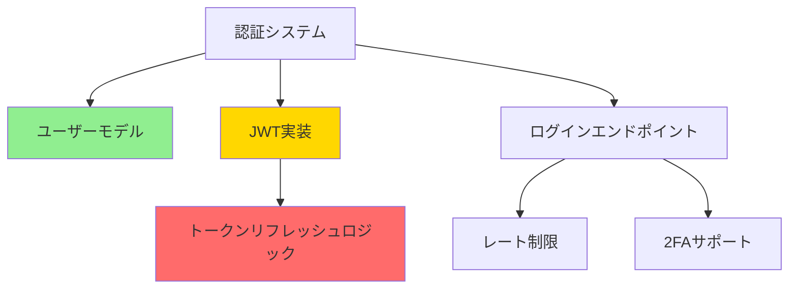

# dependency-mapper

コードベースとGitHubリポジトリ全体のIssue依存関係を可視化・管理します。

## 目的
このコマンドはコード依存関係、git履歴、GitHub Issuesを分析して視覚的な依存関係マップを作成します。ブロッカー、循環依存関係、効率的なプロジェクト実行のための最適なIssue順序を特定するのに役立ちます。

## 使用方法
```bash
# 特定のGitHub Issueの依存関係マップを表示
claude "Issue #123の依存関係マップを表示"

# モジュール内のコード依存関係を分析
claude "src/authモジュールの依存関係をマップ"

# プロジェクト内の循環依存関係を検出
claude "コードベースの循環依存関係をチェック"

# Issue実行順序を生成
claude "マイルストーンv2.0のIssuesを完了する最適な順序は？"
```

## 実行手順

### 1. コード依存関係の分析
様々な手法で依存関係を特定：

```bash
# import文の検出 (JavaScript/TypeScript)
rg "^import.*from ['\"](\.\.?/[^'\"]+)" --type ts --type js -o | sort | uniq

# require文の検出 (Node.js)
rg "require\(['\"](\.\.?/[^'\"]+)['\"]" --type js -o

# Pythonのimport分析
rg "^from \S+ import|^import \S+" --type py

# コメント内のモジュール参照を検出
rg "TODO.*depends on|FIXME.*requires|NOTE.*needs" -i
```

### 2. GitHubからIssue依存関係を抽出
Issue関係のためのGitHub APIクエリ：

```javascript
// 依存関係を含むIssueを取得
const issue = await gh.getIssue(issueNumber, repo, {
  include: ['linked_issues', 'project_items']
});

// Issue説明内の言及を検出
const mentions = issue.body.match(/#\d+|closes #\d+|fixes #\d+/gi);

// 同じマイルストーン/プロジェクトから関連Issueを取得
const relatedIssues = await gh.searchIssues({
  milestone: issue.milestone?.title,
  state: 'all',
  repo: repo
});
```

### 3. 依存関係グラフの構築
グラフ構造を作成：

```javascript
class DependencyGraph {
  constructor() {
    this.nodes = new Map(); // issueNumber -> issue details
    this.edges = new Map(); // issueNumber -> Set of dependent issueNumbers
  }
  
  addDependency(from, to, type = 'depends_on') {
    if (!this.edges.has(from)) {
      this.edges.set(from, new Set());
    }
    this.edges.get(from).add({ to, type });
  }
  
  findCycles() {
    const visited = new Set();
    const recursionStack = new Set();
    const cycles = [];
    
    const hasCycle = (node, path = []) => {
      visited.add(node);
      recursionStack.add(node);
      path.push(node);
      
      const neighbors = this.edges.get(node) || new Set();
      for (const { to } of neighbors) {
        if (!visited.has(to)) {
          if (hasCycle(to, [...path])) return true;
        } else if (recursionStack.has(to)) {
          // Found cycle
          const cycleStart = path.indexOf(to);
          cycles.push(path.slice(cycleStart));
        }
      }
      
      recursionStack.delete(node);
      return false;
    };
    
    for (const node of this.nodes.keys()) {
      if (!visited.has(node)) {
        hasCycle(node);
      }
    }
    
    return cycles;
  }
  
  topologicalSort() {
    const inDegree = new Map();
    const queue = [];
    const result = [];
    
    // Calculate in-degrees
    for (const [node] of this.nodes) {
      inDegree.set(node, 0);
    }
    
    for (const [_, edges] of this.edges) {
      for (const { to } of edges) {
        inDegree.set(to, (inDegree.get(to) || 0) + 1);
      }
    }
    
    // Find nodes with no dependencies
    for (const [node, degree] of inDegree) {
      if (degree === 0) queue.push(node);
    }
    
    // Process queue
    while (queue.length > 0) {
      const node = queue.shift();
      result.push(node);
      
      const edges = this.edges.get(node) || new Set();
      for (const { to } of edges) {
        inDegree.set(to, inDegree.get(to) - 1);
        if (inDegree.get(to) === 0) {
          queue.push(to);
        }
      }
    }
    
    return result;
  }
}
```

### 4. 視覚的表現の生成

#### ASCIIツリービュー
```
#123: 認証システム
├─ #124: ユーザーモデル [CLOSED]
├─ #125: JWT実装 [IN PROGRESS]
│  └─ #126: トークンリフレッシュロジック [BLOCKED]
└─ #127: ログインエンドポイント [OPEN]
   ├─ #128: レート制限 [OPEN]
   └─ #129: 2FAサポート [OPEN]
```

#### Mermaid図


#### 依存関係マトリックス
```
         |  #123   |  #124   |  #125   |  #126   |  #127   |
---------|---------|---------|---------|---------|---------|
 #123    |    -    |    →    |    →    |         |    →    |
 #124    |         |    -    |         |         |         |
 #125    |         |    ←    |    -    |    →    |         |
 #126    |         |         |    ←    |    -    |         |
 #127    |    ←    |    ←    |         |         |    -    |

凡例: → 依存、← 依存先
```

### 5. ファイル依存関係の分析
コード構造をタスクにマップ：

```javascript
// Analyze file imports
async function analyzeFileDependencies(filePath) {
  const content = await readFile(filePath);
  const imports = extractImports(content);
  
  const dependencies = {
    internal: [], // Project files
    external: [], // npm packages
    issues: []    // Related GitHub issues
  };
  
  for (const imp of imports) {
    if (imp.startsWith('.')) {
      dependencies.internal.push(resolveImportPath(filePath, imp));
    } else {
      dependencies.external.push(imp);
    }
    
    // Check if file is mentioned in any issue
    const issues = await gh.searchIssues(`"${path.basename(filePath)}"`, repo);
    dependencies.issues.push(...issues);
  }
  
  return dependencies;
}
```

### 6. 実行順序の生成
最適なタスクシーケンスを計算：

```javascript
function calculateExecutionOrder(graph) {
  const order = graph.topologicalSort();
  const taskDetails = [];
  
  for (const taskId of order) {
    const task = graph.nodes.get(taskId);
    const dependencies = Array.from(graph.edges.get(taskId) || [])
      .map(({ to }) => to);
    
    taskDetails.push({
      id: taskId,
      title: task.title,
      estimate: task.estimate || 0,
      dependencies,
      assignee: task.assignee,
      criticalPath: isOnCriticalPath(taskId, graph)
    });
  }
  
  return taskDetails;
}
```

### 7. エラーハンドリング
```javascript
// GitHubアクセスのチェック
if (!gh.available) {
  console.warn("GitHub APIが利用できません、コード分析のみ使用します");
  // コードのみの分析にフォールバック
}

// 循環依存関係の処理
const cycles = graph.findCycles();
if (cycles.length > 0) {
  console.error("循環依存関係が検出されました:");
  cycles.forEach(cycle => {
    console.error(`  ${cycle.join(' → ')} → ${cycle[0]}`);
  });
}

// Issue存在の検証
for (const issueNumber of mentionedIssues) {
  try {
    await gh.getIssue(issueNumber, repo);
  } catch (error) {
    console.warn(`Issue #${issueNumber} が見つからないかアクセスできません`);
  }
}
```

## Example Output

```
Analyzing dependencies for Milestone: Authentication System (#123)

📊 Dependency Graph:
━━━━━━━━━━━━━━━━━━━━━━━━━━━━━━━━━━━━━━━━━━━━━━━━━━━

LIN-123: Authentication System [EPIC]
├─ LIN-124: Create User Model ✅ [DONE]
│  └─ Files: src/models/User.ts, src/schemas/user.sql
├─ LIN-125: Implement JWT Service 🚧 [IN PROGRESS]
│  ├─ Files: src/services/auth/jwt.ts
│  ├─ Depends on: LIN-124
│  └─ LIN-126: Add Token Refresh ⛔ [BLOCKED by LIN-125]
└─ LIN-127: Create Login Endpoint 📋 [TODO]
   ├─ Files: src/routes/auth/login.ts
   ├─ Depends on: LIN-124, LIN-125
   ├─ LIN-128: Add Rate Limiting 📋 [TODO]
   └─ LIN-129: Implement 2FA 📋 [TODO]

🔄 Circular Dependencies: None found

📈 Critical Path:
1. LIN-124 (User Model) - 2 points ✅
2. LIN-125 (JWT Service) - 3 points 🚧
3. LIN-126 (Token Refresh) - 1 point ⛔
4. LIN-127 (Login Endpoint) - 2 points 📋
Total: 8 points on critical path

👥 Task Distribution:
- Alice: LIN-125 (in progress), LIN-126 (blocked)
- Bob: LIN-127 (ready to start)
- Unassigned: LIN-128, LIN-129

📁 File Dependencies:
src/routes/auth/login.ts
  └─ imports from:
     ├─ src/models/User.ts (LIN-124) ✅
     ├─ src/services/auth/jwt.ts (LIN-125) 🚧
     └─ src/middleware/rateLimiter.ts (LIN-128) 📋

⚡ Recommended Action:
Priority should be completing LIN-125 to unblock 3 dependent tasks.
Bob can start on LIN-124 prerequisite work while waiting.
```

## Advanced Features

### Impact Analysis
Show what tasks are affected by changes:
```bash
# What tasks are impacted if we change User.ts?
claude "Show impact analysis for changes to src/models/User.ts"
```

### Sprint Planning
Optimize task order for sprint capacity:
```bash
# Generate sprint plan considering dependencies
claude "Plan sprint with 20 points capacity considering dependencies"
```

### Risk Assessment
Identify high-risk dependency chains:
```bash
# Find longest dependency chains
claude "Show tasks with longest dependency chains in current sprint"
```

## Tips
- Update dependencies as code evolves
- Use consistent naming between code modules and tasks
- Mark external dependencies (APIs, services) explicitly
- Review dependency graphs in sprint planning
- Keep critical path issues assigned and monitored
- Use dependency data for accurate milestone planning