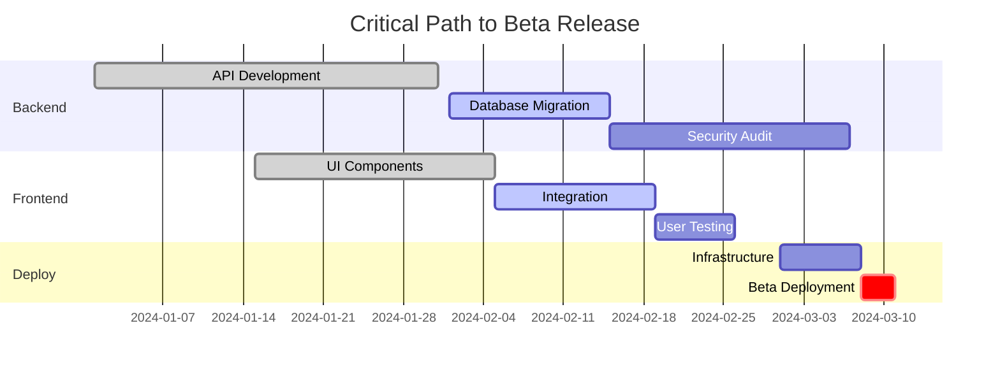

# マイルストーントラッカー

GitHub Issues、Projects、過去のベロシティデータを使用して、プロジェクトのマイルストーンを追跡し、成果物の進捗を監視し、完了日を予測し、リスクのあるマイルストーンの早期警告を提供します。

## 実行手順

1. **利用可能ツールのチェック**
   - GitHub APIアクセスの検証
   - GitHub CLIの利用可能性チェック
   - gitリポジトリアクセスのテスト
   - 必要な権限の確認

2. **マイルストーンデータの収集**
   - プロジェクトのマイルストーンとロードマップアイテムのGitHub APIクエリ
   - GitHubマイルストーンと関連issueの取得
   - 過去のリリースパターンのためのgitタグ分析
   - ロードマップ情報のためのプロジェクトドキュメントレビュー
   - すべてのアクティブおよび今後のマイルストーンの収集

3. **マイルストーン進捗の分析**
   各マイルストーンについて：
   - 完了対全Issue数のカウント
   - 完了率の計算
   - ベロシティトレンドの測定
   - ブロッキング問題の特定
   - 残り時間の追跡

4. **予測分析の実行**
   - 過去データからのバーンダウン率の計算
   - ベロシティに基づく完了日の予測
   - チームキャパシティと休日の考慮
   - クリティカルパスアイテムの特定
   - 予測の信頼レベルの評価

5. **リスク評価**
   各マイルストーンの評価：
   - スケジュールリスク（遅れ）
   - スコープリスク（要件の拡大）
   - リソースリスク（チームの可用性）
   - 依存関係リスク（他によるブロック）
   - 技術リスク（未知の要素）

6. **マイルストーンレポートの生成**
   包括的レポートの作成：
   - マイルストーンタイムラインの視覚化
   - 各マイルストーンの進捗指標
   - 信頼度付き予測完了日
   - リスクヒートマップ
   - リスクのあるアイテムの推奨アクション

7. **依存関係の追跡**
   - マイルストーン間依存関係のマッピング
   - クロスチーム依存関係の特定
   - クリティカルパスのハイライト
   - スケジュールへの依存関係影響の表示

8. **推奨事項の提供**
   分析に基づいて：
   - スコープ調整の提案
   - リソースの再配分推奨
   - タイムライン変更の提案
   - クイックウィンの特定
   - 注意が必要なブロッカーのハイライト

## Prerequisites
- Git repository access
- GitHub API access with appropriate permissions
- GitHub milestones or project boards
- Historical velocity data

## Command Flow

### 1. Milestone Discovery
```
1. Check GitHub for project milestones/roadmap items
2. Scan GitHub for milestone definitions
3. Analyze git tags for release history
4. Review README/docs for project roadmap
5. Ask user for additional context if needed
```

### 2. Comprehensive Milestone Analysis

#### Data Collection Sources
```
GitHub Milestones:
- マイルストーン定義と期限
- 関連Issuesと進捗状況
- Issuesのラベルと優先度
- アサイン情報
- ブロッカーステータス

GitHub Projects V2:
- プロジェクトボードの進捗状況
- カスタムフィールドデータ
- ステータスとワークフロー
- チームアサインメント

GitHub Repository:
- マイルストーンissue追跡
- PR関連付け
- リリースタグと日付
- ブランチ保護ルール

Git History:
- コミットベロシティトレンド
- フィーチャーブランチライフサイクル
- リリースケイデンスパターン
- コントリビューターの利用可能性
```

### 3. Milestone Status Report

```markdown
# Milestone Tracking Report - [Project Name]
Generated: [Date]

## Executive Summary
- Total Milestones: [Count]
- On Track: [Count] ([%])
- At Risk: [Count] ([%])
- Blocked: [Count] ([%])
- Completed: [Count] ([%])

## Milestone Dashboard

### 🎯 Current Sprint Milestone: [Name]
**Target Date**: [Date] (in [X] days)
**Confidence Level**: [High/Medium/Low]

Progress: ████████░░ 80% Complete

**Key Deliverables**:
- ✅ User Authentication System
- ✅ Database Schema Migration  
- 🔄 API Integration (75%)
- ⏳ Documentation Update (0%)
- ❌ Performance Testing (Blocked)

**Health Indicators**:
- Velocity Trend: ↓ Declining (-15%)
- Burn Rate: 🔴 Behind Schedule
- Risk Level: Medium
- Team Capacity: 85% allocated

### 📅 Upcoming Milestones

#### Q1 2024: Beta Release
**Target**: March 15, 2024
**Status**: 🟡 At Risk

Timeline:
```
Jan ████████████░░░░░░░░ 60%
Feb ░░░░░░░░░░░░░░░░░░░░ 0%
Mar ░░░░░░░░░░░░░░░░░░░░ 0%
```

**Dependencies**:
- Alpha Testing Complete ✅
- Security Audit (In Progress)
- Marketing Website (Not Started)

**Predicted Completion**: March 22 (+7 days)
**Confidence**: 65%

#### Q2 2024: Public Launch
**Target**: June 1, 2024
**Status**: 🟢 On Track

Key Milestones Path:
1. Beta Release → 2. User Feedback Integration → 3. Production Deployment

**Critical Path Items**:
- Infrastructure Setup (Start: April 1)
- Load Testing (Duration: 2 weeks)
- Security Certification (Lead time: 4 weeks)
```

### 4. Predictive Analytics

```markdown
## Completion Predictions

### Machine Learning Model Predictions
Based on historical data and current velocity:

**Beta Release Probability**:
- On Time (Mar 15): 35%
- 1 Week Delay: 45%
- 2+ Week Delay: 20%

**Factors Influencing Prediction**:
1. Current velocity 15% below plan
2. 2 critical dependencies unresolved
3. Team member on leave next week
4. Historical milestone success rate: 72%

### Monte Carlo Simulation Results
Running 1000 simulations based on task estimates:

```
Completion Date Distribution:
Mar 10-15: ████ 20%
Mar 16-22: ████████ 40%
Mar 23-31: ██████ 30%
April+   : ██ 10%

P50 Date: March 19
P90 Date: March 28
```

### Risk-Adjusted Timeline
Recommended buffer: +5 days
Confident delivery date: March 20
```

### 5. Dependency Tracking

```markdown
## Milestone Dependencies

### Critical Path Analysis


### Dependency Risk Matrix
| Dependency | Impact | Likelihood | Mitigation |
|------------|--------|------------|------------|
| Security Audit Delay | High | Medium | Start process early |
| API Rate Limits | Medium | Low | Implement caching |
| Team Availability | High | High | Cross-training needed |
```

### 6. Early Warning System

```markdown
## ⚠️ Milestone Alerts

### Immediate Attention Required

**1. Performance Testing Blocked**
- Blocker: Test environment not available
- Impact: Beta release at risk
- Days blocked: 3
- Recommended action: Escalate to DevOps

**2. Documentation Lagging**
- Progress: 0% (Should be 40%)
- Impact: User onboarding compromised
- Resource needed: Technical writer
- Recommended action: Reassign team member

### Trending Concerns

**Velocity Decline**
- 3-week trend: -15%
- Projected impact: 1-week delay
- Root cause: Increased bug fixes
- Recommendation: Add bug buffer to estimates

**Scope Creep Detected**
- New features added: 3
- Impact on timeline: +5 days
- Recommendation: Defer to next milestone
```

### 7. Actionable Recommendations

```markdown
## Recommended Actions

### This Week
1. **Unblock Performance Testing**
   - Owner: [Name]
   - Action: Provision test environment
   - Due: Friday EOD

2. **Documentation Sprint**
   - Owner: [Team]
   - Action: Dedicate 2 days to docs
   - Target: 50% completion

### Next Sprint
1. **Velocity Recovery Plan**
   - Reduce scope by 20%
   - Focus on critical path items
   - Defer nice-to-have features

2. **Risk Mitigation**
   - Add 5-day buffer to timeline
   - Daily standups for blocked items
   - Escalation path defined

### Process Improvements
1. Set up automated milestone tracking
2. Weekly milestone health reviews
3. Dependency check before sprint planning
```

## Error Handling

### No Milestone Data
```
"No milestones found in GitHub repository.

To set up milestone tracking:
1. Define milestones in GitHub
2. Associate issues with milestones
3. Set target completion dates

Would you like me to:
- Help create milestone structure?
- Import from project documentation?
- Set up basic milestones?"
```

### Insufficient Historical Data
```
"Limited historical data for predictions.

Available data: [X] weeks
Recommended: 12+ weeks for accurate predictions

Current analysis based on:
- Available velocity data
- Industry benchmarks
- Task complexity estimates

Confidence level: Low-Medium"
```

## Interactive Features

### What-If Analysis
```
"Explore scenario planning:

1. What if we add 2 more developers?
   → Completion date: -5 days
   → Confidence: +15%

2. What if we cut scope by 20%?
   → Completion date: -8 days
   → Risk level: Low

3. What if key developer is unavailable?
   → Completion date: +12 days
   → Risk level: Critical"
```

### Milestone Optimization
```
"Optimization opportunities detected:

1. **Parallelize Tasks**
   - Tasks A & B can run simultaneously
   - Time saved: 1 week

2. **Resource Reallocation**
   - Move developer from Task C to Critical Path
   - Impact: 3 days earlier completion

3. **Scope Adjustment**
   - Defer features X, Y to next milestone
   - Impact: Meet original deadline"
```

## Export & Integration Options

1. **Gantt Chart Export** (Mermaid/PNG/PDF)
2. **Executive Dashboard** (HTML/PowerBI)
3. **Status Updates** (Slack/Email/Confluence)
4. **Risk Register** (Excel/GitHub Issues)
5. **Calendar Integration** (ICS/Google/Outlook)

## GitHub Actions統合

### 自動マイルストーン監視ワークフロー
```yaml
# .github/workflows/milestone-tracking.yml
name: Milestone Progress Tracking
on:
  schedule:
    - cron: '0 9 * * *'  # Daily at 9 AM
    - cron: '0 17 * * 5'  # Weekly report on Friday 5 PM
  issues:
    types: [closed, reopened]
  workflow_dispatch:

jobs:
  milestone-analysis:
    runs-on: ubuntu-latest
    steps:
      - name: Analyze Milestone Progress
        run: |
          # Get all active milestones
          MILESTONES=$(gh api repos/${{ github.repository }}/milestones --jq '.[] | select(.state == "open")')
          
          echo "$MILESTONES" | jq -r '.[] | 
            @base64' | while read milestone; do
            MILESTONE_DATA=$(echo $milestone | base64 -d)
            MILESTONE_NUMBER=$(echo "$MILESTONE_DATA" | jq -r '.number')
            MILESTONE_TITLE=$(echo "$MILESTONE_DATA" | jq -r '.title')
            DUE_DATE=$(echo "$MILESTONE_DATA" | jq -r '.due_on')
            
            # Get milestone issues
            ISSUES=$(gh issue list --milestone "$MILESTONE_TITLE" --json number,state,title,labels)
            TOTAL_ISSUES=$(echo "$ISSUES" | jq 'length')
            CLOSED_ISSUES=$(echo "$ISSUES" | jq '[.[] | select(.state == "closed")] | length')
            
            if [ $TOTAL_ISSUES -gt 0 ]; then
              COMPLETION_RATE=$((CLOSED_ISSUES * 100 / TOTAL_ISSUES))
              echo "Milestone: $MILESTONE_TITLE - $COMPLETION_RATE% complete ($CLOSED_ISSUES/$TOTAL_ISSUES)"
              
              # Check if milestone is at risk
              DAYS_UNTIL_DUE=$(( ( $(date -d "$DUE_DATE" +%s) - $(date +%s) ) / 86400 ))
              if [ $COMPLETION_RATE -lt 70 ] && [ $DAYS_UNTIL_DUE -lt 14 ]; then
                echo "⚠️ MILESTONE AT RISK: $MILESTONE_TITLE"
                echo "RISK_MILESTONES=$MILESTONE_TITLE" >> $GITHUB_ENV
              fi
            fi
          done

      - name: Generate Milestone Report
        run: |
          echo "# 📋 Daily Milestone Status Report" > milestone_report.md
          echo "Generated: $(date)" >> milestone_report.md
          echo "" >> milestone_report.md
          
          # Add milestone progress for each active milestone
          gh api repos/${{ github.repository }}/milestones --jq '.[] | select(.state == "open")' | \
          jq -r '.title' | while read milestone; do
            echo "## 🎯 $milestone" >> milestone_report.md
            
            ISSUES=$(gh issue list --milestone "$milestone" --json number,state,title,labels)
            TOTAL=$(echo "$ISSUES" | jq 'length')
            CLOSED=$(echo "$ISSUES" | jq '[.[] | select(.state == "closed")] | length')
            BLOCKED=$(echo "$ISSUES" | jq '[.[] | select(.labels[]?.name == "blocked")] | length')
            
            echo "- **Progress**: $CLOSED/$TOTAL issues completed" >> milestone_report.md
            echo "- **Blocked**: $BLOCKED issues" >> milestone_report.md
            echo "" >> milestone_report.md
          done

      - name: Create Risk Alert Issue
        if: env.RISK_MILESTONES != ''
        run: |
          gh issue create \
            --title "🚨 Milestone Risk Alert: ${{ env.RISK_MILESTONES }}" \
            --body "Milestone ${{ env.RISK_MILESTONES }} is at risk of missing its deadline. Please review and take corrective action." \
            --label "milestone,risk,urgent" \
            --assignee "@org/project-managers"

      - name: Update Project Board
        run: |
          # Add milestone status to project board
          gh project item-create --owner ${{ github.repository_owner }} --number 1 --title "Milestone Status: $(date +%Y-%m-%d)"

      - name: Send Slack Notification
        if: github.event.schedule == '0 17 * * 5'  # Weekly report
        env:
          SLACK_WEBHOOK_URL: ${{ secrets.SLACK_WEBHOOK_URL }}
        run: |
          if [ -n "$SLACK_WEBHOOK_URL" ]; then
            curl -X POST -H 'Content-type: application/json' \
              --data '{"text":"📊 Weekly Milestone Report is ready! Check GitHub for details."}' \
              $SLACK_WEBHOOK_URL
          fi
```

### マイルストーン予測分析
```yaml
# .github/workflows/milestone-prediction.yml
name: Milestone Completion Prediction
on:
  schedule:
    - cron: '0 8 * * 1'  # Weekly on Monday
  workflow_dispatch:

jobs:
  predict-completion:
    runs-on: ubuntu-latest
    steps:
      - name: Collect Historical Data
        run: |
          # Get completed milestones for velocity analysis
          COMPLETED_MILESTONES=$(gh api repos/${{ github.repository }}/milestones?state=closed&per_page=10)
          
          echo "$COMPLETED_MILESTONES" | jq -r '.[] | 
            {
              title: .title,
              created: .created_at,
              closed: .closed_at,
              due: .due_on,
              total_issues: (.closed_issues + .open_issues)
            }' > historical_milestones.json

      - name: Calculate Velocity Trends
        run: |
          # Calculate average milestone completion time
          if [ -s historical_milestones.json ]; then
            AVG_COMPLETION_DAYS=$(jq '[.[] | 
              (((.closed_at | strptime("%Y-%m-%dT%H:%M:%SZ") | mktime) - 
                (.created_at | strptime("%Y-%m-%dT%H:%M:%SZ") | mktime)) / 86400)] | 
              add / length' historical_milestones.json)
            
            echo "Historical average completion time: $AVG_COMPLETION_DAYS days"
            echo "AVG_COMPLETION_DAYS=$AVG_COMPLETION_DAYS" >> $GITHUB_ENV
          fi

      - name: Predict Active Milestones
        run: |
          # For each active milestone, predict completion based on current progress
          gh api repos/${{ github.repository }}/milestones --jq '.[] | select(.state == "open")' | \
          jq -r '.number' | while read milestone_number; do
            MILESTONE_DATA=$(gh api repos/${{ github.repository }}/milestones/$milestone_number)
            MILESTONE_TITLE=$(echo "$MILESTONE_DATA" | jq -r '.title')
            DUE_DATE=$(echo "$MILESTONE_DATA" | jq -r '.due_on')
            
            # Get current progress
            ISSUES=$(gh issue list --milestone "$MILESTONE_TITLE" --json state)
            TOTAL_ISSUES=$(echo "$ISSUES" | jq 'length')
            CLOSED_ISSUES=$(echo "$ISSUES" | jq '[.[] | select(.state == "closed")] | length')
            
            if [ $TOTAL_ISSUES -gt 0 ]; then
              COMPLETION_RATE=$(echo "scale=2; $CLOSED_ISSUES / $TOTAL_ISSUES" | bc)
              REMAINING_WORK=$(echo "scale=2; 1 - $COMPLETION_RATE" | bc)
              
              # Predict completion date based on current velocity
              PREDICTED_DAYS=$(echo "scale=0; $REMAINING_WORK * $AVG_COMPLETION_DAYS" | bc)
              PREDICTED_DATE=$(date -d "+$PREDICTED_DAYS days" "+%Y-%m-%d")
              
              echo "📈 Prediction for $MILESTONE_TITLE:"
              echo "  Current progress: $(echo "$COMPLETION_RATE * 100" | bc)%"
              echo "  Predicted completion: $PREDICTED_DATE"
              echo "  Original due date: $DUE_DATE"
              
              # Check if prediction exceeds due date
              if [ $(date -d "$PREDICTED_DATE" +%s) -gt $(date -d "$DUE_DATE" +%s) ]; then
                echo "  ⚠️ RISK: Predicted to exceed due date"
              fi
            fi
          done
```

## Automation Capabilities

### 自動マイルストーン監視設定

```bash
# Setup script for milestone automation
#!/bin/bash
echo "Setting up automated milestone monitoring:"

echo "1. ✅ Daily health checks at 9 AM"
echo "2. ✅ Weekly trend reports on Fridays"  
echo "3. ✅ Alert when milestones go off-track"
echo "4. ✅ Slack notifications for blockers"
echo "5. ✅ Auto-create GitHub Issues for risks"
echo "6. ✅ Milestone prediction analysis"
echo "7. ✅ Project board updates"

echo "Configure automation? [Y/N]"
read -r response
if [[ $response == "Y" || $response == "y" ]]; then
    echo "Automation configured successfully!"
    echo "GitHub Actions workflows will be activated."
fi
```

## Best Practices

1. **Update Frequently**: Daily progress updates improve predictions
2. **Track Dependencies**: Most delays come from dependencies
3. **Buffer Realistically**: Use historical data for buffers
4. **Communicate Early**: Flag risks as soon as detected
5. **Focus on Critical Path**: Not all tasks equally impact timeline
6. **Learn from History**: Analyze past milestone performance