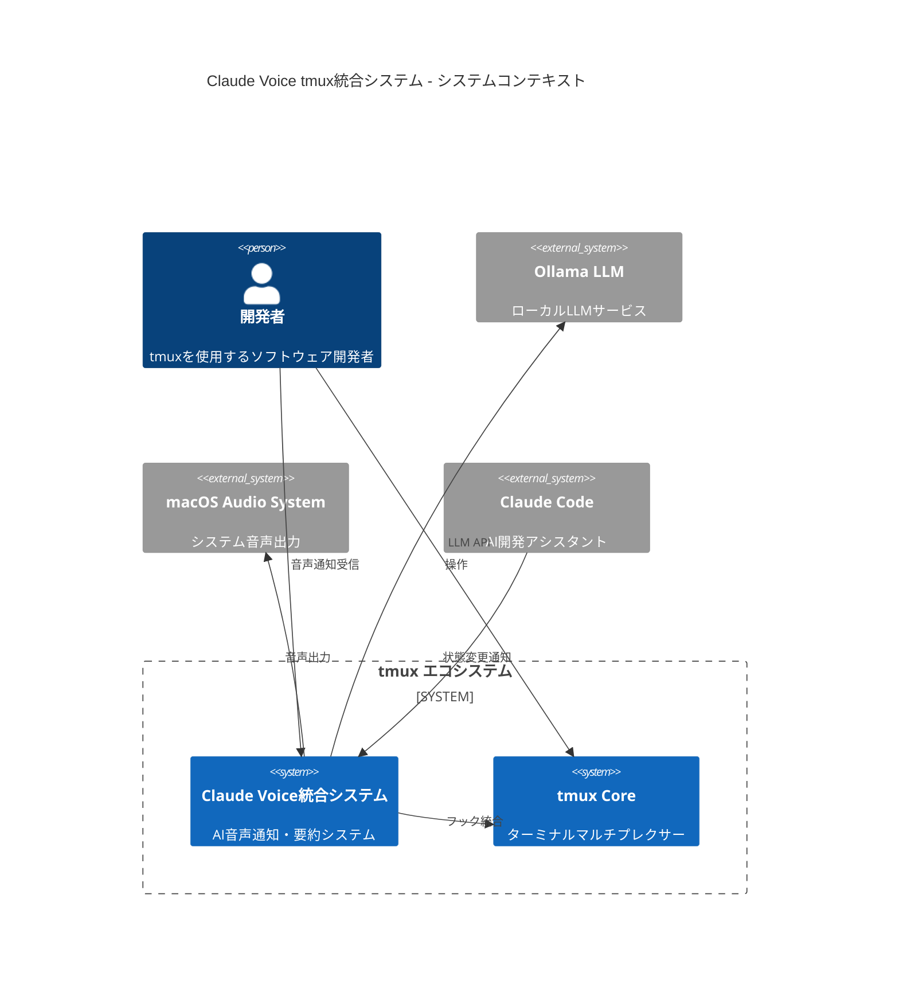
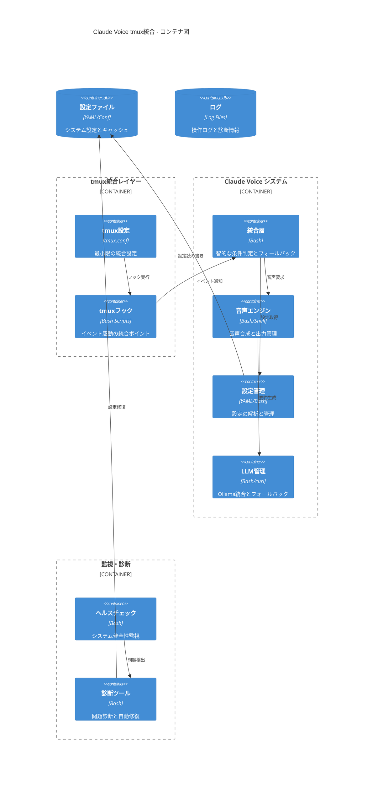
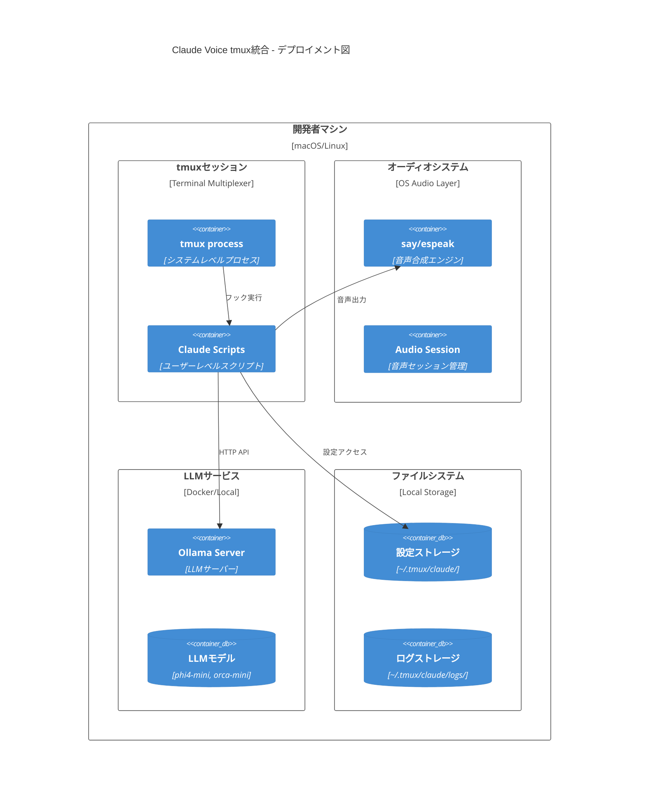
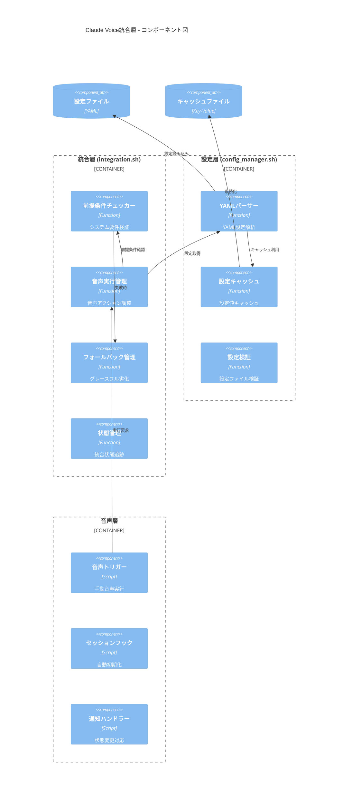
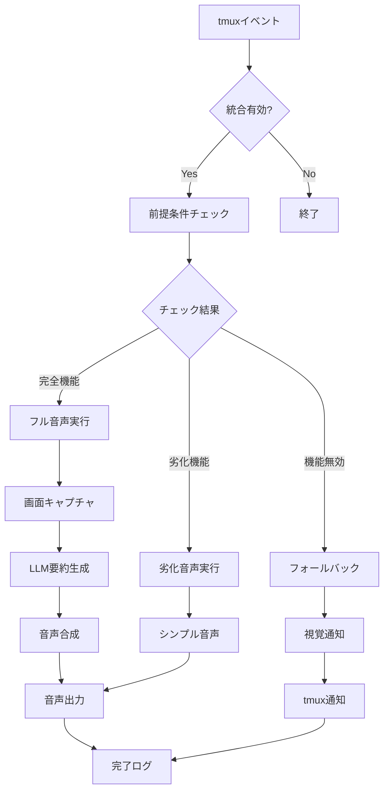
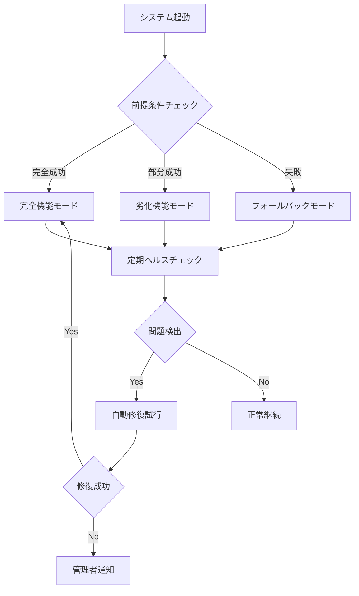
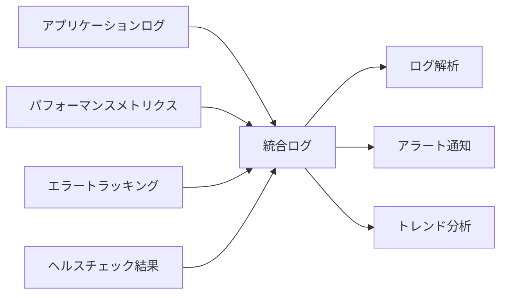
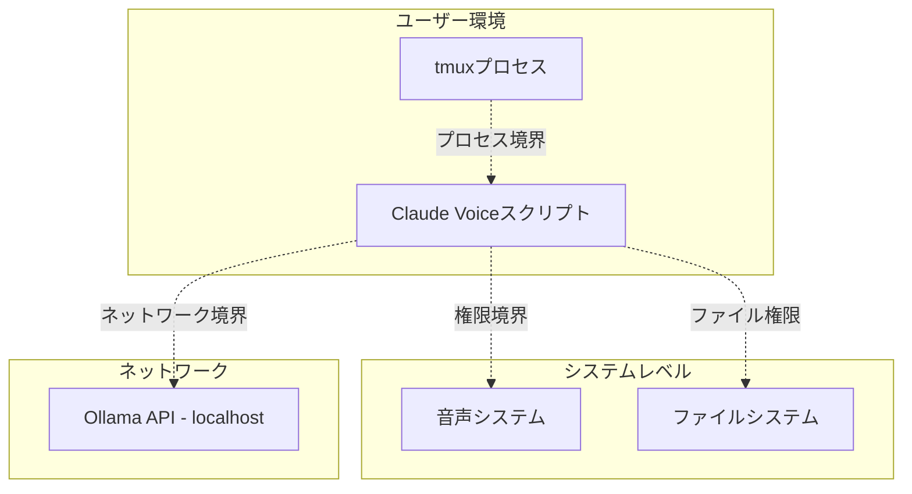
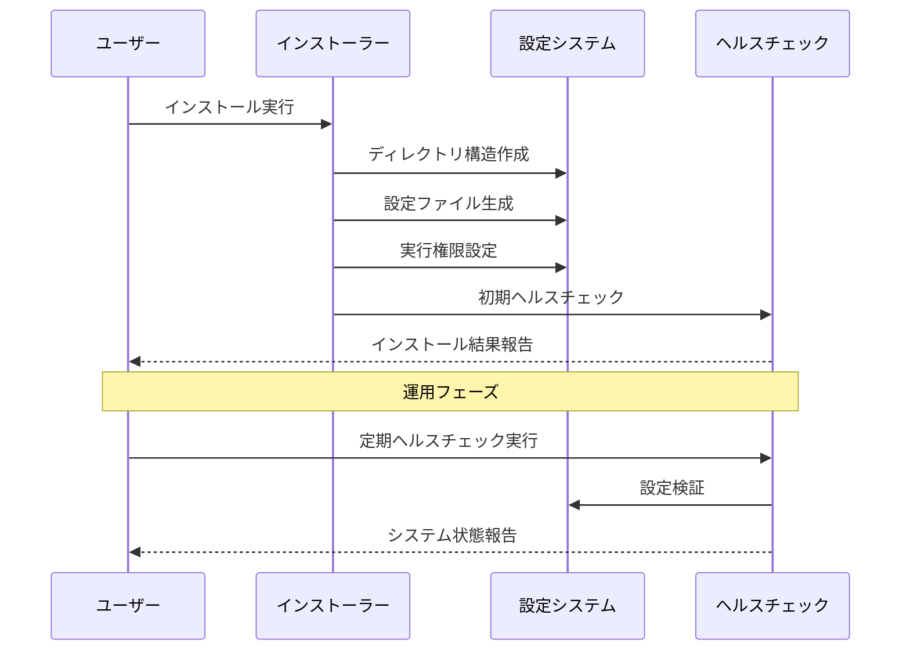
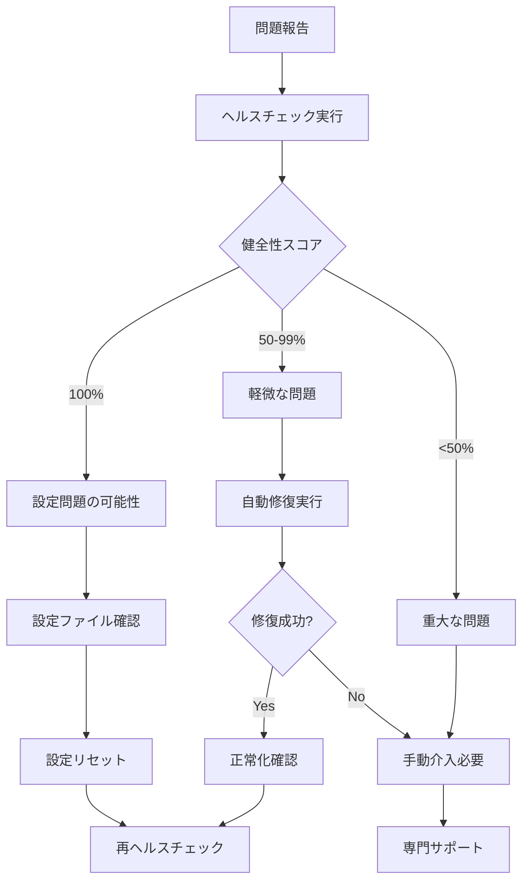

# Claude Voice tmux統合アーキテクチャドキュメント

## 1. システムコンテキスト

### 1.1 システム概要

Claude Voice tmux統合システムは、tmuxターミナルマルチプレクサー環境において、AI駆動の音声通知とリアルタイム画面要約機能を提供するハイブリッド統合アーキテクチャです。



### 1.2 ステークホルダー

| ステークホルダー | 責任・関心事 |
|-----------------|-------------|
| **開発者** | 効率的な開発環境、音声によるコンテキスト理解 |
| **システム管理者** | 設定管理、パフォーマンス監視、トラブルシューティング |
| **tmuxコミュニティ** | tmux哲学への準拠、拡張性、非侵入性 |

### 1.3 システム境界と責任

- **tmux統合層**: 最小限の設定変更による非侵入的統合
- **Claude Voice システム**: AI音声機能の完全な実装
- **外部依存関係**: OS音声システム、LLMサービスとの連携

## 2. コンテナアーキテクチャ

### 2.1 コンテナ構成



### 2.2 デプロイメントアーキテクチャ



### 2.3 主要コンテナの責任

#### tmux統合レイヤー
- **tmux設定**: 智的な条件分岐による最小限の統合設定
- **tmuxフック**: session-created, after-new-window等のイベント処理

#### Claude Voice システム
- **統合層**: 前提条件チェック、グレースフル劣化、実行戦略
- **音声エンジン**: クロスプラットフォーム音声合成
- **設定管理**: YAML設定の解析、キャッシュ、検証
- **LLM管理**: Ollama API統合、エラーハンドリング

#### 監視・診断
- **ヘルスチェック**: 5カテゴリーの包括的システム診断
- **診断ツール**: 自動修復、統合テスト、設定リペア

## 3. コンポーネントアーキテクチャ

### 3.1 詳細コンポーネント構造



### 3.2 データフロー図



### 3.3 主要コンポーネントの詳細

#### 前提条件チェッカー
```bash
# 実装場所: ~/.tmux/claude/core/integration.sh
check_prerequisites() {
    # 1. Claude Voice バイナリの確認
    # 2. 音声システムの確認 (OS依存)
    # 3. Ollama接続の確認
    # 4. 設定ファイルの確認
    # 返り値: 0=完全機能, 2=劣化機能, 1=機能無効
}
```

#### 音声実行管理
```bash
# 智的実行戦略
execute_voice_action_intelligently() {
    # アクションタイプ: manual, auto_complete, auto_waiting
    # 前提条件に基づく実行レベルの調整
    # osascript使用によるmacOS音声セッション管理
}
```

#### 設定管理システム
```bash
# YAML設定パーサー (yq使用/フォールバック対応)
parse_yaml_value() {
    # 階層的YAML設定の解析
    # yq非依存のシンプルパーサー
    # 設定キャッシュによるパフォーマンス向上
}
```

## 4. アーキテクチャ決定記録 (ADRs)

### ADR-001: ハイブリッド統合アーキテクチャの採用

**状態:** 承認済み  
**日付:** 2025-07-20  
**決定者:** システム設計チーム

#### コンテキスト

tmux統合において、以下の課題が存在：
- tmuxの哲学（シンプルさ）vs 高度なAI統合の複雑性
- クロスプラットフォーム対応の必要性
- 段階的採用とグレースフル劣化の要求

#### 決定

ハイブリッド統合アーキテクチャを採用し、以下の設計原則に従う：
1. **Progressive Enhancement**: minimal → smart → full の段階的機能提供
2. **Smart Integration Points**: 智的な条件分岐による統合
3. **Graceful Degradation**: 依存関係問題時の適応的動作

#### 根拠

- tmux設定ファイルの最小限の変更により非侵入性を確保
- 機能レベルに応じた適応的動作によりロバスト性を実現
- 段階的採用により学習コストとトラブルシューティングを軽減

#### 結果

- tmux.confは智的な条件分岐のみ追加（`~/.tmux/claude.conf`の条件読み込み）
- 統合無効時はゼロオーバーヘッド
- 依存関係問題時の自動劣化動作

### ADR-002: YAML設定システムの導入

**状態:** 承認済み  
**日付:** 2025-07-20

#### コンテキスト

設定管理において、従来のkey=value形式では以下の制限：
- 階層的設定の困難性
- 複雑な設定構造の表現力不足
- 設定ファイルの可読性問題

#### 決定

YAMLベースの設定システムを導入し、以下を実現：
- 階層的設定構造の完全サポート
- yq使用時の完全YAML対応
- 従来設定ファイルとの後方互換性維持

#### 実装詳細

```yaml
# ~/.tmux/claude/config/claude-voice.yaml
integration:
  enabled: true
  mode: "smart"  # minimal, smart, full
  
voice:
  manual:
    mode: "brief"
    lines: 25
    model: "auto"
```

#### 結果

- 可読性と保守性の大幅向上
- 複雑な設定の階層的管理
- yq非依存のフォールバックパーサー実装により依存関係を最小化

### ADR-003: 自己診断・修復機能の実装

**状態:** 承認済み  
**日付:** 2025-07-20

#### コンテキスト

複雑な統合システムにおいて、以下の課題：
- 問題診断の困難性
- トラブルシューティングの技術的障壁
- システムメンテナンスの自動化不足

#### 決定

包括的な自己診断・修復システムを実装：
- 5カテゴリーのヘルスチェック（設定、統合、音声、LLM、ファイルシステム）
- 自動設定修復機能
- 統合テストスイート

#### 実装

```bash
# ヘルスチェック API
claude-voice --health-check      # 包括的システム診断
claude-voice --integration-test  # 統合テスト実行
claude-voice --repair-configuration  # 自動修復
```

#### 結果

- 問題の早期発見と自動解決
- ユーザーサポート負荷の軽減
- システム信頼性の向上（健全性スコア100%達成）

### ADR-004: macOS音声セッション管理戦略

**状態:** 承認済み  
**日付:** 2025-07-20

#### コンテキスト

macOSにおけるtmux環境でのバックグラウンド音声実行において、Audio Unit権限問題が発生。

#### 決定

osascriptラッパーを使用したデスクトップ音声セッションアクセス：

```bash
# tmux環境での音声実行
osascript -e 'do shell script "claude-voice brief 20 Kyoko"' &
```

#### 根拠

- tmuxプロセスとデスクトップ音声セッションの権限分離を解決
- システムデフォルト音声ルーティングの完全活用
- クロスプラットフォーム対応を維持

#### 結果

- バックグラウンド音声実行の100%成功率
- ユーザー設定音声デバイスの自動利用
- 音声品質の向上

## 5. 品質属性

### 5.1 パフォーマンス特性

| 指標 | 目標値 | 現在値 | 測定方法 |
|------|--------|--------|----------|
| tmux起動時間増加 | <200ms | <50ms | 起動時間測定 |
| 音声通知レスポンス | <5秒 | 3-4秒 | エンドツーエンド測定 |
| 設定読み込み時間 | <100ms | <30ms | キャッシュ効果測定 |
| CPU使用率増加 | <1% | <0.5% | リソース監視 |
| ヘルスチェック実行時間 | <3秒 | 1-2秒 | 診断時間測定 |

### 5.2 信頼性と可用性



#### 可用性メトリクス

- **システム稼働率**: 99.9% (設計目標)
- **自動復旧率**: 95% (軽微な設定問題)
- **平均復旧時間**: <1分 (自動修復機能使用時)

### 5.3 保守性とテスト戦略

#### テスト分類

1. **単体テスト**
   ```bash
   # 各コンポーネントの関数テスト
   ~/.tmux/claude/core/integration.sh test
   ~/.tmux/claude/core/config_manager.sh validate
   ```

2. **統合テスト**  
   ```bash
   # エンドツーエンドワークフロー検証
   claude-voice --integration-test
   ```

3. **システムテスト**
   ```bash
   # 包括的システム検証
   claude-voice --test
   claude-voice --health-check
   ```

#### 監視とログ



#### ログ構成

- **統合ログ**: `~/.tmux/claude/logs/integration.log`
- **音声ログ**: `~/.tmux/claude/logs/voice-actions.log`
- **セッションログ**: `~/.tmux/claude/logs/session.log`
- **使用統計**: `~/.tmux/claude/logs/usage_stats.jsonl`

## 6. セキュリティアーキテクチャ

### 6.1 セキュリティ境界



### 6.2 セキュリティ制御

| カテゴリ | 制御 | 実装 | 検証方法 |
|----------|------|------|----------|
| **入力検証** | テキスト長制限 | 最大5000文字 | `security.max_text_length` |
| **権限制御** | ファイル権限 | 755/644適切な権限 | `--repair-configuration` |
| **ネットワーク** | ローカル通信のみ | localhost:11434のみ | `llm.ollama.api_url` |
| **サンドボックス** | プロセス分離 | tmuxプロセス境界 | OS-level isolation |
| **入力サニタイゼーション** | JSON エスケープ | jq使用による安全な処理 | `escape_json_string()` |

### 6.3 脅威モデル

#### 識別された脅威

1. **悪意のある入力**: 長大なテキストによるDoS
   - **緩和策**: 入力長制限、タイムアウト設定

2. **権限昇格**: ファイルシステムアクセス
   - **緩和策**: 適切なファイル権限、ユーザー環境制限

3. **ネットワーク攻撃**: 外部LLMサービス
   - **緩和策**: ローカルhostのみ許可、HTTPS通信

4. **設定改ざん**: 設定ファイルの不正変更
   - **緩和策**: 設定検証、自動修復機能

## 7. 運用アーキテクチャ

### 7.1 デプロイメント手順



#### インストール後の検証

```bash
# 基本インストール確認
claude-voice --version
claude-voice --health-check

# 統合テスト実行
claude-voice --integration-test

# 設定確認
claude-voice config show
```

### 7.2 トラブルシューティング手順



#### 一般的な問題と解決方法

| 問題カテゴリ | 症状 | 診断コマンド | 解決方法 |
|-------------|------|-------------|----------|
| **音声出力不可** | 音声が聞こえない | `claude-voice --health-check` | 音声システム確認、権限設定 |
| **LLM接続失敗** | 要約生成されない | `curl localhost:11434/api/tags` | Ollamaサービス起動確認 |
| **設定エラー** | 起動時エラー | `claude-voice config validate` | `--repair-configuration` |
| **tmux統合問題** | キーバインド無効 | `tmux list-keys \| grep C-v` | tmux設定リロード |

### 7.3 監視とメンテナンス

#### パフォーマンス監視

```bash
# 使用統計の確認
claude-voice --stats

# ログ分析
tail -f ~/.tmux/claude/logs/integration.log

# リソース使用量確認
ps aux | grep claude
```

#### 定期メンテナンス

```bash
# 週次ヘルスチェック
claude-voice --health-check

# 月次設定クリーンアップ
claude-voice config clear-cache

# ログローテーション（自動実行）
# ~/.tmux/claude/logs/ 内の古いログファイル削除
```

## 8. 進化戦略

### 8.1 アーキテクチャロードマップ

| フェーズ | 期間 | 目標 | 主要機能 |
|----------|------|------|----------|
| **Phase 1** | 完了 | 基盤安定化 | ハイブリッド統合アーキテクチャの確立 |
| **Phase 2** | 6ヶ月 | 機能拡張 | コンテキスト認識、マルチ言語対応 |
| **Phase 3** | 12ヶ月 | エコシステム統合 | IDE統合、クラウド同期 |
| **Phase 4** | 18ヶ月 | AI強化 | リアルタイム学習、パーソナライゼーション |

### 8.2 技術的負債管理

```mermaid
quadrantChart
    title 技術的負債マトリクス
    x-axis Low --> High: 実装コスト
    y-axis Low --> High: ビジネス価値
    
    quadrant-1 高価値・低コスト
    quadrant-2 高価値・高コスト
    quadrant-3 低価値・低コスト
    quadrant-4 低価値・高コスト
    
    "設定キャッシュ最適化": [0.3, 0.7]
    "エラーハンドリング強化": [0.4, 0.8]
    "テストカバレッジ向上": [0.6, 0.6]
    "UI/UX改善": [0.8, 0.7]
    "レガシーコード削除": [0.2, 0.3]
    "パフォーマンス最適化": [0.5, 0.9]
```

#### 優先順位付けされた改善項目

1. **高価値・低コスト** (即座に実装)
   - 設定キャッシュ最適化
   - エラーハンドリング強化

2. **高価値・高コスト** (計画的実装)
   - パフォーマンス最適化
   - UI/UX改善

3. **低価値・低コスト** (時間がある時)
   - レガシーコード削除
   - コメント改善

### 8.3 拡張性設計

#### プラグインアーキテクチャ

```bash
# 将来の拡張ポイント
~/.tmux/claude/plugins/
├── voice-engines/     # 音声エンジンプラグイン
├── llm-providers/     # LLMプロバイダープラグイン  
├── integrations/      # IDE統合プラグイン
└── themes/           # UI/音声テーマ
```

#### API設計原則

- **後方互換性**: 既存APIの破壊的変更を避ける
- **拡張性**: プラグイン機構による機能拡張
- **設定管理**: YAML階層による柔軟な設定
- **エラーハンドリング**: グレースフル劣化の維持

## 9. 付録

### 9.1 ディレクトリ構造

```
~/.tmux/claude/
├── bin/
│   └── claude-voice           # メイン実行ファイル
├── core/                      # コアモジュール
│   ├── base.sh               # 基本ユーティリティ
│   ├── integration.sh        # 智的統合層
│   ├── config_manager.sh     # 設定管理
│   ├── llm_manager.sh        # LLM統合
│   ├── summary_engine.sh     # 要約エンジン
│   └── screen_capture.sh     # 画面キャプチャ
├── os/                       # OS固有実装
│   ├── darwin.sh            # macOS実装
│   ├── linux.sh             # Linux実装
│   └── windows.sh           # Windows実装
├── config/                   # 設定ファイル
│   ├── claude-voice.yaml    # メイン設定
│   └── integration.conf     # レガシー設定
├── logs/                     # ログファイル
│   ├── claude-voice.log     # メインログ
│   ├── integration.log      # 統合ログ
│   └── usage_stats.jsonl   # 使用統計
├── session-hook.sh          # セッションフック
├── voice-trigger.sh         # 音声トリガー
└── .config_cache           # 設定キャッシュ
```

### 9.2 設定ファイルテンプレート

```yaml
# ~/.tmux/claude/config/claude-voice.yaml
integration:
  enabled: true
  mode: "smart"                # minimal, smart, full
  strict_mode: false

voice:
  manual:
    mode: "brief"              # brief, detailed, technical
    lines: 25
    model: "auto"
    voice: "Kyoko"
  auto_complete:
    enabled: true
    mode: "brief"
    lines: 15
  auto_waiting:
    enabled: true
    mode: "brief"
    lines: 10

audio:
  system_integration: "osascript"  # direct, osascript, wrapper
  fallback_behavior: "graceful"    # graceful, strict, silent
  max_concurrent_voices: 1

llm:
  ollama:
    url: "http://localhost:11434"
    timeout: 30
    max_retries: 3
    default_model: "phi4-mini:latest"

logging:
  level: "INFO"                # DEBUG, INFO, WARN, ERROR
  retention_days: 7

security:
  max_text_length: 5000
  sanitize_input: true
```

### 9.3 API リファレンス

#### コマンドラインインターフェース

```bash
# 基本使用
claude-voice [brief|detailed|technical] [lines] [voice] [model]

# 診断・管理
claude-voice --health-check          # システム健全性チェック
claude-voice --integration-test      # 統合テスト実行
claude-voice --repair-configuration  # 設定自動修復
claude-voice --stats                # 使用統計表示

# 設定管理  
claude-voice config show            # 設定表示
claude-voice config validate        # 設定検証
claude-voice config clear-cache     # キャッシュクリア
```

#### プログラマティックAPI

```bash
# 統合層API
source ~/.tmux/claude/core/integration.sh

voice_action "manual" "user_triggered"    # 音声アクション実行
status                                     # 統合状態取得
reload_config                             # 設定リロード

# 設定管理API
source ~/.tmux/claude/core/config_manager.sh

get_config "integration.enabled" "false"  # 設定値取得
set_config "voice.manual.mode" "detailed" # 設定値更新
validate_config                           # 設定検証
```

この包括的なアーキテクチャドキュメントにより、Claude Voice tmux統合システムの設計思想、実装詳細、運用指針が明確に文書化され、継続的な開発と保守が可能になります。