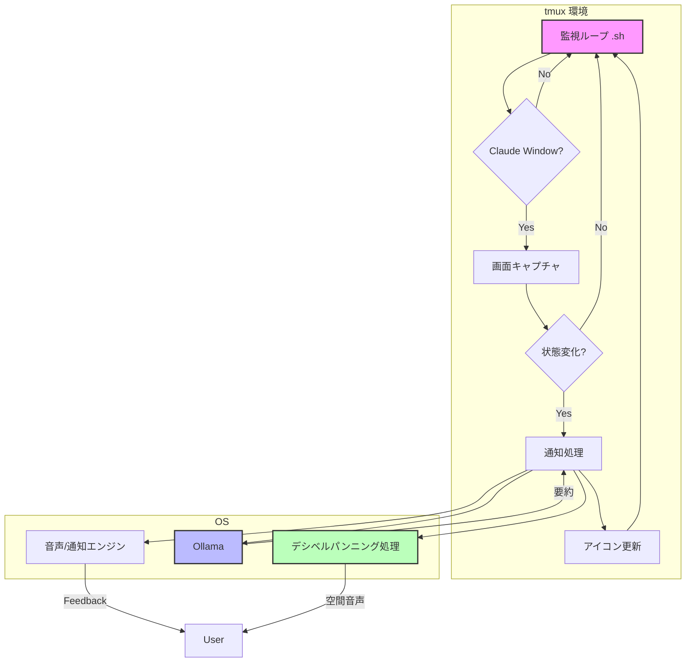

# Tmux Claude Voice: システム概要

## 1. システム概要

本システムは、`tmux`上で動作する**Claude Code**のウィンドウを監視し、その状態変化を**音声**と**システム通知**で開発者にフィードバックするエージェントです。

開発者はClaude Codeの処理中も常に画面を監視する必要がなくなり、他のタスクに集中できます。AIの思考プロセス（Busy）、ユーザーへの問いかけ（Waiting）、処理完了（Idle）といった重要な状態変化をリアルタイムに把握するための「**ガードレール**」として機能します。

### 2. 主要機能

- **自動ウィンドウ検出**: `tmux`のウィンドウ名（例: "Claude"）から、監視対象のウィンドウを自動で特定します。
- **ステータスアイコン表示**: 監視対象ウィンドウのタブ名に、現在の状態を示すアイコンをリアルタイムで表示します。
  - **⚡️ Busy**: Claudeが思考中またはコードを生成中。
  - **⌛️ Waiting**: Claudeがユーザーの確認、選択肢の入力、またはエラー修正を待っている状態。
  - **✅ Idle**: 処理が完了し、待機している状態。
- **状態変化の音声通知**:
  - `Idle/Waiting` → `Busy`: 開始を知らせる通知音。
  - `Busy` → `Idle`: 完了を知らせる通知音と、**実行結果の要約**の読み上げ。
  - `Busy` → `Waiting`: 注意を促す通知音と、**問い合わせやエラー内容の要約**の読み上げ。
- **デシベルパンニング音声システム**:
  - 複数のClaude Codeウィンドウを同時使用時に、どのウィンドウからの通知かを音像の位置で判別できる空間的音声フィードバックを提供します。
  - **ウィンドウ位置別音像定位**: 各ウィンドウの位置に応じた音像の固定配置。
  - **音量差による識別**: ウィンドウ間の区別を容易にする定位制御。
- **AIによる要約**:
  - 画面のテキストをローカルで動作する`Ollama`に渡し、約30文字の簡潔な日本語要約を生成します。
- **マルチプラットフォーム対応**:
  - **macOS**と**WSL (Windows Subsystem for Linux)**の両環境で動作します。
- **通知モード切り替え**:
  - `Prefix + n` キーで、「音声＋読み上げ」モードと「システム通知」モードを簡単にトグルできます。

## 3. 技術選択

| カテゴリ               | 技術・ツール                   | 選定理由                                                                                                                                                                |
| :--------------------- | :----------------------------- | :---------------------------------------------------------------------------------------------------------------------------------------------------------------------- |
| **コアロジック**       | **Bash Script**                | `tmux`コマンドとの親和性が非常に高く、`grep`, `awk`等の標準ツールを活用できます。macOS/WSLで共通のコードベースを維持しやすく、依存関係も最小限に抑えられます。          |
| **ステータス判定**     | **`grep` (正規表現)**          | 画面キャプチャ内の特定のキーワードパターンを高速にマッチングさせ、状態を判定します。Busy（処理中）、Waiting（待機）、Idle（待機）の3状態を明確に区別します。            |
| **要約エンジン**       | **`Ollama`**                   | ローカル環境でセキュアに動作するLLMです。API（`curl`）またはCLI経由で簡単に連携可能。ユーザーが好みのモデル（`gemma2`, `phi3`等）を選択できる柔軟性も確保します。       |
| **音声出力 (macOS)**   | **`say`, `ffplay`, `sox`**     | macOS標準の`say`コマンド（Kyoko音声）と`ffplay`によるEqual Power Pan Law対応のデシベルパンニングを実現します。音量制御範囲0.0-1.0。                                     |
| **音声出力 (WSL)**     | **`powershell.exe`, `ffplay`** | Windows PowerShell + System.Speech（Haruka音声）と`ffplay`によるEqual Power Pan Law対応のデシベルパンニングを実現します。音量制御範囲0-100%。                           |
| **デシベルパンニング** | **`ffplay` (macOS/WSL)**       | 左右チャンネル間の音量差を制御することで、音像の定位を調整します。リアルタイム再生に最適で、ファイル生成のオーバーヘッドがありません。                                  |
| **設定管理**           | **`.tmux.conf`**               | ユーザーが自身の環境に合わせて、監視間隔や対象ウィンドウ名、Ollamaモデル等を柔軟にカスタマイズできるようにするため、`tmux`のオプション機構（`@variable`）を利用します。 |

## 4. システム基本設計

### 4.1. 全体アーキテクチャ

システムは、`tmux`サーバーのバックグラウンドで動作する単一の監視スクリプトによって駆動されます。

1.  **監視ループ**: 一定間隔（例: 5秒）で全`tmux`ウィンドウをチェックします。
2.  **ウィンドウ検出**: 正規表現にマッチするウィンドウを見つけます。
3.  **状態判定**: `tmux capture-pane`で画面のテキストを取得し、正規表現で`Busy`/`Waiting`/`Idle`を判定します。
4.  **状態変化検出**: 前回の状態と現在の状態を比較します。変化があった場合のみ次のステップへ進みます。
5.  **通知処理**:
    - **要約**: `Busy`から抜ける遷移の場合、画面テキストを`Ollama`に送り、要約を取得します。
    - **音声/通知**: 状態遷移と通知モードに応じて、各プラットフォームのエンジンで音声再生またはシステム通知を行います。
    - **デシベルパンニング**: 状態変化に応じた音像位置の計算と適用。
6.  **アイコン更新**: `tmux rename-window`でウィンドウ名に最新のステータスアイコンを付与します。
7.  **状態保存**: 次回ループのために、現在の状態を`tmux`のウィンドウオプションに保存します。

### 4.2. ステータス判定システム

Claude Codeの画面コンテンツを解析し、3つの状態を正確に判定します。

- **状態定義**:
  - **Busy**: Claudeが処理中またはコード生成中の状態
  - **Waiting**: Claudeがユーザーの入力や確認を待っている状態
  - **Idle**: 処理が完了し、待機している状態
- **判定パターン**:
  - **Busy状態**: `tokens.*esc to interrupt`パターンで判定
  - **Waiting状態**: 以下のパターンで判定
    - 確認メッセージ: `Do you want to proceed?`, `Continue?`, `Proceed?`
    - 選択肢: `❯ 1`, `❯ 2`, `❯ 3`, `Choose an option`
    - 質問: `tell Claude what`, `Should I`, `Would you like`
    - 回答オプション: `Yes, and`, `No, keep`
    - エラー: `Error:`, `Failed:`, `Exception:`
  - **Idle状態**: BusyやWaiting以外のすべての状態
- **判定ロジック**:
  - 優先順位: Busy → Waiting → Idle
  - 最初にマッチしたパターンで状態を決定
  - パターンマッチングは大文字小文字を区別しない

## 5. 実装優先順位

1. **Phase 1**: 基本監視システム（`main.sh`, `functions.sh`）
2. **Phase 2**: 音声エンジン（`sound_utils.sh`）
3. **Phase 3**: デシベルパンニング（`panning_engine.sh`）
4. **Phase 4**: Ollama連携（`ollama_utils.sh`）
5. **Phase 5**: 統合テストと最適化

## 6. 実装時の注意点

- 各ファイルは独立してテスト可能な構造にする
- エラーハンドリングを必ず実装する
- ログ出力機能を組み込む
- 設定値のバリデーションを行う
- 依存関係の存在チェックを実装する

## 7. テスト戦略

- **単体テスト**: 各関数の独立テスト
- **統合テスト**: ファイル間の連携テスト
- **エンドツーエンドテスト**: 実際のtmux環境での動作確認
