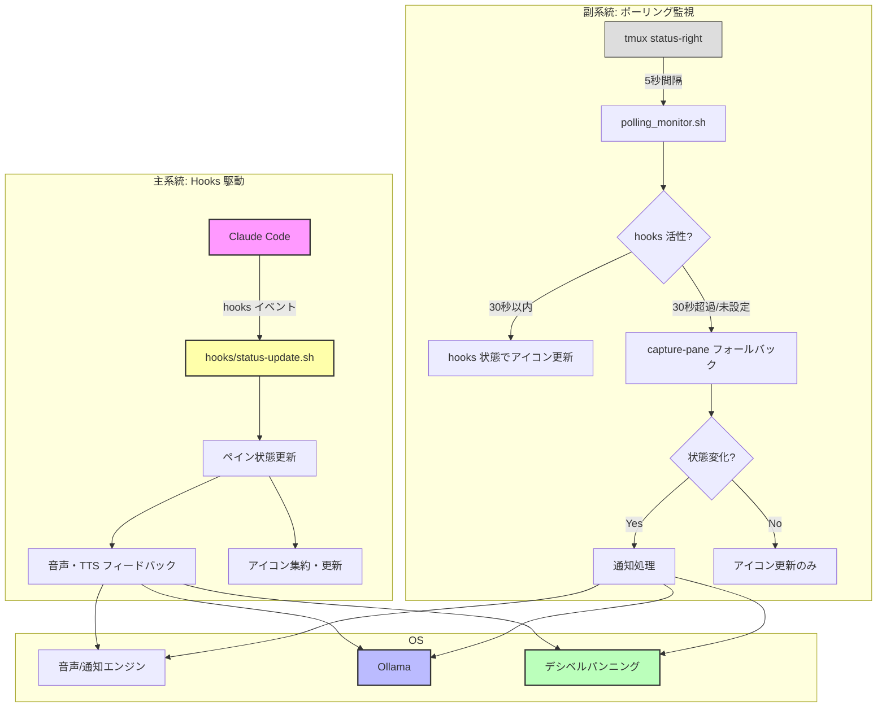

# Tmux Claude Voice: システム概要

## 1. システム概要

本システムは、`tmux`上で動作する**Claude Code**のウィンドウを監視し、その状態変化を**音声**と**システム通知**で開発者にフィードバックするエージェントです。

開発者はClaude Codeの処理中も常に画面を監視する必要がなくなり、他のタスクに集中できます。AIの思考プロセス（Busy）、ユーザーへの問いかけ（Waiting）、処理完了（Idle）といった重要な状態変化をリアルタイムに把握するための「**ガードレール**」として機能します。

### 2. 主要機能

- **自動ペイン検出**: `tmux`のペイン内プロセス名とコンテンツから、Claude Code が動作するペインを自動で特定します（ウィンドウ名による検出も後方互換で対応）。
- **ステータスアイコン表示**: 監視対象ウィンドウのタブ名に、現在の状態を示すアイコンをリアルタイムで表示します（ペイン単位で管理し、ウィンドウレベルに集約）。
  - **⚡️ Busy**: Claudeが思考中またはコードを生成中。
  - **⌛️ Waiting**: Claudeがユーザーの確認、選択肢の入力、またはエラー修正を待っている状態。
  - **✅ Idle**: 処理が完了し、待機している状態。
- **状態変化の音声通知**:
  - `Idle/Waiting` → `Busy`: 開始を知らせる通知音。
  - `Busy` → `Idle`: 完了を知らせる通知音と、**実行結果の要約**の読み上げ。
  - `Busy` → `Waiting`: 注意を促す通知音と、**問い合わせやエラー内容の要約**の読み上げ。
- **デシベルパンニング音声システム**:
  - 複数のClaude Codeウィンドウを同時使用時に、どのウィンドウからの通知かを音像の位置で判別できる空間的音声フィードバックを提供します。
  - **ペイン位置別音像定位**: 各ペインの位置に応じた音像の固定配置。
  - **音量差による識別**: ペイン間の区別を容易にする定位制御。
- **AIによる要約**:
  - 画面のテキストをローカルで動作する`Ollama`に渡し、約30文字の簡潔な日本語要約を生成します。
- **マルチプラットフォーム対応**:
  - **macOS**と**WSL (Windows Subsystem for Linux)**の両環境で動作します。
- **通知モード切り替え**:
  - `Prefix + v + v` キーで、要約機能のON/OFFを簡単にトグルできます。

## 3. 技術選択

| カテゴリ               | 技術・ツール                   | 選定理由                                                                                                                                                                |
| :--------------------- | :----------------------------- | :---------------------------------------------------------------------------------------------------------------------------------------------------------------------- |
| **コアロジック**       | **Bash Script**                | `tmux`コマンドとの親和性が非常に高く、`grep`, `awk`等の標準ツールを活用できます。macOS/WSLで共通のコードベースを維持しやすく、依存関係も最小限に抑えられます。          |
| **監視方式**           | **Hooks + ポーリング**         | Claude Code hooks でリアルタイムに状態を受信（主系統）。`tmux status-right`から5秒間隔のポーリングでフォールバック（副系統）。hooks が30秒以上古い場合に `capture-pane` にフォールバック。 |
| **ステータス判定**     | **`grep` (正規表現)**          | 画面キャプチャ内の特定のキーワードパターンを高速にマッチングさせ、状態を判定します。Busy（処理中）、Waiting（待機）、Idle（待機）の3状態を明確に区別します。            |
| **要約エンジン**       | **`Ollama`**                   | ローカル環境でセキュアに動作するLLMです。API（`curl`）またはCLI経由で簡単に連携可能。ユーザーが好みのモデル（`gemma2`, `phi3`等）を選択できる柔軟性も確保します。       |
| **音声出力 (macOS)**   | **`say`, `ffplay`, `sox`**     | macOS標準の`say`コマンド（Kyoko音声）と`ffplay`によるEqual Power Pan Law対応のデシベルパンニングを実現します。音量制御範囲0.0-1.0。                                     |
| **音声出力 (WSL)**     | **`powershell.exe`, `ffplay`** | Windows PowerShell + System.Speech（Haruka音声）と`ffplay`によるEqual Power Pan Law対応のデシベルパンニングを実現します。音量制御範囲0-100%。                           |
| **デシベルパンニング** | **`ffplay` (macOS/WSL)**       | 左右チャンネル間の音量差を制御することで、音像の定位を調整します。リアルタイム再生に最適で、ファイル生成のオーバーヘッドがありません。                                  |
| **設定管理**           | **`.tmux.conf`**               | ユーザーが自身の環境に合わせて、監視間隔や対象ウィンドウ名、Ollamaモデル等を柔軟にカスタマイズできるようにするため、`tmux`のオプション機構（`@variable`）を利用します。 |

## 4. システム基本設計

### 4.1. 全体アーキテクチャ

システムは **Hooks 駆動（主系統）** と **ポーリング監視（副系統）** のハイブリッド構成です。

#### 主系統: Hooks 駆動

1.  **イベント受信**: Claude Code が hooks イベント（`UserPromptSubmit`, `Stop`, `Notification` 等）を `hooks/status-update.sh` に送信します。
2.  **ペイン解決**: `$TMUX_PANE` からペインターゲット（例: `0:1.1`）を解決します。
3.  **状態遷移**: イベントに応じてペイン単位の状態（`Busy`/`Waiting`/`Idle`）を更新します。
4.  **重複排除**: 前回と同一状態の場合はタイムスタンプのみ更新し、音声フィードバックをスキップします。
5.  **音声フィードバック**: 状態遷移に応じた通知音・TTS読み上げをバックグラウンドで実行します。
6.  **アイコン集約**: ペイン単位のステータスをウィンドウレベルに集約し、アイコンを更新します。

#### 副系統: ポーリング監視（フォールバック）

1.  **ポーリング実行**: `tmux status-right`から5秒間隔で`polling_monitor.sh`が呼び出されます。
2.  **hooks 活性チェック**: hooks タイムスタンプが30秒以内なら、hooks の状態を信頼して `capture-pane` をスキップします。
3.  **フォールバック**: hooks が古い/未設定の場合、従来の `capture-pane` + 正規表現マッチングで状態を判定します。
4.  **アイコン更新**: ウィンドウオプションに最新のステータスアイコンを保存します。

### 4.2. ハイブリッド方式の利点

- **リアルタイム性**: hooks 駆動により、状態変化を即時検出します（ポーリング遅延なし）。
- **堅牢性**: hooks が利用できない環境でもポーリングで動作を保証します。
- **軽量性**: hooks 活性中は `capture-pane` をスキップし、リソース消費を最小化します。
- **ペイン精度**: ペイン単位で状態管理し、同一ウィンドウ内の複数 Claude セッションを識別できます。

### 4.3. ステータス判定システム

#### Hooks 駆動（主系統）

Claude Code の hooks イベントから直接状態を判定します。

| イベント | 判定結果 |
|---|---|
| `UserPromptSubmit` | Busy |
| `PreToolUse` | Busy |
| `Notification(idle_prompt)` | Waiting |
| `Notification(permission_prompt)` | Waiting |
| `Stop` | Idle |
| `SessionStart` | Idle |
| `SessionEnd` | (状態クリア) |

詳細な遷移テーブルは [07-hooks-state-machine.md](./07-hooks-state-machine.md) を参照。

#### capture-pane フォールバック（副系統）

hooks が利用できない場合、画面コンテンツを解析し3つの状態を判定します。

- **状態定義**:
  - **Busy**: Claudeが処理中またはコード生成中の状態
  - **Waiting**: Claudeがユーザーの入力や確認を待っている状態
  - **Idle**: 処理が完了し、待機している状態
- **判定パターン**:
  - **Busy状態**: `tokens.*esc to interrupt`パターンで判定
  - **Waiting状態**: 以下のパターンで判定
    - 確認メッセージ: `Do you want to proceed?`, `Continue?`, `Proceed?`
    - 選択肢: `❯ 1`, `❯ 2`, `❯ 3`, `Choose an option`
    - 質問: `tell Claude what`, `Should I`, `Would you like`
    - 回答オプション: `Yes, and`, `No, keep`
    - エラー: `Error:`, `Failed:`, `Exception:`
  - **Idle状態**: BusyやWaiting以外のすべての状態
- **判定ロジック**:
  - 優先順位: Busy → Waiting → Idle
  - 最初にマッチしたパターンで状態を決定
  - パターンマッチングは大文字小文字を区別しない

## 5. 実装優先順位

1. **Phase 1**: 基本監視システム（`polling_monitor.sh`, `functions.sh`）
2. **Phase 2**: 音声エンジン（`sound_utils.sh`）
3. **Phase 3**: デシベルパンニング（`panning_engine.sh`）
4. **Phase 4**: Ollama連携（`ollama_utils.sh`）
5. **Phase 5**: 統合テストと最適化
6. **Phase 6**: Hooks 統合（`hooks/status-update.sh`, `hooks/setup-hooks.sh`）— ペインレベル検出、リアルタイムイベント駆動

## 6. 実装時の注意点

- 各ファイルは独立してテスト可能な構造にする
- エラーハンドリングを必ず実装する
- ログ出力機能を組み込む
- 設定値のバリデーションを行う
- 依存関係の存在チェックを実装する
- ポーリング方式のため、1回実行で確実に終了するようにする

## 7. テスト戦略

- **単体テスト**: 各関数の独立テスト
- **統合テスト**: ファイル間の連携テスト
- **エンドツーエンドテスト**: 実際のtmux環境での動作確認
- **ポーリングテスト**: status-right統合後の動作確認
