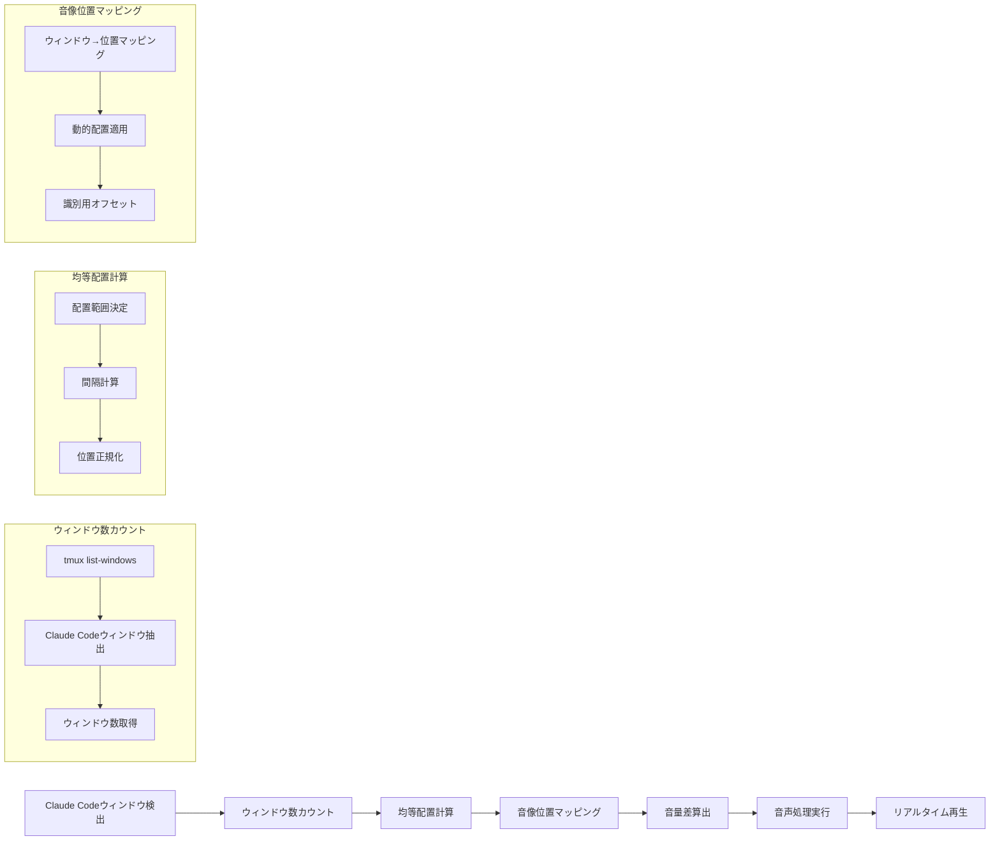

# Tmux Claude Voice: デシベルパンニングエンジン

## 5. デシベルパンニングアーキテクチャ

### 5.1. 音像定位の基本概念

デシベルパンニングは、左右のスピーカー間で音量差（デシベル）を利用して音像を移動させる手法です。本システムでは、Claude Codeの状態変化を空間的な音声フィードバックで表現します。

> **Note**: 検出単位はペインレベルです。`detect_claude_panes()` でペインを検出し、ウィンドウレベルに集約してパンニング位置を計算します。

### 5.2. 動的ウィンドウ配置戦略

| Claude Codeウィンドウ数 | 配置方式   | 音像位置範囲           | 識別効果             |
| :---------------------- | :--------- | :--------------------- | :------------------- |
| **1個**                 | 中央固定   | 0%                     | 中央からの通知       |
| **2個**                 | 左右均等   | -50%, +50%             | 左/右からの通知      |
| **3個**                 | 左/中央/右 | -100%, 0%, +100%       | 左/中央/右からの通知 |
| **4個**                 | 4分割均等  | -75%, -25%, +25%, +75% | 4方向からの通知      |
| **5個以上**             | N分割均等  | -100%～+100%を均等分割 | N方向からの通知      |

### 5.3. Equal Power Pan Law対応のデシベルパンニング

**macOS (ffplay使用)**:

```bash
# Equal Power Pan Law計算 (pan値: -1.0 ～ +1.0)
# left_gain = cos((pan + 1) * π/4)
# right_gain = sin((pan + 1) * π/4)

# 左端定位 (-100%)
ffplay -af "volume=0.707:enable='between(t,0,inf)',volume=0:enable='between(t,0,inf)'" input.wav

# 右端定位 (+100%)
ffplay -af "volume=0:enable='between(t,0,inf)',volume=0.707:enable='between(t,0,inf)'" input.wav

# 中央定位 (0%)
ffplay -af "volume=0.707:enable='between(t,0,inf)'" input.wav

# カスタム定位
left_gain=$(echo "scale=3; c($pan_position * 3.14159 / 2)" | bc -l)
right_gain=$(echo "scale=3; s($pan_position * 3.14159 / 2)" | bc -l)
ffplay -af "volume=${left_gain}:enable='between(t,0,inf)',volume=${right_gain}:enable='between(t,0,inf)'" input.wav
```

**WSL (ffplay使用)**:

```bash
# Equal Power Pan Law対応のステレオパンニング
# 左端定位
ffplay -af "pan=stereo|c0=c0|c1=0" -volume 70 input.wav -nodisp -autoexit

# 右端定位
ffplay -af "pan=stereo|c0=0|c1=c0" -volume 70 input.wav -nodisp -autoexit

# カスタム定位 (Equal Power)
left_gain=$(echo "scale=3; c($pan_position * 3.14159 / 2)" | bc -l)
right_gain=$(echo "scale=3; s($pan_position * 3.14159 / 2)" | bc -l)
ffplay -af "pan=stereo|c0=${left_gain}*c0|c1=${right_gain}*c0" -volume 70 input.wav -nodisp -autoexit
```

### 5.4. 動的ウィンドウ配置システム



### 5.5. 設定可能パラメータ

`.tmux.conf`で以下のパラメータをカスタマイズ可能：

```bash
# デシベルパンニング設定
set -g @claude_voice_panning_enabled "true"
set -g @claude_voice_pan_range "1.0"        # 最大定位範囲 (-1.0 ～ +1.0)
set -g @claude_voice_pan_identification "true"  # ウィンドウ識別機能の有効化

# 動的配置設定
set -g @claude_voice_pan_dynamic "true"     # 動的配置の有効化
set -g @claude_voice_pan_margin "0.1"       # 端からの余白 (0.0 ～ 0.5)
set -g @claude_voice_pan_min_distance "0.15" # ウィンドウ間の最小距離

# Claude Codeウィンドウ検出パターン
set -g @claude_voice_window_pattern "Claude|claude|CLAUDE"  # 検出するウィンドウ名パターン
```

### 5.6. 実装関数

```bash
# Claude Code ペインを検出する関数（プロセスベース + コンテンツベース）
# 戻り値: "session:window.pane" 形式のペインターゲット一覧
detect_claude_panes() {
    # 1. プロセス名 "claude" で直接検出
    # 2. プロセス名 "node" の場合、capture-pane で Claude 特有パターンを判定
    # 詳細は functions.sh を参照
}

# Claude Codeウィンドウを検出する関数（後方互換ラッパー）
# ペインレベル検出結果をウィンドウに集約して返す
detect_claude_windows() {
    local pattern=$(tmux show-option -gv @claude_voice_window_pattern 2>/dev/null || echo "Claude|claude|CLAUDE")
    tmux list-windows -F "#{window_index}:#{window_name}" | grep -E ":$pattern" | cut -d: -f1,2
}

# Claude Codeウィンドウ数を取得する関数
count_claude_windows() {
    detect_claude_windows | wc -l
}

# ウィンドウの均等配置位置を計算する関数
calculate_equal_spacing() {
    local window_name="$1"
    local total_claude_windows=$(count_claude_windows)

    if [[ $total_claude_windows -eq 0 ]]; then
        echo "0.0"  # デフォルト位置
        return
    fi

    # Claude Codeウィンドウのリストを取得し、対象ウィンドウのインデックスを特定
    local claude_windows=($(detect_claude_windows | cut -d: -f1 | sort -n))
    local target_index=-1

    for i in "${!claude_windows[@]}"; do
        local window_info=$(tmux list-windows -F "#{window_index}:#{window_name}" | grep "^${claude_windows[$i]}:")
        if [[ "$window_info" == *":$window_name" ]]; then
            target_index=$i
            break
        fi
    done

    if [[ $target_index -eq -1 ]]; then
        echo "0.0"  # デフォルト位置
        return
    fi

    # 均等配置の計算
    local margin=$(tmux show-option -gv @claude_voice_pan_margin 2>/dev/null || echo "0.1")
    local usable_range=$(echo "scale=3; 2 * (1 - $margin)" | bc)
    local spacing=$(echo "scale=3; $usable_range / ($total_claude_windows - 1)" | bc)
    local start_position=$(echo "scale=3; -1 + $margin" | bc)

    local position=$(echo "scale=3; $start_position + $target_index * $spacing" | bc)
    echo "$position"
}

# ウィンドウ位置に基づく音像位置を計算する関数
calculate_pan_position() {
    local window_name="$1"
    local dynamic_enabled=$(tmux show-option -gv @claude_voice_pan_dynamic 2>/dev/null || echo "true")

    if [[ "$dynamic_enabled" == "true" ]]; then
        # 動的配置を使用
        local position=$(calculate_equal_spacing "$window_name")
        local min_distance=$(tmux show-option -gv @claude_voice_pan_min_distance 2>/dev/null || echo "0.15")

        # 最小距離を確保するための調整
        local adjusted_position=$(echo "scale=3; $position * (1 - $min_distance/2)" | bc)
        echo "$adjusted_position"
    else
        # 従来の固定配置を使用
        local window_position=$(get_window_position "$window_name")
        local offset=$(tmux show-option -gv @claude_voice_pan_offset 2>/dev/null || echo "0.1")
        local adjusted_position=$(echo "scale=2; $window_position * (1 - $offset)" | bc)
        echo "$adjusted_position"
    fi
}

# Equal Power Pan Law対応のデシベルパンニングを適用する関数
apply_panning() {
    local input_file="$1"
    local pan_position="$2"
    local os_type=$(get_os_type)
    local pan_law=$(tmux show-option -gv @claude_voice_pan_law 2>/dev/null || echo "equal_power")

    if [[ "$pan_law" == "equal_power" ]]; then
        # Equal Power Pan Law: cos/sin関数を使用
        local angle=$(echo "scale=6; ($pan_position + 1) * 3.14159 / 4" | bc -l)
        local left_gain=$(echo "scale=6; c($angle)" | bc -l)
        local right_gain=$(echo "scale=6; s($angle)" | bc -l)
    else
        # Linear Pan Law: 線形補間
        local left_gain=$(echo "scale=6; (1 + $pan_position) / 2" | bc -l)
        local right_gain=$(echo "scale=6; (1 - $pan_position) / 2" | bc -l)
    fi

    if [[ "$os_type" == "Darwin" ]]; then
        # macOS: ffplay使用（リアルタイム再生）
        local volume=$(tmux show-option -gv @claude_voice_volume_macos 2>/dev/null || echo "0.8")
        ffplay -af "pan=stereo|c0=${left_gain}*c0|c1=${right_gain}*c0" -volume $(echo "$volume * 100" | bc) "$input_file" -nodisp -autoexit &
    else
        # WSL: ffplay使用（リアルタイム再生）
        local volume=$(tmux show-option -gv @claude_voice_volume_wsl 2>/dev/null || echo "80")
        ffplay -af "pan=stereo|c0=${left_gain}*c0|c1=${right_gain}*c0" -volume "$volume" "$input_file" -nodisp -autoexit &
    fi
}

# ウィンドウ識別用の音声通知を生成する関数
create_window_identified_sound() {
    local window_name="$1"
    local sound_type="$2"  # start, complete, waiting

    local pan_position=$(calculate_pan_position "$window_name")
    local sound_file=$(get_system_sound_path "$sound_type")

    # デシベルパンニングを適用してリアルタイム再生
    apply_panning "$sound_file" "$pan_position"
}
```

## 実装チェックリスト

### Phase 3: デシベルパンニング

- [ ] `panning_engine.sh`の作成
- [ ] ウィンドウ位置検出機能の実装
- [ ] Equal Power Pan Law計算の実装
- [ ] ffplay連携機能の実装
- [ ] 動的配置計算の実装
- [ ] 音像位置マッピング機能の実装
- [ ] リアルタイム再生機能の実装
- [ ] 設定パラメータの実装
- [ ] エラーハンドリングの実装
- [ ] 単体テストの作成

### テスト項目

1. **ウィンドウ検出テスト**
   - 単一ウィンドウの検出
   - 複数ウィンドウの検出
   - パターンマッチングの精度

2. **配置計算テスト**
   - 均等配置の計算精度
   - 動的配置の動作確認
   - 境界値での動作確認

3. **音像定位テスト**
   - Equal Power Pan Lawの計算精度
   - 音量差の測定
   - 音像位置の視覚的確認

4. **統合テスト**
   - 実際のtmux環境での動作確認
   - 複数ウィンドウでの識別精度
   - パフォーマンステスト
