# TMux Claude Voice - コンテナアーキテクチャ

## C4 Model - Level 2: Container Diagram

```mermaid
C4Container
    title Container Diagram for TMux Claude Voice System

    Person(user, "Development User")
    
    Container_Boundary(tmux_system, "TMux Claude Voice System") {
        Container(config_manager, "Configuration Manager", "Shell Scripts + YAML", "Unified configuration system with YAML-to-platform generation")
        Container(voice_engine, "Voice Engine Core", "Shell Scripts", "Cross-platform voice synthesis and audio management")
        Container(ai_integration, "AI Integration Layer", "Shell/Python", "Claude API client and LLM processing")
        Container(platform_adapters, "Platform Adapters", "Shell Scripts", "OS-specific implementations (WSL/macOS/Linux)")
        Container(tmux_hooks, "TMux Integration", "TMux Hooks", "Session/window/pane event handling")
        Container(status_detector, "Status Detection", "Shell Scripts", "Claude Code status monitoring and analysis")
        Container(session_manager, "Session Manager", "Shell Scripts", "Per-session state and configuration management")
        Container(monitoring, "Monitoring & Metrics", "Shell/JSON", "Performance monitoring and health checks")
    }
    
    ContainerDb(config_store, "Configuration Store", "YAML/JSON Files", "Unified configuration data")
    ContainerDb(session_store, "Session Store", "File System", "Per-session state and cache")
    ContainerDb(log_store, "Log Store", "Structured Logs", "Application logs and metrics")
    
    Container_Ext(claude_api, "Claude API", "REST API", "Anthropic's Claude AI service")
    Container_Ext(windows_tts, "Windows TTS", "PowerShell + Speech API", "Microsoft speech synthesis")
    Container_Ext(macos_speech, "macOS Speech", "osascript + say", "Apple speech framework")
    Container_Ext(linux_speech, "Linux Speech", "espeak/festival", "Linux speech synthesis")
    Container_Ext(tmux_core, "TMux Core", "C/Terminal", "Terminal multiplexer")
    
    Rel(user, tmux_hooks, "Triggers events", "terminal interactions")
    
    Rel(tmux_hooks, status_detector, "Status change", "window/pane events")
    Rel(status_detector, ai_integration, "Content analysis", "screen text + context")
    Rel(ai_integration, voice_engine, "Speech request", "processed text + metadata")
    Rel(voice_engine, platform_adapters, "Platform call", "speech synthesis parameters")
    
    Rel(config_manager, config_store, "Read/Write", "YAML configuration")
    Rel(session_manager, session_store, "State mgmt", "session-specific data")
    Rel_Back(monitoring, log_store, "Metrics/Logs", "performance data")
    
    Rel(platform_adapters, windows_tts, "PowerShell exec", "TTS synthesis")
    Rel(platform_adapters, macos_speech, "osascript call", "speech synthesis")
    Rel(platform_adapters, linux_speech, "command exec", "audio output")
    
    Rel(ai_integration, claude_api, "HTTPS", "AI processing")
    Rel(tmux_hooks, tmux_core, "Hooks/Events", "session management")
    
    Rel(config_manager, voice_engine, "Configuration", "voice settings")
    Rel(config_manager, platform_adapters, "Platform config", "OS-specific settings")
    Rel(session_manager, voice_engine, "Session state", "per-session preferences")
    
    UpdateElementStyle(voice_engine, $bgColor="#1168bd", $fontColor="#ffffff")
    UpdateElementStyle(config_manager, $bgColor="#1168bd", $fontColor="#ffffff")
```



## コンテナ詳細仕様

### 1. Configuration Manager
**責任**: 統一設定システムの管理
- **技術**: Shell Scripts (Bash 4.0+), YAML Processing
- **主要機能**:
  - YAML設定の解析・検証
  - プラットフォーム固有設定の生成
  - 設定移行・バックアップ管理
  - 設定検証・整合性チェック
- **API**:
  ```bash
  config_get_value(key, default)
  config_set_value(key, value)
  config_generate_platform(platform)
  config_validate_all()
  ```

### 2. Voice Engine Core
**責任**: クロスプラットフォーム音声システムの統一管理
- **技術**: Shell Scripts, Audio Processing Libraries
- **主要機能**:
  - 統一音声API提供
  - 音響効果処理 (Pan Law, EQ)
  - 並行音声処理制御
  - 音声キューマネジメント
- **音声能力**:
  - Text-to-Speech統合
  - Sound Effects (Beep patterns)
  - Stereo Panning (3dB Equal Power)
  - Volume/Speed調整

### 3. AI Integration Layer
**責任**: LLM統合とコンテンツ処理
- **技術**: Shell Scripts + Python/Node.js Bridge
- **主要機能**:
  - Claude API通信
  - テキスト前処理・後処理
  - 翻訳・要約処理
  - コンテキスト管理
- **統合パターン**:
  - RESTful API Client
  - Streaming Response Processing
  - Error Handling & Retry Logic
  - Rate Limiting & Quota Management

### 4. Platform Adapters
**責任**: OS固有実装の抽象化
- **技術**: Platform-specific Shell Scripts
- **サポートプラットフォーム**:
  - **WSL**: PowerShell interop, Windows API access
  - **macOS**: osascript integration, Audio Units
  - **Linux**: PulseAudio/ALSA, X11 integration
  - **FreeBSD**: Basic audio support
- **アダプターパターン**:
  ```bash
  platform_speak(text, voice, speed, volume)
  platform_play_sound(frequency, duration)
  platform_detect_capabilities()
  ```

### 5. TMux Integration
**責任**: TMux イベントシステムとの統合
- **技術**: TMux Hooks, Shell Event Handlers
- **主要フック**:
  - `session-created`: セッション初期化
  - `window-renamed`: ウィンドウ状態変更
  - `pane-focus-changed`: フォーカス変更
  - `after-new-window`: 新規ウィンドウ
- **統合レベル**:
  - Non-intrusive Integration
  - Graceful Degradation
  - Configuration Isolation

### 6. Status Detection
**責任**: Claude Code ステータスの検出・分析
- **技術**: Shell Scripts + Text Processing
- **検出状態**:
  - `⚡ Busy`: コード実行中・処理中
  - `⌛ Waiting`: 入力待機・アイドル
  - `✅ Complete`: タスク完了・成功
- **検出ロジック**:
  - Screen Content Analysis
  - Process Monitoring
  - Window Title Analysis
  - Contextual Pattern Matching

### 7. Session Manager
**責任**: セッション固有状態の管理
- **技術**: File-based State Management
- **管理データ**:
  - Session Preferences
  - User Context
  - Performance Metrics
  - Error History
- **ライフサイクル**:
  ```bash
  session_init(session_id)
  session_update_state(session_id, key, value)
  session_cleanup(session_id)
  session_backup(session_id)
  ```

### 8. Monitoring & Metrics
**責任**: システム監視と性能追跡
- **技術**: Structured Logging + JSON Metrics
- **監視項目**:
  - Response Latency (音声出力まで)
  - Resource Usage (CPU/Memory)
  - Error Rates & Recovery
  - User Interaction Patterns
- **出力形式**:
  - JSON Lines Logging
  - Metrics Export (Prometheus-compatible)
  - Health Check Endpoints

## データストア詳細

### Configuration Store
**技術**: YAML + JSON Files
**構造**:
```
/home/user/dotfiles/.tmux/config/
├── tmux-unified.yaml          # 統一設定
├── platform-overrides/       # プラットフォーム固有上書き
│   ├── wsl.yaml
│   ├── macos.yaml
│   └── linux.yaml
└── user-preferences.yaml     # ユーザー個別設定
```

### Session Store  
**技術**: File System + Cache Files
**構造**:
```
/home/user/dotfiles/.tmux/claude/sessions/
├── {session-id}/
│   ├── state.json            # セッション状態
│   ├── preferences.yaml      # セッション固有設定
│   ├── metrics.jsonl         # パフォーマンスメトリクス
│   └── cache/               # キャッシュデータ
└── global/
    ├── platform_cache        # プラットフォーム検出キャッシュ
    └── capability_cache      # 機能検出キャッシュ
```

### Log Store
**技術**: Structured Logging (JSON Lines)
**ログレベル**: DEBUG, INFO, WARN, ERROR, FATAL
**ローテーション**: 10MB × 5ファイル
**フォーマット**:
```json
{
  "timestamp": "2025-08-03T10:30:45Z",
  "level": "INFO",
  "component": "voice_engine",
  "session_id": "tmux_1234",
  "message": "Speech synthesis completed",
  "metrics": {
    "latency_ms": 1250,
    "text_length": 45,
    "platform": "wsl"
  }
}
```

## 通信パターンとプロトコル

### 内部通信
- **プロセス間通信**: Named Pipes, Shared Files
- **状態共有**: File-based State Management
- **イベント配信**: TMux Hook System
- **設定同期**: File Watch + Reload

### 外部通信
- **Claude API**: HTTPS REST (JSON over HTTP/1.1)
- **PowerShell**: Command Execution (stdin/stdout)
- **OS音声システム**: Command Line Interface
- **TMux**: Hook Scripts + Environment Variables

## デプロイメント戦略

### 単一マシン デプロイメント
```bash
# 標準インストール
./install.sh --platform=auto --config=unified

# 開発環境
./install.sh --dev --verbose --testing
```

### 分散デプロイメント
```bash
# サーバー環境 (音声なし)
./install.sh --server --no-audio --monitoring

# デスクトップ環境 (フル機能)
./install.sh --desktop --all-features
```

### コンテナ化 (将来)
```dockerfile
FROM ubuntu:22.04
RUN apt-get update && apt-get install -y tmux bash curl
COPY . /opt/tmux-claude-voice
RUN /opt/tmux-claude-voice/install.sh --container
ENTRYPOINT ["/opt/tmux-claude-voice/entrypoint.sh"]
```

## スケーラビリティ考慮事項

### 垂直スケーリング
- **メモリ使用量**: セッション数に比例 (~10MB/session)
- **CPU使用率**: AI処理時のスパイク対応
- **ストレージ**: ログローテーション・キャッシュ管理

### 水平スケーリング
- **セッション分散**: 複数マシン間での負荷分散
- **AI処理分離**: 専用AI処理サーバーとの統合
- **設定同期**: Git-based Configuration Distribution

このコンテナアーキテクチャにより、システムの各責任が明確に分離され、保守性・拡張性・テスト容易性が向上しています。