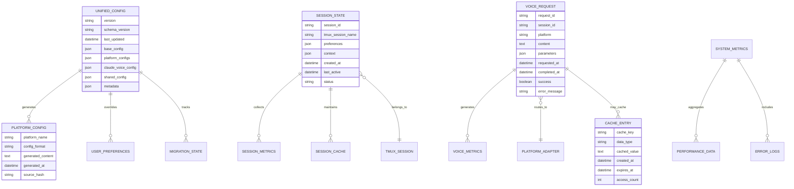
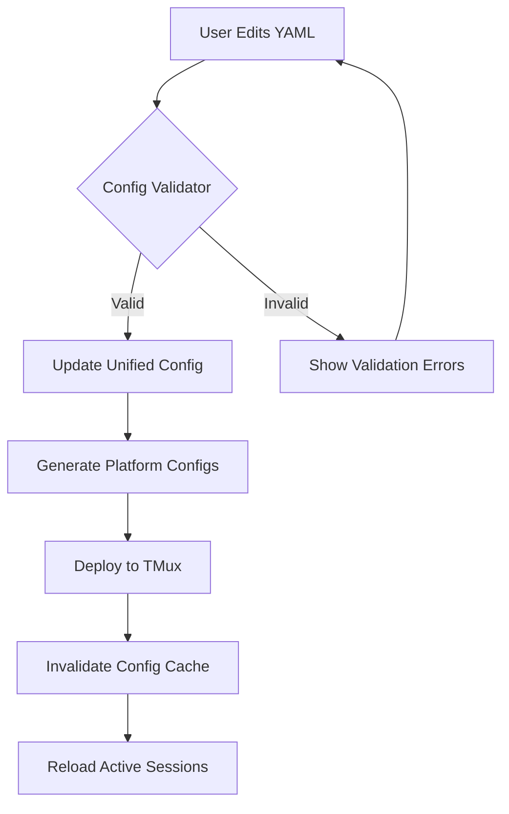
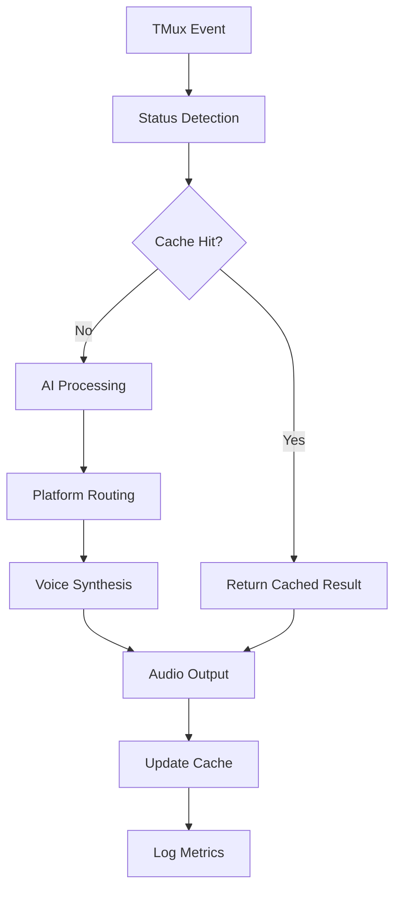
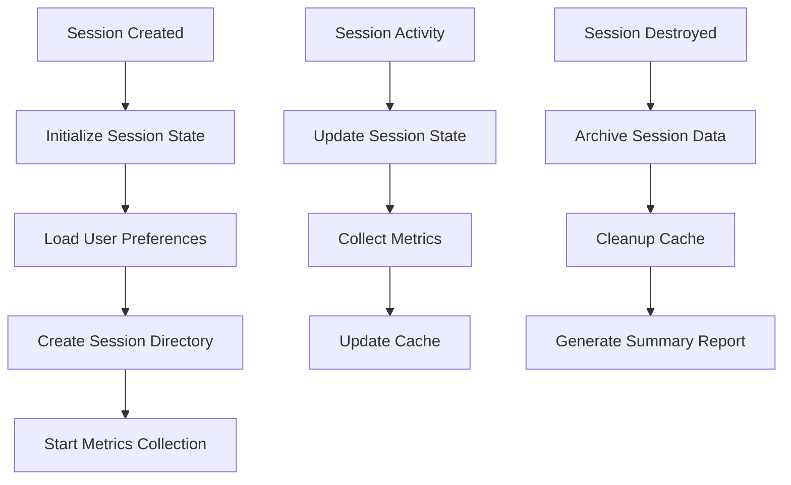

# TMux Claude Voice - データアーキテクチャ

## データモデル概要

TMux Claude Voice システムは、**多層データアーキテクチャ**を採用し、設定データ、セッション状態、メトリクス、キャッシュデータを体系的に管理しています。



## データストレージ戦略

### 1. 設定データ (Configuration Data)

#### 統一YAML設定
**場所**: `/home/user/dotfiles/.tmux/config/tmux-unified.yaml`
**形式**: YAML
**サイズ**: ~50KB
**アクセスパターン**: 読み込み頻度高、更新頻度低

```yaml
# データ構造例
metadata:
  version: "1.0.0"
  schema_version: "1.0"
  last_updated: "2025-08-03T10:30:45Z"
  checksum: "sha256:abc123..."

base:
  shell: {default_command: "zsh"}
  prefix: {key: "C-z", enable_double_tap: true}
  # ... 基本設定

platforms:
  wsl:
    environment: {WSL_INTEGRATION: "enabled"}
    clipboard: {enabled: true, command: "clip.exe"}
    # ... WSL固有設定
  macos:
    audio: {unit_integration: true}
    # ... macOS固有設定
  linux:
    audio: {system: "pulseaudio"}
    # ... Linux固有設定

claude_voice:
  master: {auto_summary_enabled: true}
  states:
    complete: {enabled: true, voice_synthesis: true}
    waiting: {enabled: true, voice_synthesis: false}
    busy: {enabled: false}
  # ... Claude Voice設定
```

#### 生成済みプラットフォーム設定
**場所**: `/home/user/dotfiles/.tmux/generated/`
**形式**: TMux Configuration Format
**アクセスパターン**: TMux起動時読み込み

```bash
# ディレクトリ構造
generated/
├── tmux-wsl.conf           # WSL用生成設定
├── tmux-macos.conf         # macOS用生成設定
├── tmux-linux.conf         # Linux用生成設定
└── generation-metadata.json # 生成メタデータ
```

#### ユーザー個別設定
**場所**: `/home/user/dotfiles/.tmux/config/user-overrides.yaml`
**形式**: YAML
**用途**: ユーザー固有のカスタマイゼーション

### 2. セッションデータ (Session Data)

#### セッション状態管理
**場所**: `/home/user/dotfiles/.tmux/claude/sessions/{session_id}/`
**形式**: JSON + Binary Files
**ライフサイクル**: セッション作成〜破棄

```json
// state.json - セッション状態
{
  "session_id": "tmux_20250803_103045",
  "tmux_session_name": "main",
  "created_at": "2025-08-03T10:30:45Z",
  "last_active": "2025-08-03T10:35:12Z",
  "status": "active",
  "preferences": {
    "voice_enabled": true,
    "auto_summary": true,
    "notification_mode": "sound",
    "volume": 80,
    "speech_rate": 200
  },
  "context": {
    "current_directory": "/home/user/project",
    "active_windows": [1, 2, 3],
    "last_claude_status": "✅",
    "work_session_type": "coding"
  },
  "statistics": {
    "voice_requests": 45,
    "successful_synthesis": 43,
    "avg_response_time_ms": 1250,
    "last_error": null
  }
}
```

#### セッション固有キャッシュ
**場所**: `/home/user/dotfiles/.tmux/claude/sessions/{session_id}/cache/`
**内容**: プリコンパイル済み音声、検出結果キャッシュ

```bash
cache/
├── voice_synthesis/        # 音声合成結果キャッシュ
│   ├── hash_abc123.wav    # TTS結果
│   └── hash_def456.wav
├── platform_detection     # プラットフォーム検出キャッシュ
├── capability_cache       # 機能検出キャッシュ
└── ai_responses/          # AI応答キャッシュ
    ├── summary_xyz789.json
    └── translation_uvw012.json
```

### 3. メトリクスとログデータ

#### 構造化ログ
**場所**: `/home/user/dotfiles/.tmux/claude/logs/`
**形式**: JSON Lines (JSONL)
**ローテーション**: 10MB × 5ファイル

```jsonl
{"timestamp":"2025-08-03T10:30:45Z","level":"INFO","component":"voice_engine","session_id":"tmux_123","message":"Speech synthesis completed","metrics":{"latency_ms":1250,"text_length":45,"platform":"wsl"}}
{"timestamp":"2025-08-03T10:30:46Z","level":"DEBUG","component":"platform_router","session_id":"tmux_123","message":"Platform capability check","platform":"wsl","capability":"speech","result":true}
{"timestamp":"2025-08-03T10:30:47Z","level":"WARN","component":"queue_manager","session_id":"tmux_123","message":"Queue depth approaching limit","queue_depth":8,"max_depth":10}
```

#### パフォーマンスメトリクス
**場所**: `/home/user/dotfiles/.tmux/claude/logs/metrics.jsonl`
**形式**: Time Series JSON
**保持期間**: 30日間

```json
{
  "timestamp": "2025-08-03T10:30:45Z",
  "type": "performance_metrics",
  "session_id": "tmux_123",
  "metrics": {
    "voice_synthesis": {
      "requests_per_minute": 5.2,
      "avg_latency_ms": 1250,
      "success_rate": 0.956,
      "error_rate": 0.044
    },
    "system_resources": {
      "cpu_percent": 15.3,
      "memory_mb": 45.2,
      "disk_io_mb_per_sec": 2.1
    },
    "platform_distribution": {
      "wsl": 0.7,
      "macos": 0.2,
      "linux": 0.1
    }
  }
}
```

#### エラートラッキング
**場所**: `/home/user/dotfiles/.tmux/claude/logs/errors.jsonl`
**分類**: エラーレベル、コンポーネント、プラットフォーム別

```json
{
  "timestamp": "2025-08-03T10:30:45Z",
  "level": "ERROR",
  "component": "wsl_adapter",
  "session_id": "tmux_123",
  "error_code": "WSL_POWERSHELL_TIMEOUT",
  "error_message": "PowerShell command timed out after 30 seconds",
  "context": {
    "text_length": 156,
    "voice": "Microsoft Haruka Desktop",
    "command": "powershell.exe -Command 'Add-Type -AssemblyName System.Speech...'",
    "platform": "wsl",
    "retry_count": 2
  },
  "stack_trace": "/home/user/dotfiles/.tmux/claude/platforms/wsl/wsl_voice_engine.sh:245",
  "resolution": "automatic_retry_with_shorter_text"
}
```

### 4. キャッシュデータアーキテクチャ

#### 多層キャッシュシステム
```
┌─────────────────────────────────────────────────────────┐
│                  Memory Cache (L1)                      │
│  - Configuration values                                  │
│  - Platform detection results                           │
│  - Recently used voice parameters                       │
│  - TTL: 5 minutes, Size: ~10MB                         │
├─────────────────────────────────────────────────────────┤
│                  Disk Cache (L2)                        │
│  - Voice synthesis results                              │
│  - AI processing results                                │
│  - Capability detection                                 │
│  - TTL: 1 hour, Size: ~100MB                          │
├─────────────────────────────────────────────────────────┤
│               Persistent Cache (L3)                     │
│  - User preferences                                     │
│  - Historical metrics                                   │
│  - Long-term configuration                              │
│  - TTL: 30 days, Size: ~1GB                           │
└─────────────────────────────────────────────────────────┘
```

#### キャッシュキー設計
```bash
# キャッシュキー命名規則
CACHE_KEY_FORMAT="{component}:{operation}:{parameters_hash}"

# 例
voice_synthesis:speak:sha256(text+voice+speed+volume)
platform_detection:wsl:capability_speech
ai_processing:summarize:sha256(content+model+parameters)
config_value:claude_voice.states.complete.enabled
```

#### キャッシュ無効化戦略
```bash
# 時間ベース無効化
cache_set_with_ttl() {
    local key="$1"
    local value="$2"
    local ttl_seconds="$3"
    local expires_at=$(($(date +%s) + ttl_seconds))
    
    echo "$expires_at:$value" > "$cache_dir/$key"
}

# イベントベース無効化
invalidate_config_cache() {
    find "$cache_dir" -name "config_value:*" -delete
    log_info "Configuration cache invalidated"
}

# 依存関係ベース無効化
invalidate_dependent_caches() {
    local changed_component="$1"
    
    case "$changed_component" in
        "platform_detection")
            find "$cache_dir" -name "*:$platform:*" -delete
            ;;
        "voice_config")
            find "$cache_dir" -name "voice_synthesis:*" -delete
            ;;
    esac
}
```

## データフロー図

### 設定データフロー


### 音声処理データフロー


### セッション管理データフロー


## データガバナンスとライフサイクル

### データ分類
```yaml
data_classification:
  public:
    - Configuration templates
    - Documentation
    - Example files
  internal:
    - User preferences
    - Session metrics
    - Performance data
  confidential:
    - API keys
    - Personal content
    - Voice recordings (if cached)
  restricted:
    - Credential files
    - Private repository content
```

### データ保持ポリシー
```yaml
retention_policy:
  configuration:
    type: "permanent"
    backup: "git_versioned"
    
  session_state:
    type: "session_lifetime"
    cleanup: "on_session_destroy"
    
  metrics:
    type: "time_based"
    retention_days: 30
    aggregation: "daily_summaries"
    
  cache:
    type: "size_and_time_based"
    max_size_mb: 1000
    max_age_days: 7
    cleanup_strategy: "lru"
    
  logs:
    type: "rolling_files"
    max_files: 5
    max_size_mb: 10
    compression: true
```

### データ同期とバックアップ
```bash
# Git-based configuration backup
backup_configuration() {
    cd "$DOTFILES_DIR"
    git add .tmux/config/
    git commit -m "Auto-backup: TMux configuration $(date -Iseconds)"
    git push origin main 2>/dev/null || true
}

# Session data backup
backup_session_data() {
    local session_id="$1"
    local backup_dir="$HOME/.tmux-backups/$(date +%Y%m%d)"
    
    mkdir -p "$backup_dir"
    tar -czf "$backup_dir/session_${session_id}.tar.gz" \
        "$TMUX_DIR/claude/sessions/$session_id"
}

# Metrics export
export_metrics() {
    local start_date="$1"
    local end_date="$2"
    local output_file="$3"
    
    # Export as CSV for external analysis
    jq -r '[.timestamp, .type, .metrics.voice_synthesis.avg_latency_ms, .metrics.system_resources.cpu_percent] | @csv' \
        "$TMUX_DIR/claude/logs/metrics.jsonl" > "$output_file"
}
```

## データインテグリティと検証

### データ検証ルール
```bash
# Configuration validation
validate_config_integrity() {
    local config_file="$1"
    
    # Schema validation
    validate_yaml_schema "$config_file" "$schema_file" || return 1
    
    # Business rule validation
    validate_platform_compatibility "$config_file" || return 1
    validate_resource_limits "$config_file" || return 1
    validate_security_constraints "$config_file" || return 1
}

# Data consistency checks
check_data_consistency() {
    # Check cache consistency
    verify_cache_coherence
    
    # Check session state consistency
    verify_session_states
    
    # Check metrics data integrity
    verify_metrics_integrity
}
```

### 災害復旧
```bash
# Configuration recovery
recover_configuration() {
    # Restore from git
    git checkout HEAD~1 -- .tmux/config/
    
    # Regenerate platform configs
    "$SCRIPT_DIR/config-generator.sh" --all
    
    # Restart affected sessions
    tmux list-sessions -F "#{session_name}" | \
        xargs -I {} tmux source-file ~/.tmux.conf
}

# Data recovery procedures
recover_corrupted_data() {
    local data_type="$1"
    
    case "$data_type" in
        "cache")
            rm -rf "$CACHE_DIR"
            mkdir -p "$CACHE_DIR"
            log_info "Cache cleared and rebuilt"
            ;;
        "session")
            restore_session_from_backup "$2"
            ;;
        "metrics")
            rebuild_metrics_from_logs
            ;;
    esac
}
```

このデータアーキテクチャにより、TMux Claude Voice システムは堅牢で効率的なデータ管理を実現し、高い可用性とパフォーマンスを維持しています。