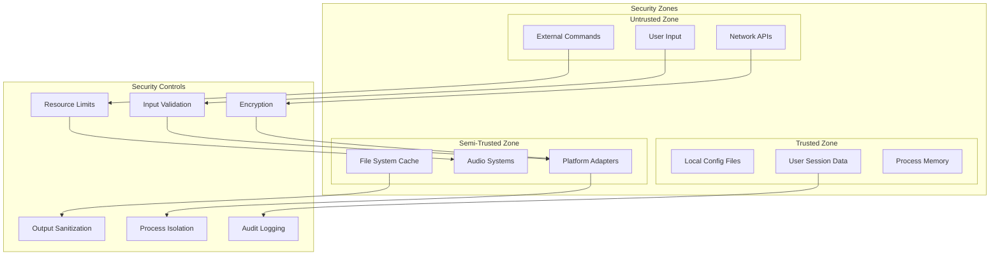
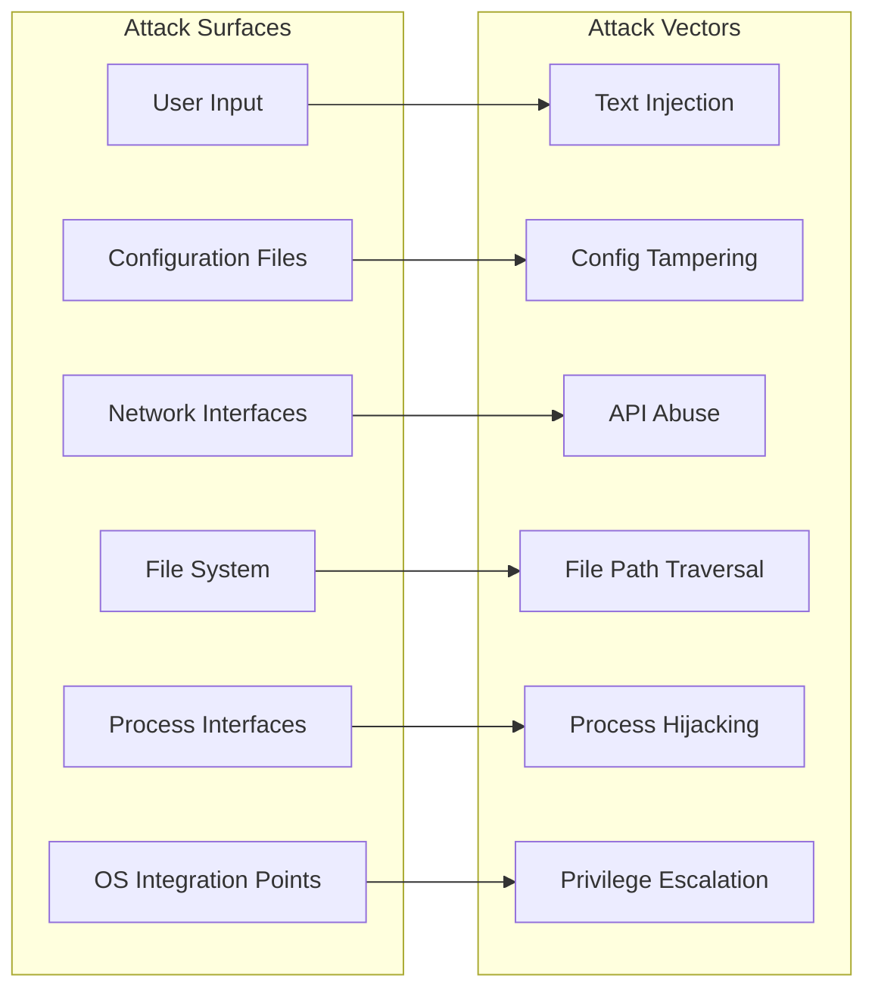

# TMux Claude Voice - セキュリティアーキテクチャ

## セキュリティモデル概要

TMux Claude Voice システムは、**多層防御アプローチ**を採用し、機密データの保護、不正アクセスの防止、セキュアな実行環境の提供を実現しています。



## 脅威モデル分析

### 1. 識別された脅威

#### 高リスク脅威
1. **コマンドインジェクション**
   - **ベクター**: 未検証のユーザー入力 → PowerShell/Shell実行
   - **影響**: 任意コード実行、システム侵害
   - **攻撃者**: 悪意のあるテキスト送信、設定ファイル改竄

2. **機密情報漏洩**
   - **ベクター**: ログファイル、音声キャッシュ、プロセスメモリ
   - **影響**: API keys、個人データ、作業内容の漏洩
   - **攻撃者**: ローカルアクセス権限を持つユーザー

3. **権限昇格**
   - **ベクター**: WSL-Windows境界越え、sudo実行
   - **影響**: システム管理者権限の取得
   - **攻撃者**: 内部攻撃者、悪意のあるスクリプト

#### 中リスク脅威
1. **サービス拒否攻撃**
   - **ベクター**: 大量音声要求、リソース枯渇
   - **影響**: システム応答性低下、音声サービス停止

2. **データ改竄**
   - **ベクター**: 設定ファイル書き換え、キャッシュ操作
   - **影響**: 不正な動作、設定破壊

3. **プライバシー侵害**
   - **ベクター**: 音声内容の記録、使用パターン分析
   - **影響**: 個人情報の不正収集

### 2. 攻撃表面分析



## セキュリティコントロール実装

### 1. 入力検証とサニタイゼーション

#### テキスト入力の厳格な検証
```bash
# Multi-layer input validation
validate_text_input() {
    local text="$1"
    local max_length="${2:-5000}"
    local context="${3:-general}"
    
    # Length validation
    if [[ ${#text} -gt $max_length ]]; then
        log_security_event "TEXT_TOO_LONG" "Input length ${#text} exceeds limit $max_length"
        return 1
    fi
    
    # Character whitelist validation
    if [[ ! "$text" =~ ^[[:print:][:space:]]*$ ]]; then
        log_security_event "INVALID_CHARACTERS" "Non-printable characters detected in input"
        return 1
    fi
    
    # Dangerous pattern detection
    local dangerous_patterns=(
        '\$\('          # Command substitution
        '`'             # Backtick command execution  
        '\|\|'          # Command chaining
        '&&'            # Command chaining
        ';'             # Command separator
        '\.\.'          # Path traversal
        '/etc/'         # System file access
        'rm -rf'        # Dangerous deletion
        '(^|[[:space:]])sudo([[:space:]]|$)'  # Privilege escalation (command context only)
        'passwd'        # Password change
    )
    
    for pattern in "${dangerous_patterns[@]}"; do
        if [[ "$text" =~ $pattern ]]; then
            log_security_event "DANGEROUS_PATTERN" "Dangerous pattern '$pattern' detected in input"
            return 1
        fi
    done
    
    # Context-specific validation  
    case "$context" in
        "voice_synthesis")
            validate_voice_text "$text"
            ;;
        "file_path")
            validate_file_path "$text"
            ;;
        "command")
            validate_command_input "$text"
            ;;
    esac
}

# PowerShell injection prevention
escape_powershell_string() {
    local input="$1"
    
    # Replace dangerous characters
    input=${input//\'/\'\'}        # Escape single quotes
    input=${input//\"/\"\"}        # Escape double quotes  
    input=${input//\$/\`\$}        # Escape dollar signs
    input=${input//\`/\`\`}        # Escape backticks
    input=${input//\|/\`\|}        # Escape pipes
    input=${input//&/\`&}          # Escape ampersands
    input=${input//</\`<}          # Escape less than
    input=${input//>/\`>}          # Escape greater than
    
    echo "$input"
}

# Shell command argument sanitization
sanitize_shell_argument() {
    local arg="$1"
    
    # Remove null bytes
    arg=${arg//$'\0'/}
    
    # Escape shell metacharacters
    printf '%q' "$arg"
}
```

#### 設定ファイル検証
```bash
# Configuration security validation
validate_config_security() {
    local config_file="$1"
    
    # File permission check
    local file_perms=$(stat -c %a "$config_file")  
    if [[ "$file_perms" != "600" && "$file_perms" != "644" ]]; then
        log_security_event "INSECURE_PERMISSIONS" "Config file has insecure permissions: $file_perms"
        return 1
    fi
    
    # Owner verification
    local file_owner=$(stat -c %U "$config_file")
    local current_user=$(whoami)
    if [[ "$file_owner" != "$current_user" ]]; then
        log_security_event "WRONG_OWNER" "Config file owned by different user: $file_owner"
        return 1
    fi
    
    # Content security scan
    scan_config_for_secrets "$config_file"
    scan_config_for_dangerous_commands "$config_file"
}

scan_config_for_secrets() {
    local config_file="$1"
    
    local secret_patterns=(
        'password[[:space:]]*[:=][[:space:]]*[^[:space:]]+'
        'api[_-]?key[[:space:]]*[:=][[:space:]]*[^[:space:]]+'
        'secret[[:space:]]*[:=][[:space:]]*[^[:space:]]+'
        'token[[:space:]]*[:=][[:space:]]*[^[:space:]]+'
        'private[_-]?key[[:space:]]*[:=][[:space:]]*[^[:space:]]+'
    )
    
    for pattern in "${secret_patterns[@]}"; do
        if grep -qiE "$pattern" "$config_file"; then
            log_security_event "POTENTIAL_SECRET" "Potential secret detected in config: $pattern"
        fi
    done
}
```

### 2. プロセス分離と権限制限

#### サンドボックス実行環境
```bash
# Sandboxed execution wrapper
execute_sandboxed() {
    local command="$1"
    local timeout="${2:-30}"
    local max_memory="${3:-50M}"
    local max_cpu="${4:-20}"
    
    # Create isolated environment
    (
        # Resource limits
        ulimit -t "$timeout"           # CPU time limit
        ulimit -v $((50*1024*1024))   # Virtual memory limit
        ulimit -n 64                   # File descriptor limit
        ulimit -u 10                   # Process limit
        
        # Environment cleanup
        unset SSH_AUTH_SOCK
        unset GPG_AGENT_INFO
        unset DISPLAY
        
        # Restricted PATH
        export PATH="/usr/bin:/bin"
        
        # Execute with timeout
        timeout "${timeout}s" bash -c "$command"
    ) 2>/dev/null
}

# Platform-specific privilege dropping
drop_privileges_wsl() {
    # Ensure we're not running as root
    if [[ $EUID -eq 0 ]]; then
        log_security_event "ROOT_EXECUTION" "Refusing to run as root user"
        return 1
    fi
    
    # Limit Windows access if possible
    export WSLENV=""  # Clear WSL environment passing
}

drop_privileges_macos() {
    # Remove admin privileges if present
    if groups | grep -q admin; then
        log_security_event "ADMIN_USER" "Running with admin privileges - consider using non-admin user"
    fi
}
```

#### 並行処理の安全な制限
```bash
# Secure concurrency management
manage_concurrent_processes() {
    local max_processes="${1:-2}"
    local process_timeout="${2:-30}"
    
    # Track active processes
    local active_pids=()
    
    # Clean up finished processes
    for pid in "${voice_processes[@]}"; do
        if kill -0 "$pid" 2>/dev/null; then
            active_pids+=("$pid")
            
            # Check for runaway processes
            local process_runtime=$(ps -o etime= -p "$pid" | tr -d ' ')
            if [[ "$process_runtime" =~ ^[0-9]+:[0-9]+ ]]; then
                local minutes=$(echo "$process_runtime" | cut -d: -f1)
                if [[ $minutes -gt 5 ]]; then
                    log_security_event "RUNAWAY_PROCESS" "Terminating long-running process $pid"
                    kill -TERM "$pid"
                    sleep 2
                    kill -KILL "$pid" 2>/dev/null
                fi
            fi
        fi
    done
    
    voice_processes=("${active_pids[@]}")
    
    # Enforce process limit
    if [[ ${#voice_processes[@]} -ge $max_processes ]]; then
        log_security_event "PROCESS_LIMIT" "Maximum concurrent processes reached: $max_processes"
        return 1
    fi
    
    return 0
}
```

### 3. ネットワークセキュリティ

#### API通信の保護
```bash
# Secure API communication
secure_api_call() {
    local url="$1"
    local data="$2" 
    local api_key="$3"
    local timeout="${4:-30}"
    
    # URL validation
    if [[ ! "$url" =~ ^https:// ]]; then
        log_security_event "INSECURE_URL" "Non-HTTPS URL rejected: $url"
        return 1
    fi
    
    # Certificate validation
    local cert_check=$(curl -s --connect-timeout 5 "$url" -w "%{ssl_verify_result}" -o /dev/null)
    if [[ "$cert_check" != "0" ]]; then
        log_security_event "CERT_VALIDATION_FAILED" "SSL certificate validation failed for $url"
        return 1
    fi
    
    # Rate limiting
    check_api_rate_limit "$url" || return 1
    
    # Secure request execution
    curl \
        --max-time "$timeout" \
        --connect-timeout 10 \
        --retry 3 \
        --retry-delay 1 \
        --fail \
        --silent \
        --show-error \
        --header "Authorization: Bearer $api_key" \
        --header "Content-Type: application/json" \
        --header "User-Agent: TMux-Claude-Voice/1.0" \
        --data "$data" \
        "$url" 2>/dev/null
}

# Rate limiting implementation
check_api_rate_limit() {
    local url="$1"
    local rate_limit_file="/tmp/tmux_claude_rate_limit_$(echo "$url" | sha256sum | cut -d' ' -f1)"
    local current_time=$(date +%s)
    local max_requests=10
    local time_window=60  # seconds
    
    # Clean old entries
    if [[ -f "$rate_limit_file" ]]; then
        local cutoff_time=$((current_time - time_window))
        awk "\$1 > $cutoff_time" "$rate_limit_file" > "${rate_limit_file}.tmp" && \
            mv "${rate_limit_file}.tmp" "$rate_limit_file"
    fi
    
    # Count recent requests
    local request_count=0
    if [[ -f "$rate_limit_file" ]]; then
        request_count=$(wc -l < "$rate_limit_file")
    fi
    
    # Check limit
    if [[ $request_count -ge $max_requests ]]; then
        log_security_event "RATE_LIMIT_EXCEEDED" "API rate limit exceeded for $url"
        return 1
    fi
    
    # Record this request
    echo "$current_time" >> "$rate_limit_file"
    return 0
}
```

### 4. データ保護と暗号化

#### 機密データの暗号化
```bash
# Secure credential storage
store_encrypted_credential() {
    local key_name="$1"
    local credential="$2"
    local credentials_file="$HOME/.tmux/claude/config/credentials.enc"
    
    # Generate or load encryption key
    local encryption_key_file="$HOME/.tmux/claude/config/.encryption_key"
    local encryption_key
    if [[ -f "$encryption_key_file" ]]; then
        encryption_key=$(cat "$encryption_key_file")
    else
        # Ensure directory exists
        mkdir -p "$(dirname "$encryption_key_file")"
        encryption_key=$(openssl rand -hex 32)
        echo "$encryption_key" > "$encryption_key_file"
        chmod 600 "$encryption_key_file"
    fi
    
    # Encrypt credential
    local encrypted_credential=$(echo "$credential" | openssl enc -aes-256-cbc -pbkdf2 -k "$encryption_key" -base64)
    
    # Store with timestamp
    local timestamp=$(date -Iseconds)
    echo "${key_name}:${timestamp}:${encrypted_credential}" >> "$credentials_file"
    chmod 600 "$credentials_file"
}

retrieve_encrypted_credential() {
    local key_name="$1"
    local credentials_file="$HOME/.tmux/claude/config/credentials.enc"
    local encryption_key_file="$HOME/.tmux/claude/config/.encryption_key"
    
    # Check file permissions
    [[ -f "$credentials_file" ]] || return 1
    [[ -f "$encryption_key_file" ]] || return 1
    
    local file_perms=$(stat -c %a "$credentials_file")
    if [[ "$file_perms" != "600" ]]; then
        log_security_event "INSECURE_CREDENTIAL_PERMS" "Credentials file has insecure permissions"
        return 1
    fi
    
    # Load encryption key
    local encryption_key=$(cat "$encryption_key_file")
    
    # Find and decrypt credential
    local credential_line=$(grep "^${key_name}:" "$credentials_file" | tail -1)
    [[ -n "$credential_line" ]] || return 1
    
    local encrypted_credential=$(echo "$credential_line" | cut -d: -f3-)
    echo "$encrypted_credential" | openssl enc -aes-256-cbc -pbkdf2 -d -k "$encryption_key" -base64
}
```

#### ログデータの保護
```bash
# Secure logging with PII redaction
log_secure() {
    local level="$1"
    local component="$2"
    local message="$3"
    local session_id="${4:-unknown}"
    
    # Redact sensitive information
    message=$(redact_sensitive_data "$message")
    
    # Add security context
    local security_context=$(get_security_context)
    
    # Structured secure log entry
    local log_entry=$(cat << EOF
{
  "timestamp": "$(date -Iseconds)",
  "level": "$level", 
  "component": "$component",
  "session_id": "$session_id",
  "message": "$message",
  "security_context": $security_context,
  "integrity_hash": "$(echo "$message" | sha256sum | cut -d' ' -f1)"
}
EOF
)
    
    # Write to secure log
    echo "$log_entry" >> "$HOME/.tmux/claude/logs/secure.jsonl"
    
    # Set appropriate permissions
    chmod 600 "$HOME/.tmux/claude/logs/secure.jsonl"
}

redact_sensitive_data() {
    local text="$1"
    
    # Redact common sensitive patterns
    text=$(echo "$text" | sed -E 's/password=[^[:space:]]*/password=***REDACTED***/gi')
    text=$(echo "$text" | sed -E 's/api[_-]?key=[^[:space:]]*/api_key=***REDACTED***/gi')
    text=$(echo "$text" | sed -E 's/token=[^[:space:]]*/token=***REDACTED***/gi')
    text=$(echo "$text" | sed -E 's/secret=[^[:space:]]*/secret=***REDACTED***/gi')
    
    # Redact file paths containing sensitive directories
    text=$(echo "$text" | sed -E 's|/home/[^/]+/\.ssh/[^[:space:]]*|***SSH_KEY_PATH***|g')
    text=$(echo "$text" | sed -E 's|/home/[^/]+/\.gnupg/[^[:space:]]*|***GPG_PATH***|g')
    
    echo "$text"
}
```

### 5. セキュリティ監視と監査

#### セキュリティイベント監視
```bash
# Security event logging
log_security_event() {
    local event_type="$1"
    local description="$2"
    local severity="${3:-MEDIUM}"
    local session_id="${TMUX_SESSION:-unknown}"
    
    local security_event=$(cat << EOF
{
  "timestamp": "$(date -Iseconds)",
  "event_type": "$event_type",
  "severity": "$severity", 
  "description": "$description",
  "session_id": "$session_id",
  "user": "$(whoami)",
  "process_id": $$,
  "parent_process": "$(ps -o comm= -p $PPID)",
  "working_directory": "$(pwd)",
  "environment": {
    "platform": "$(uname -s)",
    "shell": "$SHELL",
    "tmux_version": "$(tmux -V)"
  }
}
EOF
)
    
    echo "$security_event" >> "$HOME/.tmux/claude/logs/security-events.jsonl"
    
    # Alert on high severity events
    if [[ "$severity" == "HIGH" || "$severity" == "CRITICAL" ]]; then
        alert_security_team "$event_type" "$description"
    fi
}

# Intrusion detection patterns  
detect_suspicious_activity() {
    local log_file="$HOME/.tmux/claude/logs/security-events.jsonl"
    
    # Multiple failed authentication attempts
    local failed_attempts=$(grep -c "AUTHENTICATION_FAILED" "$log_file" | tail -10)
    if [[ $failed_attempts -gt 5 ]]; then
        log_security_event "BRUTE_FORCE_ATTEMPT" "Multiple authentication failures detected" "HIGH"
    fi
    
    # Unusual command patterns
    local dangerous_commands=$(grep -c "DANGEROUS_PATTERN" "$log_file" | tail -10)  
    if [[ $dangerous_commands -gt 3 ]]; then
        log_security_event "COMMAND_INJECTION_ATTEMPT" "Multiple dangerous command patterns detected" "HIGH"
    fi
    
    # Resource exhaustion attacks
    local resource_events=$(grep -c "RESOURCE_LIMIT" "$log_file" | tail -10)
    if [[ $resource_events -gt 10 ]]; then
        log_security_event "DOS_ATTEMPT" "Possible denial of service attack detected" "HIGH"
    fi
}
```

#### セキュリティ健全性チェック
```bash
# Comprehensive security health check
security_health_check() {
    local issues=()
    
    # File permission audit
    while read -r file; do
        local perms=$(stat -c %a "$file")
        local owner=$(stat -c %U "$file")
        
        if [[ "$perms" =~ [2367] ]]; then
            issues+=("INSECURE_PERMISSIONS: $file has permissions $perms")
        fi
        
        if [[ "$owner" != "$(whoami)" ]]; then
            issues+=("WRONG_OWNER: $file owned by $owner")
        fi
    done < <(find "$HOME/.tmux/claude" -type f -name "*.sh" -o -name "*.yaml" -o -name "*.conf")
    
    # Configuration security scan
    scan_all_configs_for_security_issues
    
    # Process audit
    audit_running_processes
    
    # Network connections audit
    audit_network_connections
    
    # Generate security report
    generate_security_report "${issues[@]}"
}

generate_security_report() {
    local issues=("$@")
    local report_file="$HOME/.tmux/claude/logs/security-health-$(date +%Y%m%d-%H%M%S).txt"
    
    cat > "$report_file" << EOF
===============================================
TMux Claude Voice Security Health Report
===============================================
Generated: $(date)
System: $(uname -a)
User: $(whoami)

Security Issues Found: ${#issues[@]}

EOF
    
    if [[ ${#issues[@]} -eq 0 ]]; then
        echo "✅ No security issues detected" >> "$report_file"
    else
        echo "Security Issues:" >> "$report_file"
        printf '%s\n' "${issues[@]}" >> "$report_file"
    fi
    
    echo "Report generated: $report_file"
}
```

## セキュリティ運用手順

### インシデント対応プロセス
```bash
# Security incident response
handle_security_incident() {
    local incident_type="$1"
    local severity="$2"
    local description="$3"
    
    # Immediate containment
    case "$incident_type" in
        "COMMAND_INJECTION")
            disable_voice_synthesis
            quarantine_suspicious_sessions
            ;;
        "CREDENTIAL_COMPROMISE") 
            revoke_api_credentials
            force_password_reset
            ;;
        "PRIVILEGE_ESCALATION")
            terminate_suspicious_processes
            lock_user_account
            ;;
    esac
    
    # Evidence collection
    collect_incident_evidence "$incident_type"
    
    # Notification
    notify_security_team "$incident_type" "$severity" "$description"
    
    # Recovery procedures
    initiate_recovery_procedures "$incident_type"
}
```

### セキュリティ更新管理
```bash
# Security update management
check_security_updates() {
    # Check for tmux security updates
    check_tmux_cve_database
    
    # Check dependencies for vulnerabilities
    audit_shell_script_dependencies
    
    # Update security policies
    update_security_policies
    
    # Regenerate security configurations
    regenerate_security_configs
}
```

このセキュリティアーキテクチャにより、TMux Claude Voice システムは包括的な保護を実現し、様々な脅威に対する堅牢性を確保しています。