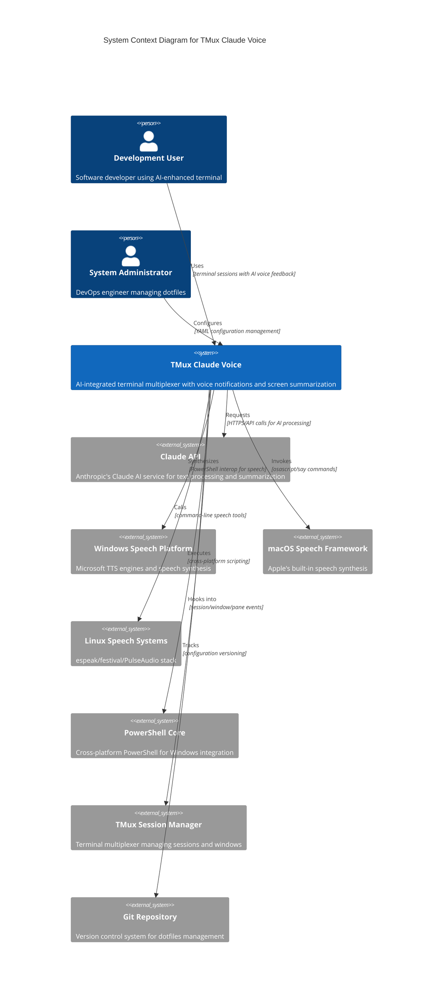

# TMux Claude Voice - システムコンテキスト図

## C4 Model - Level 1: System Context



## システム境界と責任

### コアシステム (TMux Claude Voice)
- **主要責任**: AI統合ターミナル体験の提供
- **技術スタック**: Bash/Shell Scripts, YAML Configuration, Python/Node.js integrations
- **品質属性**: 高可用性(99.9%), 低レイテンシ(<3秒), クロスプラットフォーム対応

### 外部システム統合

#### 1. AI・LLM統合
- **Claude API**: テキスト要約・処理・翻訳
- **統合方式**: REST API (localhost:11434 Ollama, HTTP Claude API)
- **フォールバック**: オフライン時のローカル処理

#### 2. プラットフォーム音声システム
- **Windows**: Microsoft Speech Platform + PowerShell Core
- **macOS**: macOS Speech Framework + Audio Units
- **Linux**: espeak/festival + ALSA/PulseAudio

#### 3. ターミナル・シェル統合
- **TMux**: セッション管理・フック・ステータスバー
- **Shell環境**: Zsh/Bash + プロファイル統合
- **Git**: 設定バージョニング・ワークフロー管理

## 主要なユーザーペルソナ

### 開発者 (Primary User)
- **目標**: AI支援による生産性向上、音声フィードバックによる作業状況把握
- **使用パターン**: 長時間のコーディングセッション、複数プロジェクト並行作業
- **期待価値**: 非侵入的通知、作業文脈の自動理解、多言語対応

### システム管理者 (Secondary User)
- **目標**: 企業・チーム環境でのシステム統一管理
- **使用パターン**: 大規模デプロイメント、設定標準化、セキュリティポリシー適用
- **期待価値**: 一元設定管理、監査ログ、セキュリティコンプライアンス

## システムランドスケープ

### 開発環境エコシステム
```
┌─────────────────────────────────────────────────────────┐
│                Development Ecosystem                    │
├─────────────────────────────────────────────────────────┤
│ IDE Integration │ Terminal Multiplexer │ AI Services    │
│ - VS Code       │ - TMux Sessions      │ - Claude API   │
│ - Emacs         │ - Screen/Zellij      │ - Ollama Local │
│ - NeoVim        │ - Windows Terminal   │ - OpenAI GPT   │
├─────────────────────────────────────────────────────────┤
│ Audio/Speech    │ OS Integration       │ Config Mgmt    │
│ - TTS Engines   │ - WSL/Windows        │ - Git/dotfiles │
│ - Sound Effects │ - macOS/Darwin       │ - YAML/TOML    │
│ - Audio APIs    │ - Linux Distros      │ - Ansible/Chef │
└─────────────────────────────────────────────────────────┘
```

### 企業環境統合
```
┌─────────────────────────────────────────────────────────┐
│                Enterprise Integration                   │
├─────────────────────────────────────────────────────────┤
│ Security        │ Monitoring           │ Deployment     │
│ - SSO/LDAP      │ - Prometheus         │ - Docker       │
│ - VPN/Firewall  │ - Grafana            │ - Kubernetes   │
│ - Policy Mgmt   │ - ELK Stack          │ - CI/CD        │
├─────────────────────────────────────────────────────────┤
│ Compliance      │ Asset Management     │ Support        │
│ - SOC2/ISO      │ - CMDB              │ - Help Desk    │
│ - GDPR/CCPA     │ - License Tracking   │ - Training     │
│ - Audit Logs    │ - Inventory          │ - Documentation│
└─────────────────────────────────────────────────────────┘
```

## データフローサマリー

### 主要データフロー
1. **User Interaction** → TMux Events → Status Detection → AI Processing
2. **AI Response** → Platform Router → Audio Synthesis → User Feedback
3. **Configuration Changes** → YAML Processing → Platform Generation → Deployment

### データ分類
- **機密データ**: API keys, user credentials, private repository content
- **個人データ**: user preferences, session history, voice settings
- **システムデータ**: performance metrics, error logs, configuration state
- **公開データ**: documentation, templates, example configurations

## セキュリティ境界

### Trust Zones
1. **High Trust**: Local configuration files, user session data
2. **Medium Trust**: External API calls, speech synthesis engines
3. **Low Trust**: Network communications, third-party integrations

### Security Controls
- **認証**: Local user authentication, API key validation
- **認可**: File system permissions, process isolation
- **暗号化**: HTTPS API calls, encrypted credential storage
- **監査**: Configuration changes, system access logs