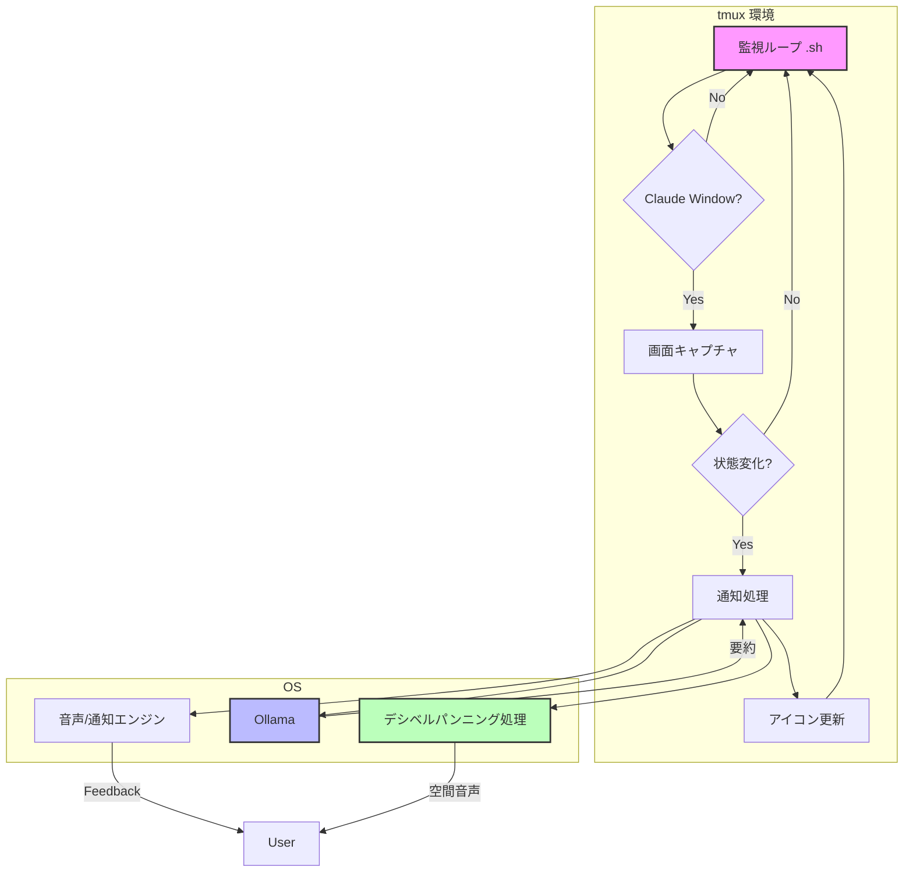
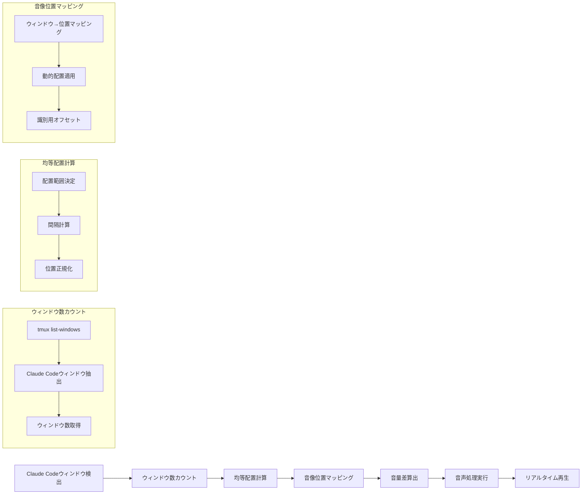

## **Tmux Claude Voice: システム設計書**

### 1\. **システム概要**

本システムは、`tmux`上で動作する**Claude Code**のウィンドウを監視し、その状態変化を**音声**と**システム通知**で開発者にフィードバックするエージェントです。

開発者はClaude Codeの処理中も常に画面を監視する必要がなくなり、他のタスクに集中できます。AIの思考プロセス（Busy）、ユーザーへの問いかけ（Waiting）、処理完了（Idle）といった重要な状態変化をリアルタイムに把握するための「**ガードレール**」として機能します。

### 2\. **主要機能**

  - **自動ウィンドウ検出**: `tmux`のウィンドウ名（例: "Claude"）から、監視対象のウィンドウを自動で特定します。
  - **ステータスアイコン表示**: 監視対象ウィンドウのタブ名に、現在の状態を示すアイコンをリアルタイムで表示します。
      - **⚡️ Busy**: Claudeが思考中またはコードを生成中。
      - **⌛️ Waiting**: Claudeがユーザーの確認、選択肢の入力、またはエラー修正を待っている状態。
      - **✅ Idle**: 処理が完了し、待機している状態。
  - **状態変化の音声通知**:
      - `Idle/Waiting` → `Busy`: 開始を知らせる通知音。
      - `Busy` → `Idle`: 完了を知らせる通知音と、**実行結果の要約**の読み上げ。
      - `Busy` → `Waiting`: 注意を促す通知音と、**問い合わせやエラー内容の要約**の読み上げ。
  - **デシベルパンニング音声システム**:
      - 複数のClaude Codeウィンドウを同時使用時に、どのウィンドウからの通知かを音像の位置で判別できる空間的音声フィードバックを提供します。
      - **ウィンドウ位置別音像定位**: 各ウィンドウの位置に応じた音像の固定配置。
      - **音量差による識別**: ウィンドウ間の区別を容易にする定位制御。
  - **AIによる要約**:
      - 画面のテキストをローカルで動作する`Ollama`に渡し、約30文字の簡潔な日本語要約を生成します。
  - **マルチプラットフォーム対応**:
      - **macOS**と\*\*WSL (Windows Subsystem for Linux)\*\*の両環境で動作します。
  - **通知モード切り替え**:
      - `Prefix + n` キーで、「音声＋読み上げ」モードと「システム通知」モードを簡単にトグルできます。

-----

### 3\. **技術選択**

| カテゴリ | 技術・ツール | 選定理由 |
| :--- | :--- | :--- |
| **コアロジック** | **Bash Script** | `tmux`コマンドとの親和性が非常に高く、`grep`, `awk`等の標準ツールを活用できます。macOS/WSLで共通のコードベースを維持しやすく、依存関係も最小限に抑えられます。 |
| **ステータス判定** | **`grep` (正規表現)** | 画面キャプチャ内の特定のキーワードパターンを高速にマッチングさせ、状態を判定します。Busy（処理中）、Waiting（待機）、Idle（待機）の3状態を明確に区別します。 |
| **要約エンジン** | **`Ollama`** | ローカル環境でセキュアに動作するLLMです。API（`curl`）またはCLI経由で簡単に連携可能。ユーザーが好みのモデル（`gemma2`, `phi3`等）を選択できる柔軟性も確保します。 |
| **音声出力 (macOS)** | **`say`, `ffplay`, `sox`** | macOS標準の`say`コマンド（Kyoko音声）と`ffplay`によるEqual Power Pan Law対応のデシベルパンニングを実現します。音量制御範囲0.0-1.0。 |
| **音声出力 (WSL)** | **`powershell.exe`, `ffplay`** | Windows PowerShell + System.Speech（Haruka音声）と`ffplay`によるEqual Power Pan Law対応のデシベルパンニングを実現します。音量制御範囲0-100%。 |
| **デシベルパンニング** | **`ffplay` (macOS/WSL)** | 左右チャンネル間の音量差を制御することで、音像の定位を調整します。リアルタイム再生に最適で、ファイル生成のオーバーヘッドがありません。 |
| **設定管理** | **`.tmux.conf`** | ユーザーが自身の環境に合わせて、監視間隔や対象ウィンドウ名、Ollamaモデル等を柔軟にカスタマイズできるようにするため、`tmux`のオプション機構（`@variable`）を利用します。 |

-----

### 4\. **システム基本設計**

#### 4.1. 全体アーキテクチャ

システムは、`tmux`サーバーのバックグラウンドで動作する単一の監視スクリプトによって駆動されます。



1.  **監視ループ**: 一定間隔（例: 5秒）で全`tmux`ウィンドウをチェックします。
2.  **ウィンドウ検出**: 正規表現にマッチするウィンドウを見つけます。
3.  **状態判定**: `tmux capture-pane`で画面のテキストを取得し、正規表現で`Busy`/`Waiting`/`Idle`を判定します。
4.  **状態変化検出**: 前回の状態と現在の状態を比較します。変化があった場合のみ次のステップへ進みます。
5.  **通知処理**:
      - **要約**: `Busy`から抜ける遷移の場合、画面テキストを`Ollama`に送り、要約を取得します。
      - **音声/通知**: 状態遷移と通知モードに応じて、各プラットフォームのエンジンで音声再生またはシステム通知を行います。
      - **デシベルパンニング**: 状態変化に応じた音像位置の計算と適用。
6.  **アイコン更新**: `tmux rename-window`でウィンドウ名に最新のステータスアイコンを付与します。
7.  **状態保存**: 次回ループのために、現在の状態を`tmux`のウィンドウオプションに保存します。

#### 4.2. ステータス判定システム

Claude Codeの画面コンテンツを解析し、3つの状態を正確に判定します。

  - **状態定義**:
      - **Busy**: Claudeが処理中またはコード生成中の状態
      - **Waiting**: Claudeがユーザーの入力や確認を待っている状態
      - **Idle**: 処理が完了し、待機している状態
  - **判定パターン**:
      - **Busy状態**: `tokens.*esc to interrupt`パターンで判定
      - **Waiting状態**: 以下のパターンで判定
          - 確認メッセージ: `Do you want to proceed?`, `Continue?`, `Proceed?`
          - 選択肢: `❯ 1`, `❯ 2`, `❯ 3`, `Choose an option`
          - 質問: `tell Claude what`, `Should I`, `Would you like`
          - 回答オプション: `Yes, and`, `No, keep`
          - エラー: `Error:`, `Failed:`, `Exception:`
      - **Idle状態**: BusyやWaiting以外のすべての状態
  - **判定ロジック**:
      - 優先順位: Busy → Waiting → Idle
      - 最初にマッチしたパターンで状態を決定
      - パターンマッチングは大文字小文字を区別しない

#### 4.3. Ollama連携と要約指針

ローカルLLMを最大限に活用し、的確な要約を生成します。

  - **ホスト検出**:
      - **macOS**: `localhost` を使用します。
      - **WSL**: `/etc/resolv.conf`からWindowsホストのIPアドレスを動的に取得し、接続します。
  - **モデル選択**:
      - ハードコードされた優先順位リスト（`gemma3:1b` → `gemma2:2b` → `phi4-mini:latest` → `orca-mini:latest`）から、利用可能なモデルを順次選択します。
      - **ローカルOllama**: `ollama list`コマンドで利用可能なモデルを確認。
      - **外部Ollama**: APIエンドポイント（`/api/tags`）で利用可能なモデルを確認。
      - **フォールバック**: モデル確認が失敗した場合、優先順位リストの最初のモデル（`gemma3:1b`）を使用。
  - **要約プロンプトの指針**:
      - **目標**: 約30文字で、端的・簡潔・完結した状況報告を生成する。
      - **コンテキストの重視**:
          - **最後の数行**が最も重要。`tail -n 20`などで最新のテキストを切り出す。
          - Claude Codeが出力する見出し（`⏺`）以降に注目する。
      - **キーワードの優先**:
          - **完了メッセージ**: `Successfully`, `Done`, `Created`
          - **エラーメッセージ**: `Error`, `Failed`, `Exception`
          - **ユーザーへの問いかけ**: `Proceed?`, `Choose an option`, `(y/n)`
      - **プロンプト例**:
        ```prompt
        以下のテキストはAIアシスタントの出力です。現在の「問い合わせ内容」について、状況を30文字以内で具体的に要約してください。特に最後の行を重視してください。

        <画面キャプチャの末尾20行>
        ```

#### 4.4. プラットフォーム依存処理

OS間の差異は、以下の関数内で吸収します。

  - **`get_os_type()`**: `uname`コマンドの結果（`Darwin` or `Linux`）を返し、処理を分岐させます。
  - **`speak(text)`**:
      - **macOS**: `say -v Kyoko -r 200 "$text"` (Kyoko音声、200WPM)
      - **WSL**: `powershell.exe -Command "Add-Type -AssemblyName System.Speech; \$synth = New-Object System.Speech.Synthesis.SpeechSynthesizer; \$synth.SelectVoice('Microsoft Haruka Desktop'); \$synth.Speak('$text')"`
  - **利用可能音声**:
      - **macOS**: Kyoko（Enhanced）、Otoya（Enhanced）、Kyoko、Otoya
      - **Windows**: Haruka、Ayumi、Ichiro
  - **`play_notification_sound(type)`**:
      - プラットフォーム固有のシステム通知音を活用。
      - **macOS**: システム通知音（AIFF）を使用。
      - **WSL**: Windowsシステム通知音（WAV）を使用。

-----

### 5\. **デシベルパンニングアーキテクチャ**

#### 5.1. 音像定位の基本概念

デシベルパンニングは、左右のスピーカー間で音量差（デシベル）を利用して音像を移動させる手法です。本システムでは、Claude Codeの状態変化を空間的な音声フィードバックで表現します。

#### 5.2. 動的ウィンドウ配置戦略

| Claude Codeウィンドウ数 | 配置方式 | 音像位置範囲 | 識別効果 |
| :--- | :--- | :--- | :--- |
| **1個** | 中央固定 | 0% | 中央からの通知 |
| **2個** | 左右均等 | -50%, +50% | 左/右からの通知 |
| **3個** | 左/中央/右 | -100%, 0%, +100% | 左/中央/右からの通知 |
| **4個** | 4分割均等 | -75%, -25%, +25%, +75% | 4方向からの通知 |
| **5個以上** | N分割均等 | -100%～+100%を均等分割 | N方向からの通知 |

#### 5.3. 技術実装

**Equal Power Pan Law対応のデシベルパンニング**

**macOS (ffplay使用)**:
```bash
# Equal Power Pan Law計算 (pan値: -1.0 ～ +1.0)
# left_gain = cos((pan + 1) * π/4)
# right_gain = sin((pan + 1) * π/4)

# 左端定位 (-100%)
ffplay -af "volume=0.707:enable='between(t,0,inf)',volume=0:enable='between(t,0,inf)'" input.wav

# 右端定位 (+100%)
ffplay -af "volume=0:enable='between(t,0,inf)',volume=0.707:enable='between(t,0,inf)'" input.wav

# 中央定位 (0%)
ffplay -af "volume=0.707:enable='between(t,0,inf)'" input.wav

# カスタム定位
left_gain=$(echo "scale=3; c($pan_position * 3.14159 / 2)" | bc -l)
right_gain=$(echo "scale=3; s($pan_position * 3.14159 / 2)" | bc -l)
ffplay -af "volume=${left_gain}:enable='between(t,0,inf)',volume=${right_gain}:enable='between(t,0,inf)'" input.wav
```

**WSL (ffplay使用)**:
```bash
# Equal Power Pan Law対応のステレオパンニング
# 左端定位
ffplay -af "pan=stereo|c0=c0|c1=0" -volume 70 input.wav -nodisp -autoexit

# 右端定位
ffplay -af "pan=stereo|c0=0|c1=c0" -volume 70 input.wav -nodisp -autoexit

# カスタム定位 (Equal Power)
left_gain=$(echo "scale=3; c($pan_position * 3.14159 / 2)" | bc -l)
right_gain=$(echo "scale=3; s($pan_position * 3.14159 / 2)" | bc -l)
ffplay -af "pan=stereo|c0=${left_gain}*c0|c1=${right_gain}*c0" -volume 70 input.wav -nodisp -autoexit
```

#### 5.4. 動的ウィンドウ配置システム



#### 5.5. 設定可能パラメータ

`.tmux.conf`で以下のパラメータをカスタマイズ可能：

```bash
# デシベルパンニング設定
set -g @claude_voice_panning_enabled "true"
set -g @claude_voice_pan_range "1.0"        # 最大定位範囲 (-1.0 ～ +1.0)
set -g @claude_voice_pan_identification "true"  # ウィンドウ識別機能の有効化

# 動的配置設定
set -g @claude_voice_pan_dynamic "true"     # 動的配置の有効化
set -g @claude_voice_pan_margin "0.1"       # 端からの余白 (0.0 ～ 0.5)
set -g @claude_voice_pan_min_distance "0.15" # ウィンドウ間の最小距離

# Claude Codeウィンドウ検出パターン
set -g @claude_voice_window_pattern "Claude|claude|CLAUDE"  # 検出するウィンドウ名パターン

# Ollama設定
set -g @claude_voice_ollama_host "localhost"  # Ollamaサーバーのホスト
set -g @claude_voice_ollama_port "11434"      # Ollamaサーバーのポート
set -g @claude_voice_ollama_timeout "10"      # API呼び出しのタイムアウト（秒）

# モデル優先順位リスト（ハードコード）
# 設定ファイルでの変更は不要、スクリプト内で直接管理
# OLLAMA_MODEL_PRIORITY=("gemma3:1b" "gemma2:2b" "phi4-mini:latest" "orca-mini:latest")

# 通知音設定
set -g @claude_voice_sound_enabled "true"     # 通知音の有効化
set -g @claude_voice_sound_start "Submarine"  # 処理開始音（macOS: Submarine.aiff, Windows: Submarine.wav）
set -g @claude_voice_sound_complete "Funk"    # 処理完了音（macOS: Funk.aiff, Windows: Funk.wav）
set -g @claude_voice_sound_waiting "Basso"    # 待機音（macOS: Basso.aiff, Windows: Basso.wav）
set -g @claude_voice_sound_error "Basso"      # エラー音（macOS: Basso.aiff, Windows: Basso.wav）

# 音声エンジン設定
set -g @claude_voice_speech_rate "200"        # 音声速度（WPM、macOS用）
set -g @claude_voice_volume_macos "0.8"       # macOS音量制御（0.0-1.0）
set -g @claude_voice_volume_wsl "80"          # WSL音量制御（0-100）
set -g @claude_voice_pan_law "equal_power"    # パンニング法則（equal_power/linear）

# 日本語音声キャラクター設定
set -g @claude_voice_macos_voice "Kyoko"      # macOS音声（Kyoko, Otoya, Kyoko Enhanced, Otoya Enhanced）
set -g @claude_voice_wsl_voice "Haruka"       # WSL音声（Haruka, Ayumi, Ichiro）
set -g @claude_voice_voice_quality "enhanced" # 音声品質（enhanced/standard）
```

#### 5.6. 実装関数

```bash
# Claude Codeウィンドウを検出する関数
detect_claude_windows() {
    local pattern=$(tmux show-option -gv @claude_voice_window_pattern 2>/dev/null || echo "Claude|claude|CLAUDE")
    tmux list-windows -F "#{window_index}:#{window_name}" | grep -E ":$pattern" | cut -d: -f1,2
}

# Claude Codeウィンドウ数を取得する関数
count_claude_windows() {
    detect_claude_windows | wc -l
}

# ウィンドウの均等配置位置を計算する関数
calculate_equal_spacing() {
    local window_name="$1"
    local total_claude_windows=$(count_claude_windows)
    
    if [[ $total_claude_windows -eq 0 ]]; then
        echo "0.0"  # デフォルト位置
        return
    fi
    
    # Claude Codeウィンドウのリストを取得し、対象ウィンドウのインデックスを特定
    local claude_windows=($(detect_claude_windows | cut -d: -f1 | sort -n))
    local target_index=-1
    
    for i in "${!claude_windows[@]}"; do
        local window_info=$(tmux list-windows -F "#{window_index}:#{window_name}" | grep "^${claude_windows[$i]}:")
        if [[ "$window_info" == *":$window_name" ]]; then
            target_index=$i
            break
        fi
    done
    
    if [[ $target_index -eq -1 ]]; then
        echo "0.0"  # デフォルト位置
        return
    fi
    
    # 均等配置の計算
    local margin=$(tmux show-option -gv @claude_voice_pan_margin 2>/dev/null || echo "0.1")
    local usable_range=$(echo "scale=3; 2 * (1 - $margin)" | bc)
    local spacing=$(echo "scale=3; $usable_range / ($total_claude_windows - 1)" | bc)
    local start_position=$(echo "scale=3; -1 + $margin" | bc)
    
    local position=$(echo "scale=3; $start_position + $target_index * $spacing" | bc)
    echo "$position"
}

# ウィンドウ位置に基づく音像位置を計算する関数
calculate_pan_position() {
    local window_name="$1"
    local dynamic_enabled=$(tmux show-option -gv @claude_voice_pan_dynamic 2>/dev/null || echo "true")
    
    if [[ "$dynamic_enabled" == "true" ]]; then
        # 動的配置を使用
        local position=$(calculate_equal_spacing "$window_name")
        local min_distance=$(tmux show-option -gv @claude_voice_pan_min_distance 2>/dev/null || echo "0.15")
        
        # 最小距離を確保するための調整
        local adjusted_position=$(echo "scale=3; $position * (1 - $min_distance/2)" | bc)
        echo "$adjusted_position"
    else
        # 従来の固定配置を使用
        local window_position=$(get_window_position "$window_name")
        local offset=$(tmux show-option -gv @claude_voice_pan_offset 2>/dev/null || echo "0.1")
        local adjusted_position=$(echo "scale=2; $window_position * (1 - $offset)" | bc)
        echo "$adjusted_position"
    fi
}

# Equal Power Pan Law対応のデシベルパンニングを適用する関数
apply_panning() {
    local input_file="$1"
    local pan_position="$2"
    local os_type=$(get_os_type)
    local pan_law=$(tmux show-option -gv @claude_voice_pan_law 2>/dev/null || echo "equal_power")
    
    if [[ "$pan_law" == "equal_power" ]]; then
        # Equal Power Pan Law: cos/sin関数を使用
        local angle=$(echo "scale=6; ($pan_position + 1) * 3.14159 / 4" | bc -l)
        local left_gain=$(echo "scale=6; c($angle)" | bc -l)
        local right_gain=$(echo "scale=6; s($angle)" | bc -l)
    else
        # Linear Pan Law: 線形補間
        local left_gain=$(echo "scale=6; (1 + $pan_position) / 2" | bc -l)
        local right_gain=$(echo "scale=6; (1 - $pan_position) / 2" | bc -l)
    fi
    
    if [[ "$os_type" == "Darwin" ]]; then
        # macOS: ffplay使用（リアルタイム再生）
        local volume=$(tmux show-option -gv @claude_voice_volume_macos 2>/dev/null || echo "0.8")
        ffplay -af "pan=stereo|c0=${left_gain}*c0|c1=${right_gain}*c0" -volume $(echo "$volume * 100" | bc) "$input_file" -nodisp -autoexit &
    else
        # WSL: ffplay使用（リアルタイム再生）
        local volume=$(tmux show-option -gv @claude_voice_volume_wsl 2>/dev/null || echo "80")
        ffplay -af "pan=stereo|c0=${left_gain}*c0|c1=${right_gain}*c0" -volume "$volume" "$input_file" -nodisp -autoexit &
    fi
}

# ウィンドウ識別用の音声通知を生成する関数
create_window_identified_sound() {
    local window_name="$1"
    local sound_type="$2"  # start, complete, waiting
    
    local pan_position=$(calculate_pan_position "$window_name")
    local sound_file=$(get_system_sound_path "$sound_type")
    
    # デシベルパンニングを適用してリアルタイム再生
    apply_panning "$sound_file" "$pan_position"
}

# Ollamaサーバーの接続情報を取得する関数
get_ollama_connection() {
    local host=$(tmux show-option -gv @claude_voice_ollama_host 2>/dev/null || echo "localhost")
    local port=$(tmux show-option -gv @claude_voice_ollama_port 2>/dev/null || echo "11434")
    echo "http://$host:$port"
}

# ペインのコンテンツからステータスを判定する関数
analyze_pane_content() {
    local content="$1"
    
    # 状態定数
    local STATUS_NAME_BUSY="busy"
    local STATUS_NAME_WAITING="waiting"
    local STATUS_NAME_IDLE="idle"
    
    # Busy状態のパターン
    if echo "$content" | grep -qE "(tokens.*esc to interrupt)" 2>/dev/null; then
        echo "$STATUS_NAME_BUSY"
        return
    fi
    
    # Waiting状態のパターン
    if echo "$content" | grep -qE "(Do you want to proceed\?|❯ 1|❯ 2|❯ 3|tell Claude what|Should I|Would you like|Yes, and|No, keep|Choose an option|Continue\?|Proceed\?|Error:|Failed:|Exception:)" 2>/dev/null; then
        echo "$STATUS_NAME_WAITING"
        return
    fi
    
    # BusyやWaiting以外はIdleとして判定される
    echo "$STATUS_NAME_IDLE"
}

# 利用可能なOllamaモデルを取得する関数
get_available_ollama_models() {
    local connection=$(get_ollama_connection)
    local timeout=$(tmux show-option -gv @claude_voice_ollama_timeout 2>/dev/null || echo "10")
    
    # まずローカルのollama listコマンドを試行
    if command -v ollama >/dev/null 2>&1; then
        local local_models=$(ollama list --format json 2>/dev/null | jq -r '.models[].name' 2>/dev/null)
        if [[ -n "$local_models" ]]; then
            echo "$local_models"
            return 0
        fi
    fi
    
    # 外部APIを使用してモデルリストを取得
    local api_response=$(curl -s --max-time "$timeout" "${connection}/api/tags" 2>/dev/null)
    if [[ -n "$api_response" ]]; then
        local api_models=$(echo "$api_response" | jq -r '.models[].name' 2>/dev/null)
        if [[ -n "$api_models" ]]; then
            echo "$api_models"
            return 0
        fi
    fi
    
    # フォールバック: ハードコードされた優先順位リストの最初のモデルを使用
    echo "${OLLAMA_MODEL_PRIORITY[0]}"
    return 1
}

# モデル優先順位リスト（ハードコード）
OLLAMA_MODEL_PRIORITY=("gemma3:1b" "gemma2:2b" "phi4-mini:latest" "orca-mini:latest")

# 最適なOllamaモデルを選択する関数
select_optimal_ollama_model() {
    local available_models=$(get_available_ollama_models)
    
    # ハードコードされた優先順位リストを使用
    for model in "${OLLAMA_MODEL_PRIORITY[@]}"; do
        if echo "$available_models" | grep -q "^${model}$"; then
            echo "$model"
            return 0
        fi
    done
    
    # 利用可能なモデルが見つからない場合、最初の利用可能なモデルを使用
    local first_available=$(echo "$available_models" | head -n1)
    if [[ -n "$first_available" ]]; then
        echo "$first_available"
        return 0
    fi
    
    # 最後のフォールバック: 優先順位リストの最初のモデル
    echo "${OLLAMA_MODEL_PRIORITY[0]}"
    return 1
}

# プラットフォーム固有の通知音ファイルパスを取得する関数
get_system_sound_path() {
    local sound_name="$1"
    local os_type=$(get_os_type)
    
    if [[ "$os_type" == "Darwin" ]]; then
        # macOS: システム通知音のパス
        local sound_paths=(
            "/System/Library/Sounds/${sound_name}.aiff"
            "/System/Library/PrivateFrameworks/ToneLibrary.framework/Versions/A/Resources/AlertTones/${sound_name}.aiff"
            "${HOME}/Library/Sounds/${sound_name}.aiff"
        )
        
        for path in "${sound_paths[@]}"; do
            if [[ -f "$path" ]]; then
                echo "$path"
                return 0
            fi
        done
        
        # デフォルトのシステム音
        echo "/System/Library/Sounds/Submarine.aiff"
    else
        # WSL/Windows: Windowsシステム通知音のパス
        local windows_media_path="/mnt/c/Windows/Media"
        local sound_path="${windows_media_path}/${sound_name}.wav"
        
        if [[ -f "$sound_path" ]]; then
            echo "$sound_path"
        else
            # デフォルトのWindows通知音
            echo "${windows_media_path}/Windows Notify Messaging.wav"
        fi
    fi
}

# 利用可能なmacOS音声を取得する関数
get_available_macos_voices() {
    if command -v say >/dev/null 2>&1; then
        say -v "?" | grep -E "(Kyoko|Otoya)" | grep -E "(enhanced|compact)" | head -n 4
    fi
}

# 利用可能なWindows音声を取得する関数
get_available_windows_voices() {
    powershell.exe -Command "
        Add-Type -AssemblyName System.Speech
        \$synth = New-Object System.Speech.Synthesis.SpeechSynthesizer
        \$synth.GetInstalledVoices() | ForEach-Object {
            \$voice = \$_.VoiceInfo
            if (\$voice.Culture.Name -eq 'ja-JP') {
                Write-Output \$voice.Name
            }
        }
    " 2>/dev/null
}

# 音声合成でテキストを読み上げる関数
speak_text() {
    local text="$1"
    local os_type=$(get_os_type)
    
    if [[ "$os_type" == "Darwin" ]]; then
        # macOS: sayコマンド（設定可能な音声）
        local speech_rate=$(tmux show-option -gv @claude_voice_speech_rate 2>/dev/null || echo "200")
        local voice_name=$(tmux show-option -gv @claude_voice_macos_voice 2>/dev/null || echo "Kyoko")
        local voice_quality=$(tmux show-option -gv @claude_voice_voice_quality 2>/dev/null || echo "enhanced")
        
        # 音声品質に応じた音声名の選択
        if [[ "$voice_quality" == "enhanced" ]]; then
            case "$voice_name" in
                "Kyoko") voice_name="Kyoko Enhanced" ;;
                "Otoya") voice_name="Otoya Enhanced" ;;
            esac
        fi
        
        if command -v say >/dev/null 2>&1; then
            say -v "$voice_name" -r "$speech_rate" "$text" &
        fi
    else
        # WSL: PowerShell + System.Speech（設定可能な音声）
        local volume=$(tmux show-option -gv @claude_voice_volume_wsl 2>/dev/null || echo "80")
        local voice_name=$(tmux show-option -gv @claude_voice_wsl_voice 2>/dev/null || echo "Haruka")
        
        # Windows音声名の完全指定
        case "$voice_name" in
            "Haruka") voice_name="Microsoft Haruka Desktop" ;;
            "Ayumi") voice_name="Microsoft Ayumi Desktop" ;;
            "Ichiro") voice_name="Microsoft Ichiro Desktop" ;;
        esac
        
        powershell.exe -Command "
            Add-Type -AssemblyName System.Speech
            \$synth = New-Object System.Speech.Synthesis.SpeechSynthesizer
            \$synth.SelectVoice('$voice_name')
            \$synth.Volume = $volume
            \$synth.Speak('$text')
        " &
    fi
}

# 通知音を再生する関数
play_notification_sound() {
    local sound_type="$1"  # start, complete, waiting, error
    local os_type=$(get_os_type)
    
    # 設定から音声名を取得
    local sound_name=$(tmux show-option -gv @claude_voice_sound_${sound_type} 2>/dev/null)
    if [[ -z "$sound_name" ]]; then
        case "$sound_type" in
            "start") sound_name="Submarine" ;;
            "complete") sound_name="Funk" ;;
            "waiting") sound_name="Basso" ;;
            "error") sound_name="Basso" ;;
            *) sound_name="Submarine" ;;
        esac
    fi
    
    local sound_file=$(get_system_sound_path "$sound_name")
    
    if [[ "$os_type" == "Darwin" ]]; then
        # macOS: afplayを使用
        if command -v afplay >/dev/null 2>&1; then
            local volume=$(tmux show-option -gv @claude_voice_volume_macos 2>/dev/null || echo "0.8")
            afplay -v "$volume" "$sound_file" &
        fi
    else
        # WSL: WindowsのSoundPlayerを使用
        local volume=$(tmux show-option -gv @claude_voice_volume_wsl 2>/dev/null || echo "80")
        local windows_path=$(echo "$sound_file" | sed 's|/mnt/c/|C:/|g' | sed 's|/|\\|g')
        powershell.exe -Command "
            Add-Type -AssemblyName System.Windows.Forms
            \$player = New-Object System.Media.SoundPlayer
            \$player.SoundLocation = '$windows_path'
            \$player.Play()
        " &
    fi
}
```

-----

### 6\. **コーディングエージェントへの指示**

上記設計に基づき、以下の構造でスクリプトを実装してください。

1.  **`main.sh`**:
      - 設定読み込み、無限ループ、監視対象ウィンドウの特定とループ処理。
2.  **`functions.sh`**:
      - `analyze_pane_content()`: ペインコンテンツからステータスを判定するロジック。
      - `handle_status_change()`: 状態遷移に応じた処理の振り分け。
      - `summarize_with_ollama()`: Ollama APIと連携し要約を生成する機能。
      - `update_window_icon()`: ウィンドウ名を変更する機能。
3.  **`platform_utils.sh`**:
      - `get_os_type()`, `speak()`, `play_notification_sound()`, `get_ollama_host()`など、プラットフォーム依存の処理をすべてここにまとめる。
4.  **`panning_engine.sh`**:
      - `detect_claude_windows()`: Claude Codeウィンドウの検出。
      - `count_claude_windows()`: Claude Codeウィンドウ数のカウント。
      - `calculate_equal_spacing()`: 均等配置位置の計算。
      - `calculate_pan_position()`: 動的音像位置の計算。
      - `apply_panning()`: デシベルパンニングの適用。
      - `create_window_identified_sound()`: ウィンドウ識別用音声の生成。
5.  **`ollama_utils.sh`**:
      - `OLLAMA_MODEL_PRIORITY`: ハードコードされたモデル優先順位リスト。
      - `get_ollama_connection()`: Ollamaサーバーの接続情報取得。
      - `get_available_ollama_models()`: 利用可能なモデルリスト取得。
      - `select_optimal_ollama_model()`: 優先順位に基づく最適なモデル選択。
      - `summarize_with_ollama()`: Ollama APIを使用した要約生成。
6.  **`sound_utils.sh`**:
      - `get_system_sound_path()`: プラットフォーム固有の通知音パス取得。
      - `get_available_macos_voices()`: 利用可能なmacOS音声の取得。
      - `get_available_windows_voices()`: 利用可能なWindows音声の取得。
      - `speak_text()`: 設定可能な音声キャラクターでの音声合成。
      - `play_notification_sound()`: システム通知音の再生。
      - `apply_panning()`: Equal Power Pan Law対応のデシベルパンニング。
      - `get_os_type()`: OS種別の判定。
5.  **`toggle_notify_mode.sh`**:
      - `Prefix + n`で実行される通知モード切り替えスクリプト。
7.  **`README.md`**:
      - インストール方法、`.tmux.conf`での設定例、依存関係（`ollama`, `ffplay`, `jq`, `curl`）について記述する。

**最優先事項**:

  - **堅牢性**: スクリプトがエラーで停止しないよう、コマンドの存在チェックやエラーハンドリングを適切に行うこと。
  - **パフォーマンス**: `tmux`全体のパフォーマンスに影響を与えないよう、ループ間隔やコマンド実行を効率的に行うこと。
  - **音声品質**: Equal Power Pan Law対応により、デシベルパンニング処理による音質劣化を最小限に抑えること。
  - **ウィンドウ識別精度**: 複数ウィンドウ間での音像位置の明確な区別を確保すること。
  - **プラットフォーム最適化**: macOS（Kyoko/Otoya Enhanced）とWSL（Haruka/Ayumi/Ichiro）の高品質音声合成を活用すること。
  - **保守性**: 機能ごとにファイルを分割し、変数のスコープを適切に管理すること。