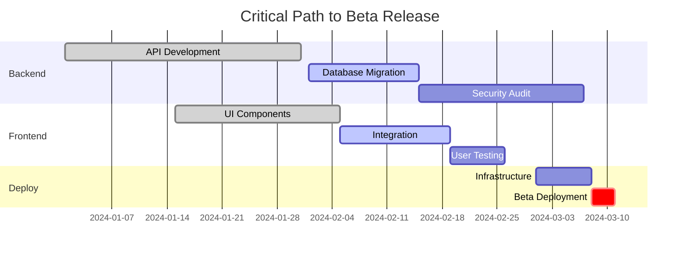

## Instructions

1. **Check Available Tools**
   - Verify Linear MCP server connection
   - Check GitHub CLI availability
   - Test git repository access
   - Ensure required permissions

2. **Gather Milestone Data**
   - Query Linear for project milestones and roadmap items
   - Fetch GitHub milestones and their associated issues
   - Analyze git tags for historical release patterns
   - Review project documentation for roadmap information
   - Collect all active and upcoming milestones

3. **Analyze Milestone Progress**
   For each milestone:
   - Count completed vs. total tasks
   - Calculate percentage complete
   - Measure velocity trends
   - Identify blocking issues
   - Track time remaining

4. **Perform Predictive Analysis**
   - Calculate burn-down rate from historical data
   - Project completion dates based on velocity
   - Factor in team capacity and holidays
   - Identify critical path items
   - Assess confidence levels for predictions

5. **Risk Assessment**
   Evaluate each milestone for:
   - Schedule risk (falling behind)
   - Scope risk (expanding requirements)
   - Resource risk (team availability)
   - Dependency risk (blocked by others)
   - Technical risk (unknowns)

6. **Generate Milestone Report**
   Create comprehensive report showing:
   - Milestone timeline visualization
   - Progress indicators for each milestone
   - Predicted completion dates with confidence
   - Risk heat map
   - Recommended actions for at-risk items

7. **Track Dependencies**
   - Map inter-milestone dependencies
   - Identify cross-team dependencies
   - Highlight critical path
   - Show dependency impact on schedule

8. **Provide Recommendations**
   Based on analysis:
   - Suggest scope adjustments
   - Recommend resource reallocation
   - Propose timeline changes
   - Identify quick wins
   - Highlight blockers needing attention

## Prerequisites
- Git repository access
- Linear MCP server connection (preferred)
- GitHub milestones or project boards
- Historical velocity data

## Command Flow

### 1. Milestone Discovery
```
1. Check Linear for project milestones/roadmap items
2. Scan GitHub for milestone definitions
3. Analyze git tags for release history
4. Review README/docs for project roadmap
5. Ask user for additional context if needed
```

### 2. Comprehensive Milestone Analysis

#### Data Collection Sources
```
Linear/Project Management:
- Milestone definitions and due dates
- Associated tasks and dependencies
// ... (16 lines truncated)
```

### 3. Milestone Status Report

```markdown
Generated: [Date]

## Executive Summary
// ... (35 lines truncated)
```
Jan ████████████░░░░░░░░ 60%
Feb ░░░░░░░░░░░░░░░░░░░░ 0%
Mar ░░░░░░░░░░░░░░░░░░░░ 0%
```

**Dependencies**:
- Alpha Testing Complete ✅
// ... (18 lines truncated)
```

### 4. Predictive Analytics

```markdown
## Completion Predictions

### Machine Learning Model Predictions
// ... (17 lines truncated)
```
Completion Date Distribution:
Mar 10-15: ████ 20%
Mar 16-22: ████████ 40%
Mar 23-31: ██████ 30%
April+   : ██ 10%

P50 Date: March 19
P90 Date: March 28
```

### Risk-Adjusted Timeline
Recommended buffer: +5 days
Confident delivery date: March 20
```

### 5. Dependency Tracking

```markdown
## Milestone Dependencies

### Critical Path Analysis


### Dependency Risk Matrix
| Dependency | Impact | Likelihood | Mitigation |
// ... (5 lines truncated)
```

### 6. Early Warning System

```markdown
## ⚠️ Milestone Alerts

### Immediate Attention Required
// ... (26 lines truncated)
```

### 7. Actionable Recommendations

```markdown
## Recommended Actions

### This Week
// ... (26 lines truncated)
```

## Error Handling

### No Milestone Data
```
"No milestones found in Linear or GitHub.

To set up milestone tracking:
// ... (9 lines truncated)
```

### Insufficient Historical Data
```
"Limited historical data for predictions.

Available data: [X] weeks
// ... (9 lines truncated)
```

## Interactive Features

### What-If Analysis
```
"Explore scenario planning:

1. What if we add 2 more developers?
// ... (11 lines truncated)
```

### Milestone Optimization
```
"Optimization opportunities detected:

1. **Parallelize Tasks**
// ... (11 lines truncated)
```

## Export & Integration Options

1. **Gantt Chart Export** (Mermaid/PNG/PDF)
2. **Executive Dashboard** (HTML/PowerBI)
3. **Status Updates** (Slack/Email/Confluence)
4. **Risk Register** (Excel/Linear/Jira)
5. **Calendar Integration** (ICS/Google/Outlook)

## Automation Capabilities

```
"Set up automated milestone monitoring:

1. Daily health checks at 9 AM
// ... (7 lines truncated)
```
