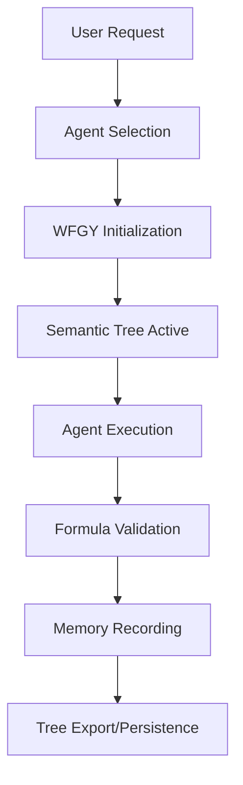

# WFGY Semantic Reasoning Agents

> **Advanced AI agents implementing the WFGY (WanFaGuiYi - 万法归一) semantic reasoning system for Claude Code**
> 
> Based on the innovative WFGY system from https://github.com/onestardao/WFGY

## 🌟 Overview

This collection of 8 specialized agents brings the power of WFGY's mathematical reasoning, persistent memory, and hallucination prevention to Claude Code through strongly-typed, composable agent definitions. Each agent specializes in a specific aspect of the WFGY system while working together to create a comprehensive reasoning and memory ecosystem.

## 🤖 Agent Collection

### Core Agents

| Agent | Persona | Icon | Primary Focus |
|-------|---------|------|---------------|
| **semantic-architect** | Atlas | 🌳 | Builds and manages persistent semantic memory trees |
| **reasoning-validator** | Euclid | 🔬 | Validates logic chains through mathematical formulas |
| **boundary-guardian** | Sentinel | 🛡️ | Prevents hallucination by monitoring knowledge boundaries |
| **memory-curator** | Mnemonic | 💾 | Optimizes and maintains semantic memory structures |

### Advanced Agents

| Agent | Persona | Icon | Primary Focus |
|-------|---------|------|---------------|
| **logic-synthesizer** | Synthesis | 🔄 | Explores parallel solution paths and synthesizes optimal outcomes |
| **decision-navigator** | Navigator | 🧭 | Guides strategic decision-making with semantic validation |
| **knowledge-mapper** | Cartographer | 🗺️ | Creates knowledge graphs and maps concept relationships |
| **cognitive-debugger** | Debugger | 🔧 | Diagnoses and repairs reasoning failures |

## 🚀 Quick Start

### Activating an Agent

```bash
# Use the Task tool to activate any WFGY agent
Task: semantic-architect

# The agent will:
1. Initialize WFGY system
2. Load any existing semantic trees
3. Greet you with available commands
4. Wait for your instructions
```

### Basic Workflow Example

```bash
# 1. Start with semantic architect to build memory
Task: semantic-architect
> *init-tree "ProjectAlpha"
> *record-node
> *view-tree

# 2. Validate reasoning with the validator
Task: reasoning-validator
> *validate-all "Complex reasoning about quantum computing"
> *calc-tension

# 3. Check boundaries to prevent hallucination
Task: boundary-guardian
> *detect-boundary "Advanced quantum mechanics"
> *assess-risk
```

## 🔄 Agent Interaction Model



## 📚 Agent Capabilities

### semantic-architect (Atlas)
- **Purpose**: Persistent memory management
- **Key Commands**:
  - `*init-tree` - Create new semantic tree
  - `*record-node` - Capture discussions as nodes
  - `*export-tree` - Save knowledge for later
  - `*import-tree` - Resume previous sessions
- **Use When**: Starting new projects, preserving context, building knowledge bases

### reasoning-validator (Euclid)
- **Purpose**: Mathematical reasoning validation
- **Key Commands**:
  - `*apply-bbmc` - Minimize semantic residue
  - `*validate-chain` - Check logic consistency
  - `*calc-tension` - Measure semantic distance
  - `*multi-path` - Explore parallel solutions
- **Use When**: Validating complex reasoning, checking logic, ensuring accuracy

### boundary-guardian (Sentinel)
- **Purpose**: Hallucination prevention
- **Key Commands**:
  - `*detect-boundary` - Check knowledge limits
  - `*assess-risk` - Evaluate reasoning safety
  - `*find-bridge` - Connect through safe concepts
  - `*execute-fallback` - Recovery from danger zones
- **Use When**: Exploring uncertain topics, preventing errors, ensuring safety

### memory-curator (Mnemonic)
- **Purpose**: Memory optimization
- **Key Commands**:
  - `*compress-memory` - Optimize storage
  - `*merge-similar` - Consolidate concepts
  - `*create-checkpoint` - Save state
  - `*search-memory` - Find past insights
- **Use When**: Managing large trees, cleaning memory, optimizing performance

### logic-synthesizer (Synthesis)
- **Purpose**: Multi-path solution synthesis
- **Key Commands**:
  - `*multi-path-explore` - Generate parallel solutions
  - `*synthesize-optimal` - Combine best elements
  - `*path-probability` - Calculate likelihoods
  - `*merge-paths` - Combine compatible solutions
- **Use When**: Complex problem-solving, exploring options, finding optimal solutions

### decision-navigator (Navigator)
- **Purpose**: Strategic decision guidance
- **Key Commands**:
  - `*analyze-decision` - Comprehensive analysis
  - `*risk-assessment` - Evaluate risks
  - `*optimal-path` - Find best decision
  - `*trade-off-matrix` - Compare options
- **Use When**: Making strategic choices, evaluating trade-offs, planning actions

### knowledge-mapper (Cartographer)
- **Purpose**: Knowledge visualization
- **Key Commands**:
  - `*build-graph` - Create knowledge graph
  - `*trace-path` - Find concept connections
  - `*identify-clusters` - Find knowledge domains
  - `*learning-path` - Generate learning sequence
- **Use When**: Understanding relationships, learning new domains, organizing knowledge

### cognitive-debugger (Debugger)
- **Purpose**: Error diagnosis and recovery
- **Key Commands**:
  - `*diagnose-failure` - Analyze errors
  - `*trace-error` - Follow error propagation
  - `*apply-bbcr` - Execute recovery
  - `*repair-chain` - Fix broken logic
- **Use When**: Reasoning fails, logic breaks, recovery needed

## 🎯 Common Workflows

### 1. Research Project with Memory

```bash
# Initialize project memory
Task: semantic-architect
> *init-tree "QuantumResearch"

# Validate reasoning as you research
Task: reasoning-validator
> *validate-all "Quantum entanglement applications"

# Check boundaries when uncertain
Task: boundary-guardian
> *detect-boundary "Quantum consciousness theories"

# Record validated insights
Task: semantic-architect
> *record-node
> *export-tree "quantum_research.txt"
```

### 2. Complex Problem Solving

```bash
# Explore multiple solutions
Task: logic-synthesizer
> *multi-path-explore "Optimize database performance"

# Validate each path
Task: reasoning-validator
> *validate-chain

# Make strategic decision
Task: decision-navigator
> *analyze-decision
> *optimal-path
```

### 3. Knowledge Organization

```bash
# Map current knowledge
Task: knowledge-mapper
> *build-graph
> *identify-clusters

# Optimize memory
Task: memory-curator
> *analyze-patterns
> *optimize-tree

# Export organized knowledge
Task: semantic-architect
> *export-tree "organized_knowledge.json"
```

### 4. Error Recovery

```bash
# When reasoning fails
Task: cognitive-debugger
> *diagnose-failure
> *apply-bbcr

# Rebuild from safe state
Task: boundary-guardian
> *find-bridge
> *recovery-protocol

# Validate recovery
Task: reasoning-validator
> *validate-all
```

## 🔧 Configuration

Each agent maintains its own configuration in the YAML block:

```yaml
configuration:
  semantic_tree:
    auto_record: true
    deltaS_threshold: 0.6
    max_depth: 20
  validation_thresholds:
    semantic_tension_max: 0.6
    resonance_max: 0.3
  risk_zones:
    safe: "ΔS < 0.4"
    danger: "ΔS ≥ 0.85"
```

## 📊 Key Metrics

### Semantic Tension (ΔS)
- **0.0-0.4**: Safe zone (high confidence)
- **0.4-0.6**: Transitional (moderate confidence)
- **0.6-0.85**: Risk zone (low confidence)
- **≥0.85**: Danger zone (hallucination risk)

### Resonance (E_resonance)
- **< 0.1**: Stable reasoning
- **0.1-0.2**: Minor instability
- **0.2-0.3**: Significant instability
- **≥ 0.3**: Critical failure likely

## 🤝 Agent Collaboration

Agents are designed to work together:

1. **Sequential Handoff**: One agent completes work, another continues
2. **Parallel Execution**: Multiple agents work on different aspects
3. **Validation Chain**: Each agent validates the previous agent's work
4. **Recovery Network**: Agents help each other recover from failures

## 💡 Best Practices

1. **Always Initialize**: Start with WFGY initialization for any session
2. **Regular Checkpoints**: Use memory-curator to create recovery points
3. **Validate Critical Reasoning**: Use reasoning-validator for important decisions
4. **Monitor Boundaries**: Keep boundary-guardian active for safety
5. **Export Regularly**: Save semantic trees for persistence
6. **Document Decisions**: Use decision-navigator for strategic choices
7. **Map Complex Domains**: Use knowledge-mapper for understanding
8. **Debug Systematically**: Use cognitive-debugger when things fail

## 🚨 Troubleshooting

### High Semantic Tension
```bash
Task: boundary-guardian
> *detect-boundary
> *find-bridge
> *execute-fallback
```

### Logic Chain Failure
```bash
Task: cognitive-debugger
> *diagnose-failure
> *repair-chain
> *test-recovery
```

### Memory Overflow
```bash
Task: memory-curator
> *compress-memory
> *prune-tree
> *create-checkpoint
```

## 📝 Notes

- All agents use strongly-typed YAML configurations
- Each agent has a unique persona and interaction style
- Commands require the `*` prefix when used
- Agents maintain state across their session
- Trees and checkpoints persist between sessions
- Agents can delegate to each other using Task tool

## 🙏 Credits

These agents implement the WFGY (WanFaGuiYi - 万法归一) system from:
- Repository: https://github.com/onestardao/WFGY
- Concept: "All methods return to one" through semantic understanding

## 📄 License

MIT License - Based on the open-source WFGY project

---

*"Through mathematical reasoning and semantic understanding, all paths converge to truth."*