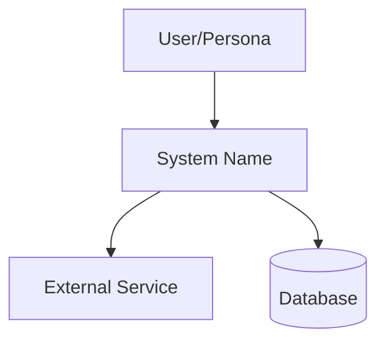

# Architecture Document フォーマット仕様

AI-DLC 上流成果物契約。`/ai-dlc:create-architecture` が生成する文書のフォーマット。

## メタデータヘッダ

```yaml
---
type: ai-dlc-architecture
version: "1.0"
status: draft | review | approved
created: YYYY-MM-DD
linked-prd: docs/prd-{kebab-case}.md
adr-count: {N}
---
```

## 必須セクション

### 1. Executive Summary

2-3 文でシステムの全体像を要約。PRD の Problem Statement を技術的に翻訳する。

### 2. System Context Diagram

システムと外部アクターの関係を Mermaid で記述。



### 3. Component Design

各コンポーネントを以下の構造で定義:

```markdown
#### Component: {名前}

- **責務**: {単一責務の記述}
- **インターフェース**: {公開 API / イベント}
- **データ所有権**: {所有するデータモデル}
- **依存先**: {他コンポーネント / 外部サービス}
- **AI 実装適性**: {High/Med/Low} — {理由}
```

AI 実装適性は Agent Loop での分割判断に使用:
- **High**: 明確な入出力、テスト自動化容易、副作用少
- **Med**: 部分的に人間判断が必要、外部依存あり
- **Low**: ドメイン知識密度高、セキュリティクリティカル、創造的判断

### 4. Data Model

主要エンティティの関係を定義。

```markdown
| エンティティ | 主要属性 | 関係 |
|---|---|---|
| {名前} | {属性リスト} | {1:N, N:M 等} |
```

必要に応じて ER 図（Mermaid）を追加。

### 5. ADR (Architecture Decision Records)

重要なアーキテクチャ判断を ADR-NNN 形式で記録。

```markdown
#### ADR-001: {タイトル}

- **Status**: Proposed | Accepted | Deprecated | Superseded
- **Context**: {判断が必要になった背景}
- **Options**:
  1. {選択肢 A}: {概要}
  2. {選択肢 B}: {概要}
  3. {選択肢 C}: {概要}
- **Decision**: {選択した選択肢}
- **Rationale**: {選択理由}
- **Consequences**:
  - Positive: {利点}
  - Negative: {受け入れるトレードオフ}
  - Risks: {残存リスクと緩和策}
```

### 6. Technology Stack

```markdown
| レイヤー | 技術 | 選定理由 | ADR |
|---|---|---|---|
| Frontend | {技術} | {理由} | ADR-NNN |
| Backend | {技術} | {理由} | ADR-NNN |
| Database | {技術} | {理由} | ADR-NNN |
| Infrastructure | {技術} | {理由} | ADR-NNN |
```

### 7. Quality Attributes

NFR を技術的に具体化。

```markdown
| 品質属性 | 要件 | 実現方法 | 測定方法 |
|---|---|---|---|
| Performance | {PRD NFR から} | {アーキテクチャレベルの対策} | {メトリクス・ツール} |
| Security | {PRD NFR から} | {認証・認可・暗号化方式} | {テスト・監査手段} |
| Scalability | {PRD NFR から} | {水平/垂直スケーリング戦略} | {負荷テスト基準} |
```

→ Atomic Spec **Constraints** の技術的裏付け

## AI-DLC 互換性チェック

Architecture 文書の品質ゲート。`/ai-dlc:create-architecture` が Step 3 で実行:

| チェック項目 | 基準 | 不合格時のアクション |
|---|---|---|
| **Atomic Spec 分割可能性** | 各コンポーネントが 2-4h 単位で実装可能 | コンポーネント再分割を提案 |
| **コンテキストウィンドウ適合** | インターフェースが AI Agent の理解範囲に収まる | インターフェース簡素化を提案 |
| **テスト自動化可能性** | CI で自動検証できるテスト戦略 | テスト戦略の具体化を提案 |
| **ADR 完全性** | 主要判断に ADR が存在する | 不足 ADR の追加を提案 |

## Atomic Spec マッピング

| Architecture セクション | → Atomic Spec 要素 |
|---|---|
| Executive Summary + System Context | **Context** |
| Component Design (インターフェース) | **Expected Behavior** |
| Quality Attributes + ADR (Consequences) | **Constraints** |
| Quality Attributes (測定方法) | **Verification** |

## 出力先

`docs/architecture-{kebab-case}.md`（プロジェクトルート基準）
