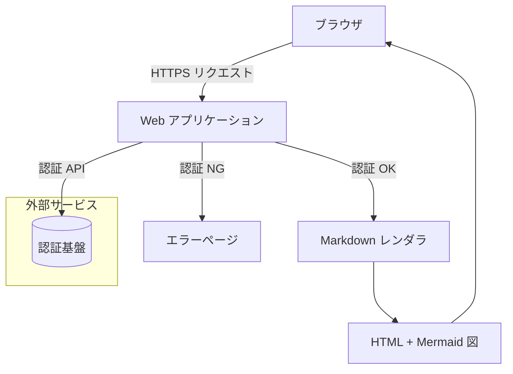
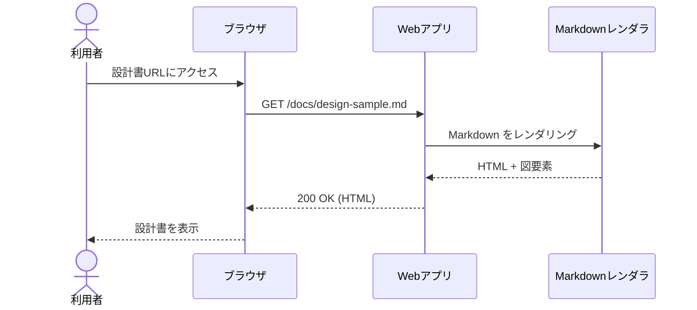
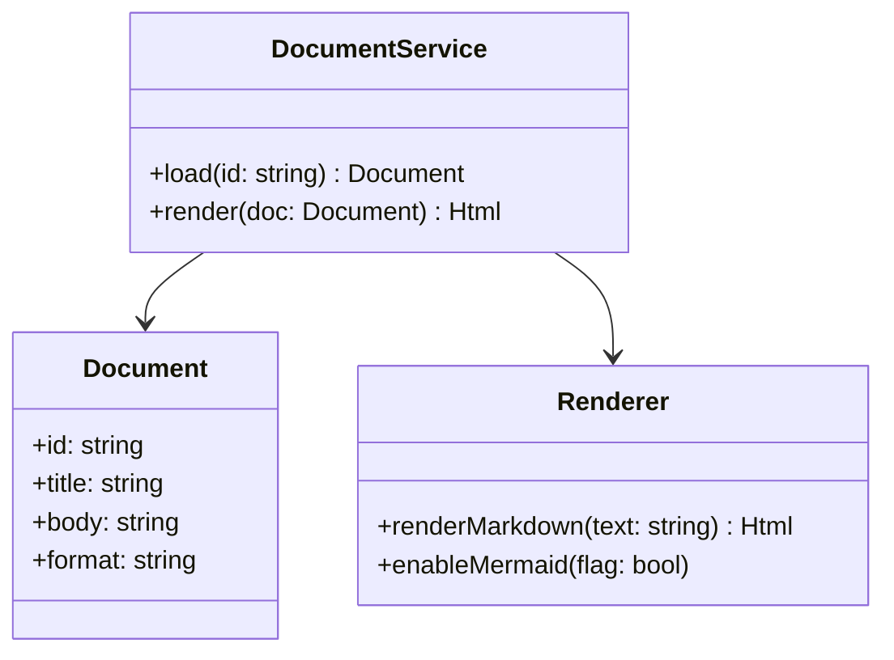

# 1. 概要

このドキュメントは、Markdown プレビューと Mermaid 図の描画テスト用のサンプルです。
以下の要素が含まれています。

- 見出し・段落
- 箇条書き・番号付きリスト
- 表（テーブル）
- Mermaid フローチャート
- Mermaid シーケンス図
- Mermaid クラス図

# 2. 要求仕様（抜粋）

## 2.1 機能一覧

| ID  | 機能名                 | 概要                                     |
|-----|------------------------|------------------------------------------|
| F-1 | ユーザ登録             | ユーザがアカウントを新規作成できる       |
| F-2 | ログイン               | メールアドレスとパスワードで認証する     |
| F-3 | プロジェクト一覧表示   | 所属プロジェクトの一覧を確認できる       |
| F-4 | 設計書プレビュー       | Markdown で書かれた設計書をブラウザ表示 |

## 2.2 非機能要件（例）

1. レスポンス時間：主要画面の 95% が 1 秒以内に応答すること
2. 可用性：サービスの年間稼働率 99.9% 以上とする
3. セキュリティ：全通信を HTTPS で暗号化すること

# 3. アーキテクチャ概要

## 3.1 フローチャート（Mermaid）



## 3.2 シーケンス図（Mermaid）



## 3.3 クラス図（Mermaid）



# 4. 画面仕様（抜粋）

## 4.1 設計書プレビュー画面

- URL: `/docs/{docId}`
- 主な要素:
  - タイトルバー: 設計書タイトル、バージョン
  - 本文エリア: Markdown を HTML に変換した内容
  - 図エリア: Mermaid による各種ダイアグラム

### レイアウト要件

- 画面幅 1024px 以上を想定
- コードブロックは横スクロール可能とする
- 図は本文幅に収まるようにリサイズする

# 5. 動作確認チェックリスト

- [ ] 見出しレベル H1〜H3 が正しく表示される
- [ ] テーブルの罫線が崩れずに表示される
- [ ] `flowchart` の Mermaid 図が描画される
- [ ] `sequenceDiagram` の Mermaid 図が描画される
- [ ] `classDiagram` の Mermaid 図が描画される
- [ ] ダークテーマでも文字と図が判読できる
```

このファイルがそのまま正しく表示されれば、「Markdown＋Mermaid の典型的な設計書」についてプレビュー環境は概ね機能していると考えてよいです。 [mermaid.js](https://mermaid.js.org/syntax/examples.html)
