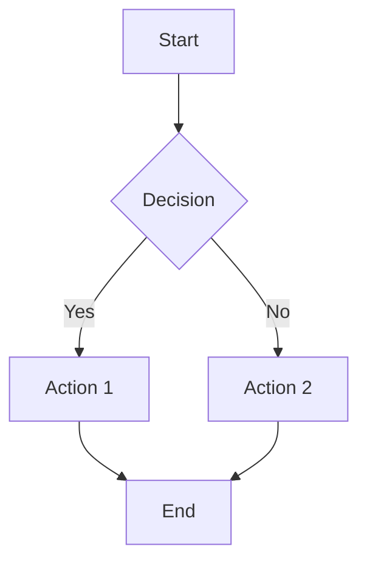
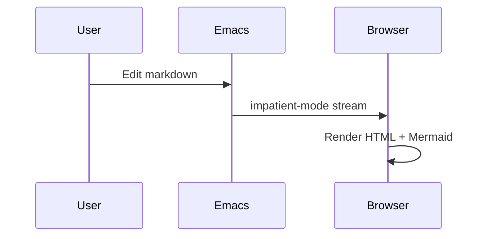

# Preview Test Document

## Headings

### H3 heading

#### H4 heading

## Inline formatting

This is **bold text** and this is *italic text*. Here is `inline code`.

A [link to example](https://example.com) and an image reference.

## Lists

### Unordered list

- Item one
- Item two
- Item three

### Ordered list

1. First step
2. Second step
3. Third step

## Blockquote

> This is a blockquote.
> It can span multiple lines.

## Code block

```javascript
function greet(name) {
  console.log(`Hello, ${name}!`);
}
```

```python
def fibonacci(n):
    a, b = 0, 1
    for _ in range(n):
        a, b = b, a + b
    return a
```

## Table

| Name    | Role       | Status |
|---------|------------|--------|
| Alice   | Developer  | Active |
| Bob     | Designer   | Active |
| Charlie | Manager    | Away   |

## Horizontal rule

---

## Mermaid diagram




