# Mermaid 全ダイアグラム描画テスト

## 1. フローチャート

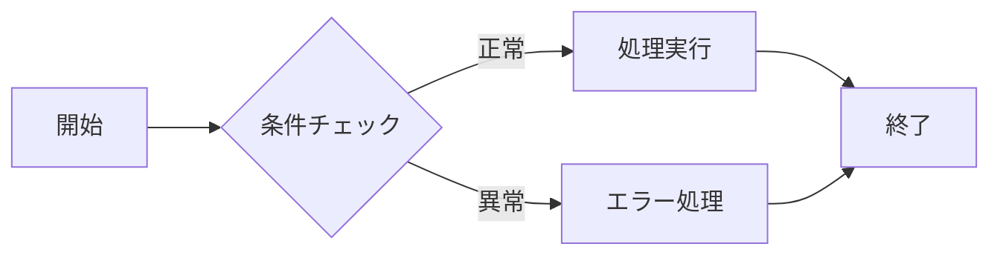

## 2. シーケンス図

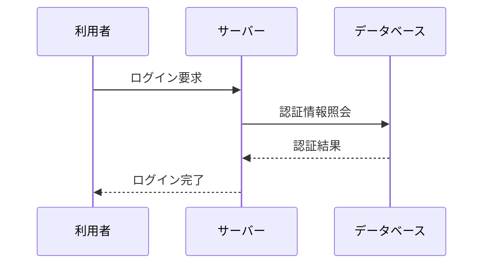

## 3. クラス図

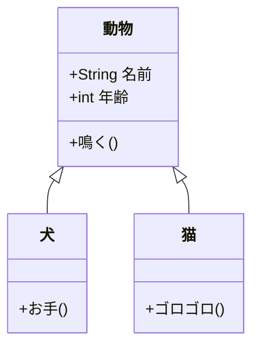

## 4. 状態遷移図

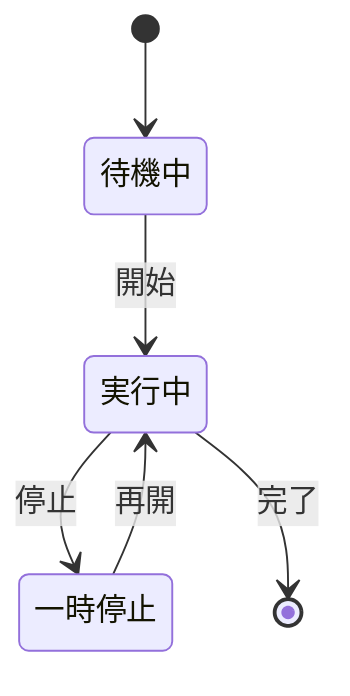

## 5. ER図

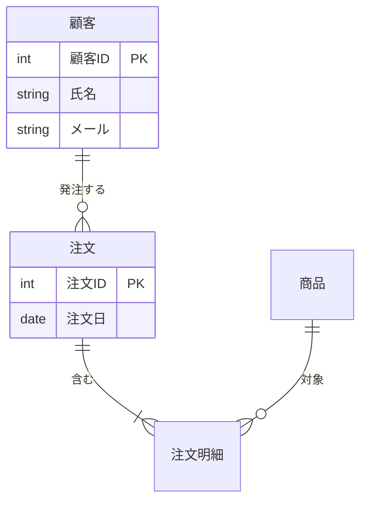

## 6. ガントチャート

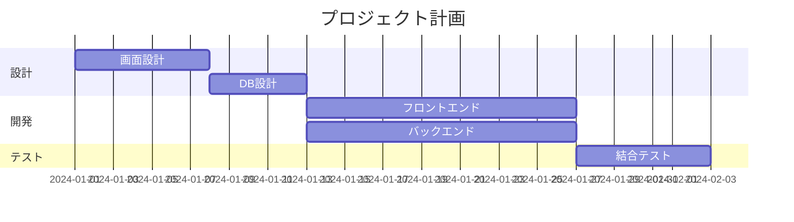

## 7. 円グラフ

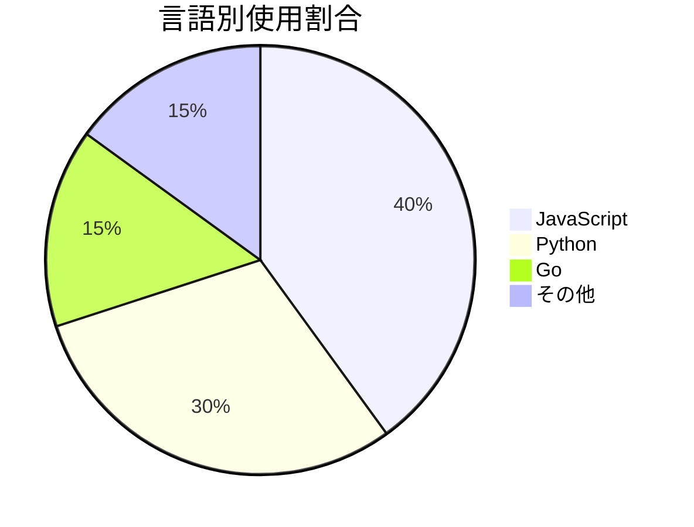

## 8. Gitグラフ

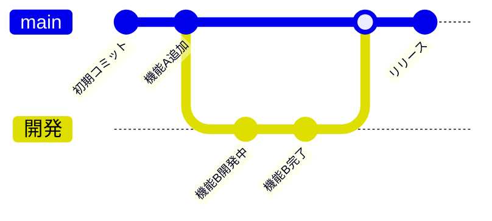

## 9. ユーザージャーニー

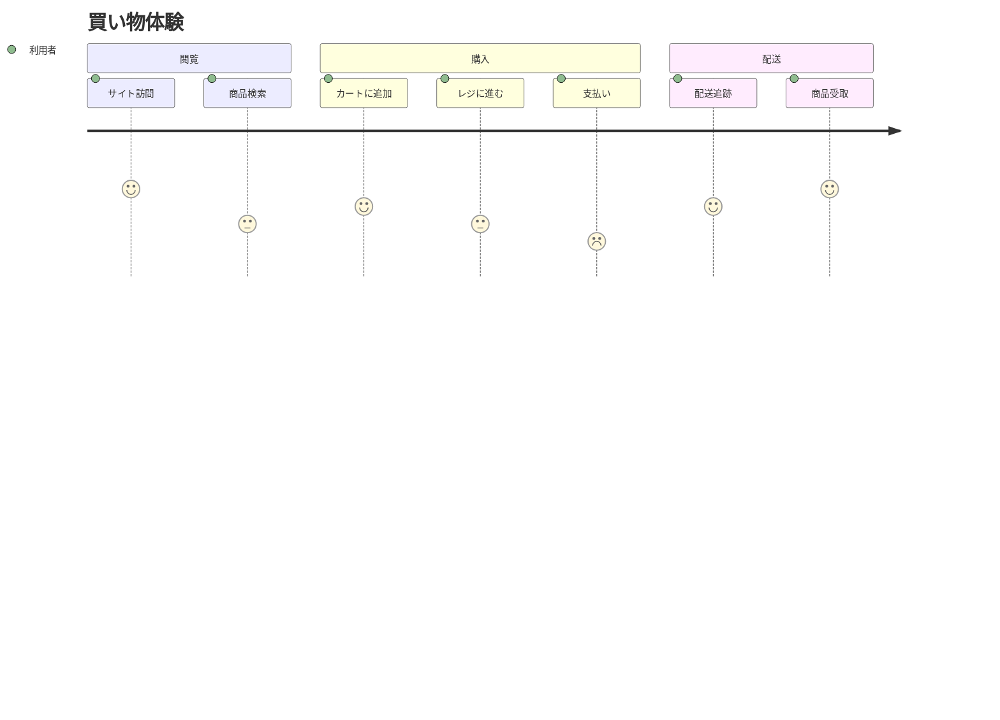

## 10. マインドマップ

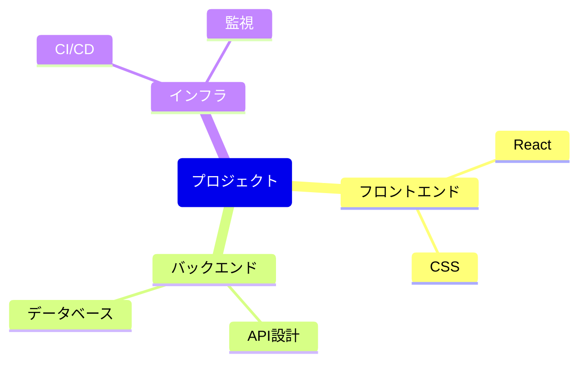

## 11. タイムライン

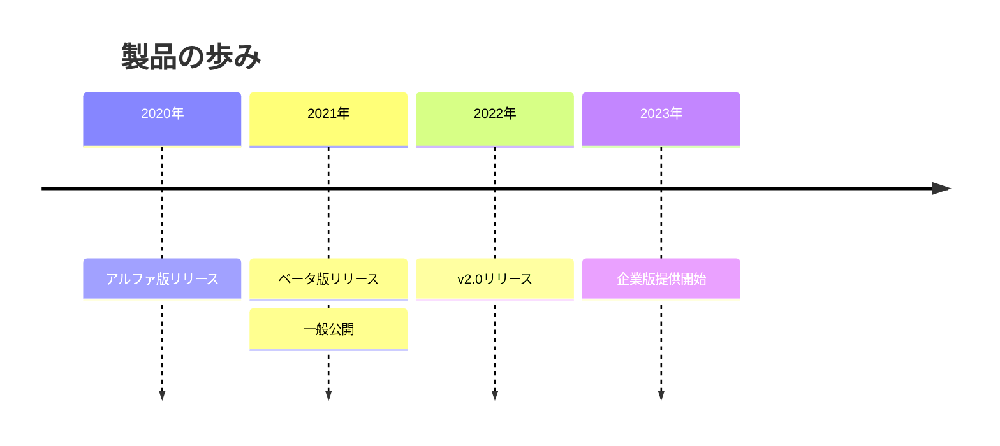

## 12. 四象限チャート

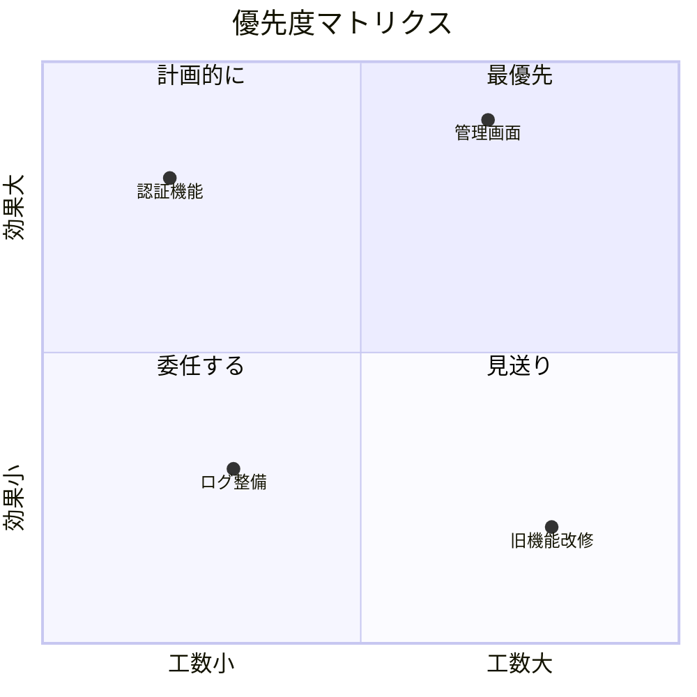

## 13. サンキー図

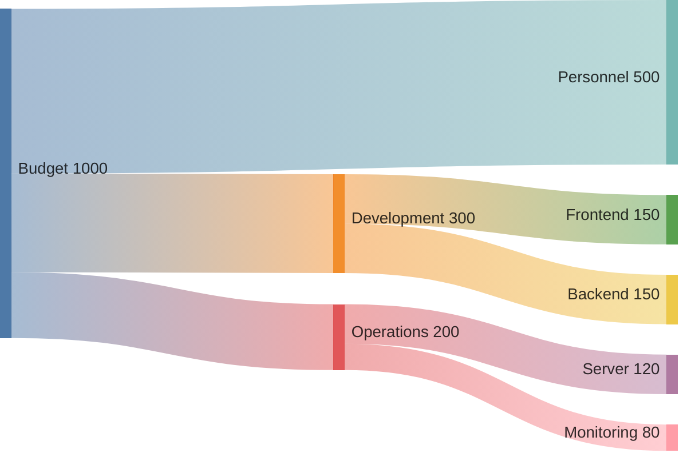

> Note: sankey-beta は非ASCII文字未対応（mermaid v11）

## 14. XYチャート

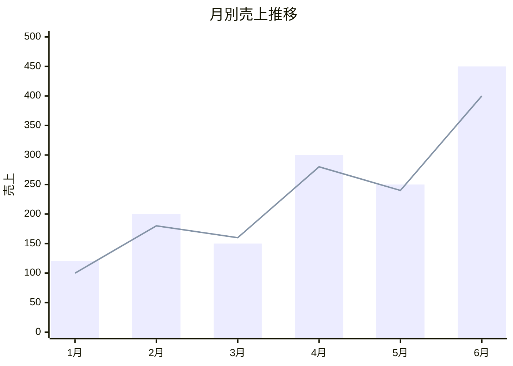

## 15. ブロック図

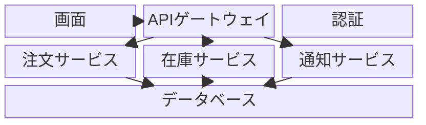

## 16. カンバン

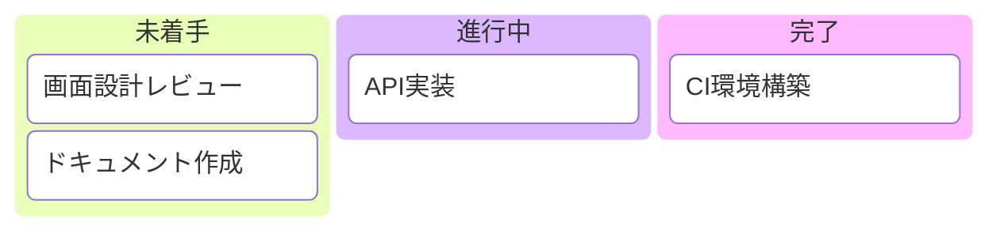

## 17. パケット図

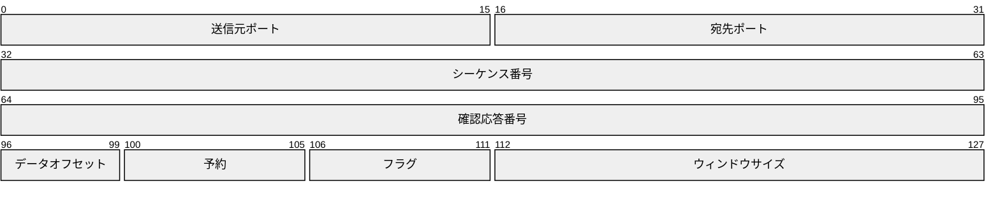

## 18. アーキテクチャ図

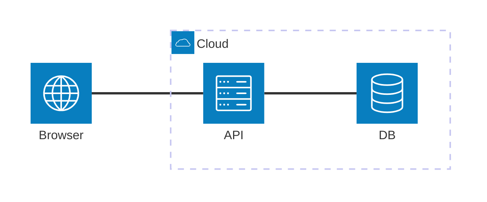

> Note: architecture-beta は非ASCII文字未対応（mermaid v11）
